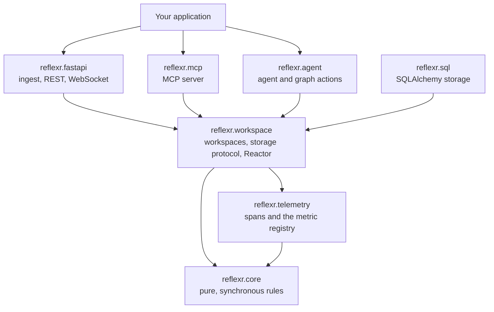
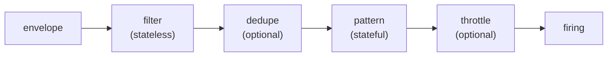
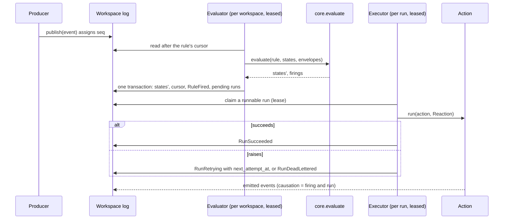
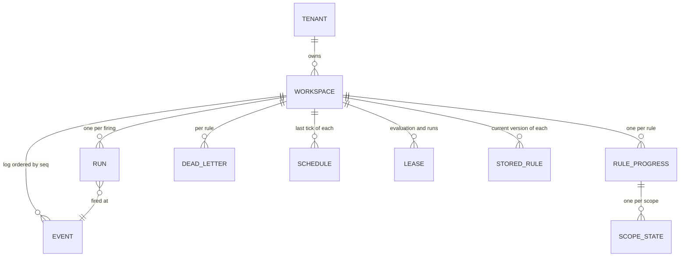

# Architecture

This document is evergreen: it is updated in the same pull request as the code that changes it. Decisions are recorded in [`adr/`](adr/README.md), proposals in [`rfcs/`](rfcs/README.md), and the wire protocol in [`protocol.md`](protocol.md).

## What reflexr is

reflexr is a Python library for **reactive agent workflows**. Applications publish events into workspaces. Rules watch each workspace's event log, and when a rule's condition holds (three errors from one service within a minute, a deploy followed by a spike, a heartbeat that stops), it runs a workflow: a pydantic-ai agent, a pydantic-graph graph, or a plain async function.

It is the sibling of [artifactr](https://github.com/alexnodeland/artifactr), and the two cover different ways of working with LLM agents:

| | artifactr | reflexr |
|---|---|---|
| Trigger | A person talks to an agent | Something happens in the world |
| Shape | Live chat, with shared artifacts both sides edit | Rules over a stream of events, running workflows in the background |
| Unit | A workspace of artifacts and threads, with one log | A workspace of events, with one log and the rules that watch it |
| Agent's job | Collaborate, turn by turn | Decide and act, then report |

Neither library imports the other. They share conventions (tenants and workspaces, envelopes, actors, storage protocols, pydantic-ai integration, protocol shape), so that a third system can bring them together over a shared context with thin adapters ([ADR-0003](adr/0003-independent-sibling-of-artifactr.md)).

### Goals

- Rules are typed, serializable data. Conditions compose, rules have a JSON Schema, and an agent can author one as easily as a person.
- Deciding is deterministic. The same log and the same rules always produce the same firings, so rules are testable without I/O and replayable after a fix.
- Rules are isolated. Each has its own cursor, state, retries and dead letters, so one failing rule never re-runs or blocks another.
- Acting is durable. Every firing's workflow runs at least once, with an idempotency key, and graph workflows resume from their last completed step after a crash.
- Multi-tenant, with tenants and workspaces exactly like artifactr's, scaled across processes with storage leases.
- Idiomatic use of Pydantic, pydantic-ai, pydantic-graph, SQLAlchemy, FastAPI and the MCP SDK, rather than parallel abstractions next to them.
- Small: seven core concepts, readable in an afternoon.

### Non-goals (for now)

- A general stream processor. There are no joins across workspaces, and a workspace's appends are serialized, so throughput per workspace is modest; scale comes from many workspaces.
- Exactly-once external effects. Actions run at least once and receive an idempotency key.
- Connectors for every broker. Applications publish over the API or in process; Kafka or SQS consumers can be written against the same `publish`.
- A frontend.

## Core concepts

| Concept | What it is |
|---|---|
| **Event** | A Pydantic model subclass for one kind of fact (`ops:service.error`, `ops:deploy.finished`), registered under its owner's namespace and a name. Stored in an **envelope** with its `seq`, time, actor and causation. |
| **Workspace** | A tenant-scoped unit with one append-only log of events (its stream), and the rules' cursors and runs over it. The unit of ordering, isolation and scale, as in artifactr. |
| **Rule** | Typed data: a condition over events (`when`), a scope that partitions its state and ordering (`scope`), and the action it runs (`then`). |
| **Firing** | The durable record that a rule's condition held for one scope at one point in the log, with the events that matched. Written atomically with the rule's cursor and state. |
| **Action** | What a firing runs: a pydantic-ai agent, a pydantic-graph graph or an async function, registered under a name that rules refer to. |
| **Run** | One execution of an action for one firing. Retried until it succeeds or is dead-lettered; its lifecycle is recorded in the log. |
| **Reactor** | The runtime that evaluates rules and executes runs across workspaces, in any number of processes. |

Supporting types: `Condition` (the stages of a rule's `when`), `Scope`, `Schedule`, `Actor`, and `Reaction` (what an action receives: the workspace, the run, the rule, the matched envelopes and the application's own deps).

## Layers



Dependencies point one way. Each layer is usable without the ones above it, and a test enforces the imports.

| Package | Depends on | Responsibility |
|---|---|---|
| `reflexr.core` | pydantic | Events and envelopes, actors, conditions and their reducers, rules, evaluation, the run lifecycle and retry policy. Pure, synchronous, no I/O. |
| `reflexr.telemetry` | core, opentelemetry-api | Attribute names, the metric registry and its cardinality policy, and the tracer and instruments. Never configures the SDK. |
| `reflexr.scores` (needs evalr, from the `langfuse` or `evals` extra) | core, telemetry, workspace, evalr's core | Feedback types as score configs and feedback as scores, through evalr's mapping with each type's registered name, and the `FeedbackMirror` that follows a log into evalr's `ScoreSink` port. |
| `reflexr.evals` (extra) | workspace, evalr | evalr's `FeedbackSource` over a workspace's log, `EvaluatorAction`, which runs an evalr evaluator as a rule's action and records its verdicts as feedback, replay experiments and the end-to-end measures. |
| `reflexr.workspace` | core, telemetry, cronsim | `Workspaces`, `Workspace` and the rule and schedule statuses it reports, the storage protocol, in-memory storage, the `Reactor` (evaluation, execution and schedules), the action port and `Reaction`, and function actions. |
| `reflexr.agent` | workspace, pydantic-ai, pydantic-graph | Agent actions with the `EventContext` capability, graph actions with checkpoints (adapters of the action port), and `function_model` for tests. |
| `reflexr.sql` (extra) | workspace, SQLAlchemy 2 async, Alembic | `SqlStorage` on PostgreSQL and SQLite, and its packaged migrations. |
| `reflexr.fastapi` (extra) | workspace, FastAPI | HTTP ingest, REST reads and administration, and the WebSocket stream protocol, over one command handler. |
| `reflexr.mcp` (extra) | workspace, mcp | Publishing, reading and administration as MCP tools, and runs as resources. |
| `reflexr.otel` (extra) | telemetry, the OpenTelemetry SDK and instrumentations | `configure_telemetry`: the SDK behind the API, with the metric views, composed with other libraries' contributions. |
| `reflexr.langfuse` (extra) | workspace, Langfuse | Whole traces and run attributes in Langfuse; feedback reaches it as scores through evalr's adapters. |
| `reflexr.litellm` (extra) | workspace, pydantic-ai's OpenAI-compatible models | Models over the LiteLLM proxy, with tenancy, keys and guardrails per request. |
| `examples/oncall` | every layer | The reference implementation: incident response with a triage agent, a runbook graph, a paging function, every surface and a terminal client. |

### Ports and adapters

The core is the hexagon; everything it talks to is behind a port, a small protocol owned by the layer that needs it, with adapters in their own modules or extras ([ADR-0025](adr/0025-ports-and-adapters.md)):

| Port | Adapters |
|---|---|
| `Storage` (driven) | `InMemoryStorage`; `SqlStorage` on PostgreSQL, Supabase's Postgres or SQLite |
| `Clock` (driven) | `utc_now`; fake clocks in tests |
| The OpenTelemetry API (driven) | Any SDK and exporter, such as OTLP to stackr's Collector |
| Actions (driven) | Functions; pydantic-ai agents and pydantic-graph graphs; evaluators |
| pydantic-ai's `Model` (driven) | Any provider, or the LiteLLM proxy |
| Log subscribers (driven) | The feedback mirror; evalr's `FeedbackSource` |
| evalr's `ScoreSink` and `ScoreConfigStore` (driven) | evalr's `LangfuseScoreSink` and `LangfuseScoreConfigStore` (with the `[langfuse]` extra), checked by evalr's contract suites; evalr's in-memory adapters in tests |
| `Workspace` handles and the `Reactor` (driving) | In-process calls, REST, WebSocket, MCP, schedules |

Every port has a fake or in-memory adapter and one contract suite that all its adapters pass; the storage behaviour suite is the first.

### `reflexr.core`: sans-IO

Core holds every decision as plain functions over immutable values ([ADR-0001](adr/0001-library-with-a-sans-io-core.md), [ADR-0017](adr/0017-the-cores-evaluation-contract.md)). The host (the workspace layer, or any other) asks core what to load, loads it, lets core decide, and saves what core returns in one transaction:

```python
scopes = core.needs(rule, progress, batch, predicates=predicates)
evaluation = core.evaluate(rule, progress, load(scopes), batch, predicates=predicates)
save(evaluation)  # scope states, the new progress and cursor, and the firings' runs and events
```

- `needs` returns the scopes a batch reads: those of the envelopes that pass the rule's filter, and those whose `absence` deadline passes during the batch. Scopes the host has no state for are new.
- `evaluate` folds the envelopes into the rule's per-scope state and returns an `Evaluation`: the changed scope states, the new `RuleProgress` (cursor, generation, definition hash, deadlines), the firings, the evaluation errors, and the `reflexr:rule_fired` and `reflexr:rule_errored` events to append, in order. It reads nothing but its arguments; time is the envelopes' `ts`.
- `begin` gives a new rule its starting progress (the head of the log, or the beginning), and `reset` starts a new generation when a rule's definition changes or it is replayed.
- The run lifecycle is pure too: `create_run`, `start`, `checkpoint`, `succeed`, `fail` (retry under the rule's `RetryPolicy`, or dead-letter), `cancel`, `skip`, `retry` (appending `reflexr:run_requeued`), and `runnable`, which picks the runs of a scope that may start now.
- A firing joins the **causal chain** of the latest envelope it matched, and its run carries that chain ([ADR-0024](adr/0024-causal-chains-and-operator-actions.md)). For an absence, that is the last envelope the rule saw.

Firing ids are derived from the rule, its generation, the scope and the `seq`, so evaluating the same log twice produces the same ids.

Because core is pure, its behaviour is pinned by a **conformance suite** of JSON fixtures in `tests/conformance/cases/`: given a rule and a sequence of envelopes, expect these firings or these errors. Every case is also evaluated one envelope at a time with the state saved as JSON between batches, and property tests check that any batching of any log decides the same. The fixtures are the language-neutral specification.

## Events and envelopes

An event type is a Pydantic model that subclasses `Event` through a base that declares its owner's namespace ([ADR-0039](adr/0039-namespaced-event-types.md)). Defining the class registers it under the namespace, a `:` and a local name, derived from the class name (`ServiceError` becomes `service_error`) or given explicitly, as artifactr names its artifact types and pydantic-ai its events:

```python
class OpsEvent(Event, abstract=True, event_namespace="ops"):
    """The application's events."""


class ServiceError(OpsEvent, name="service.error"):  # ops:service.error
    service: str
    severity: int
    message: str


class Deploy(OpsEvent, name="deploy.finished"):  # ops:deploy.finished
    service: str
    version: str
```

A namespace belongs to the base that declared it, once per process, so a library's, a bridge's and an application's types never clash, and every name says who owns it. reflexr's own facts are in the `reflexr` namespace: `reflexr:rule_fired`, `reflexr:tick`. A name without a namespace fails wherever it appears, with a hint naming the qualified one.

A stored event is an `Envelope`, which is also its wire shape:

```python
class Envelope(BaseModel):
    seq: int  # gap-free position in the workspace's log, from 1
    id: str  # the event's id: publishing the same id again is a no-op
    ts: datetime  # when it was appended; the clock rules use
    workspace_id: str
    actor: Actor  # who published it
    causation: Causation | None  # the firing and run that emitted it, and the chain's depth
    correlation_id: str  # the id of the first event in its causal chain
    traceparent: str | None  # the W3C trace context of the span that published it
    event: Event  # discriminated by `type`
```

- **Publishing is idempotent** by event id within a workspace, so producers can retry, and a run that retries does not duplicate the events it emits.
- **Application events form an open family**: any registered `Event` subclass. reflexr's own facts form a **closed** union, so pyright checks `match` blocks for exhaustiveness: `RuleFired`, `RuleErrored`, `RuleReset`, `RunStarted`, `RunProgressed`, `RunRetrying`, `RunSucceeded`, `RunDeadLettered`, `RunCancelled`, `RunSkipped`, `FeedbackGiven`, and `Tick` from schedules. An event type from a newer version validates as `UnknownEvent` and round-trips unchanged.
- **Actors** match artifactr's kinds: `UserActor`, `AgentActor` (an agent or graph run, by rule and run), `ExternalAgentActor` (an MCP client), `SystemActor` (the reactor and schedules) and `EvaluatorActor` (a judge or decision model, by name and version), plus `SourceActor` for systems that publish events, such as a monitoring service.
- **Type allowlist.** `Workspaces(storage, events=[ServiceError, Deploy, Heartbeat])` rejects publishing any other type, even one registered elsewhere in the process.
- **Registries.** An `EventRegistry` is a set of namespaces, read as a mapping of their types by name. A base's `registry=` puts its namespace in one, and `registry.add(*bases)` includes another's; reflexr's namespace is in every registry, and `DEFAULT_REGISTRY` holds every namespace whose base names no other. `Workspaces(registry=...)` accepts, and checks rules against, only its registry's types, so applications in one process stay apart.

## Rules

A rule is a Pydantic model: what to watch, how to partition it, and what to run ([ADR-0006](adr/0006-rules-as-typed-serializable-data.md)). Its name is qualified like an event type's, `ops:error-spike`, and the `reflexr` namespace is reserved ([RFC-0003](rfcs/0003-managing-rules-at-runtime.md)).

```python
from datetime import timedelta

from reflexr import F, Rule, by, on, run

error_spike = Rule(
    name="ops:error-spike",
    when=on(ServiceError)
    .where(F.severity >= 7)
    .count(at_least=3, within=timedelta(minutes=1))
    .at_most(1, per=timedelta(minutes=15)),
    scope=by(F.service),
    then=run(triage),
)
```

Serialized, the same rule is plain JSON, with a schema generated from the models:

```json
{
  "name": "ops:error-spike",
  "when": {
    "filter": {"kind": "all", "of": [
      {"kind": "on", "types": ["ops:service.error"]},
      {"kind": "where", "field": "severity", "op": "ge", "value": 7}
    ]},
    "pattern": {"kind": "count", "at_least": 3, "within": "PT1M"},
    "throttle": {"at_most": 1, "per": "PT15M"}
  },
  "scope": {"fields": ["service"]},
  "then": {"action": "triage"}
}
```

Rules are registered in code today. Stored rules, installed in one workspace at runtime, are designed in [RFC-0003](rfcs/0003-managing-rules-at-runtime.md), and core holds what fixes their bounds: `StoredRules`, the configuration (an `allow` hook shaped like `authorize`, which sees a `RuleChange`, the allowlisted actions with their params models, and the rule namespaces stored rules may use), and `check_stored`, which lists every way a rule breaks it or core's limits: a required throttle of at most 60 firings in any hour, no scope fields, predicates or `matches`, and bounded retries, timeout, windows, description and size. Storage keeps each stored rule's current version, a `StoredRule`, and the commands and the surfaces follow.

### Conditions

A condition is a pipeline of stages, evaluated per scope:



| Stage | Kinds | State |
|---|---|---|
| **filter** | `on(types)`, `where(field op value)`, `all`, `any`, `not`, and `predicate(name)`, a registered Python function as an escape hatch | None |
| **dedupe** | Drop an event whose key was seen within a window | Recent keys |
| **pattern** | `each` (the default: every event that gets through fires), `count(at_least, within)`, `sequence(steps, within)` (A then B), `absence(within)` (nothing matched for a while) | Per pattern |
| **throttle** | At most N firings per period, a cooldown that bounds spend | Recent firings |

Field references (`F.severity`, `F.labels.env`) are checked against the event types that can reach them, those its own conjunction admits, when the condition is built, and again by `Rule.check` when rules are registered, so a typo fails at startup rather than silently never matching. A sequence's steps may therefore filter on fields of their own types. Operators are `eq`, `ne`, `lt`, `le`, `gt`, `ge`, `in`, `contains`, `matches` and `exists`. Ordering compares numbers with numbers and strings with strings, and a missing field matches nothing but `exists=False`. Equality is spelled `F.service.eq("auth")`, or `.where(service="auth")`, because `==` must return a bool.

The builder names each stage: `.where(...)`, `.distinct(key, within=)` for dedupe, `.count(at_least=, within=)`, `.absent(within=)`, `sequence(step, step, within=)`, and `.at_most(n, per=)` for the throttle. Their semantics:

- **count** fires when enough envelopes pass within the window, and the firing consumes them.
- **sequence** fires when its steps match in order within the window of the first; a new first step while it waits restarts it, so the latest start counts.
- **absence** fires once when a scope that has been seen goes quiet for the window, and rearms with the next matching envelope.

### Scopes

`scope=by(F.service)` gives a rule independent state and ordering per service: three errors from `auth` and two from `billing` are two counts, and a slow run for `auth` never delays `billing`. The default scope is the whole workspace. An envelope that passes a rule's filter but lacks its scope fields is an evaluation error for that rule.

### Time

Rules measure time by the log: an envelope's `ts`, assigned when it is appended ([ADR-0007](adr/0007-rule-state-as-pure-reducers.md)). Evaluation never reads a clock, so replaying a log reproduces its firings exactly.

Every envelope advances a rule's clock, including envelopes its filter rejects: time is a separate input to the stateful stages, not an event they have to match. When the clock passes a deadline, such as the end of an `absence` window, it applies to every scope that already has state. So a `Tick`, which matches no heartbeat filter and has no `service` field, still lets `absence` fire for each service the rule has seen. A [schedule](#schedules) appending a `Tick` every so often guarantees that time keeps moving in a quiet workspace.

## Deciding and acting

Processing a workspace's log has two halves with different guarantees ([ADR-0005](adr/0005-per-rule-cursors.md)):



**Deciding** is exact. One evaluator holds each workspace's lease at a time and evaluates every rule in one pass over new envelopes. For each rule it loads the state of the scopes involved, calls `core.evaluate`, and saves the new state, the advanced cursor, the `RuleFired` envelopes and the pending runs in a single transaction. A crash before the commit means the same envelopes are evaluated again against the same state, so each envelope affects each rule exactly once. An evaluation error (a predicate that raises, a missing scope field) is recorded as `RuleErrored` and dead-lettered for that rule alone; the rule moves on.

Each rule has its **own cursor**. A rule added later, or reset for replay, catches up on its own without holding back the others. The reactor evaluates a workspace in passes until every rule is caught up, since one rule's facts can be what another watches, renewing its lease between batches and stopping if it loses it. `batch_size` bounds each transaction, which holds the workspace's lock.

Where a rule starts ([ADR-0026](adr/0026-the-reactors-evaluation.md)):

- A **new workspace** meets every registered rule at its first event.
- A rule **added later** starts at the head of the log (`start="now"`, the default) or at its beginning (`start="beginning"`).
- A rule whose **definition changed** starts afresh at the head, with a new generation and `reflexr:rule_reset` in the log.
- **Replaying** (`workspace.replay_rule(rule, from_seq=, mode=)`) resets a rule to evaluate again. `"rebuild"` recomputes its state up to the head without firing, then carries on; `"refire"` fires again for the past, as new runs with new ids.
- A **disabled** rule (`enabled=False`) stays registered and checked, but the reactor neither evaluates it nor claims its runs, so its cursor holds and its runs wait. Enabled again, it resumes from its cursor; `enabled` is not part of its definition, so this never resets it.

**Acting** is at least once ([ADR-0041](adr/0041-executing-runs.md)):

- **Attempts.** Each attempt runs inside its `invoke_workflow` span with the run's chain in OpenTelemetry baggage (`session.id`), so an SDK's baggage processor can put the database and HTTP spans it causes in the same session, and inside the reactor's `run_context`, a port that backends such as Langfuse implement to attribute runs their own way, as artifactr's `TurnContext` does for turns.
- **Leases.** Executors claim runnable runs under leases that they renew while working, so a crashed executor's run is picked up again when its lease lapses; the abandoned attempt counts as a failed one. An attempt's outcome is recorded only if the run is still at that attempt, so an executor that lost its lease cannot overwrite a newer attempt, and cancelling a running run stops its action.
- **Order.** With the default `ordering="scope"`, runs of one rule and scope execute in firing order: a run that fails and is waiting to retry holds back later runs of the same scope, and nothing else. A run that exhausts its retry policy is dead-lettered; later runs of its scope continue (`on_dead_letter="continue"`, the default) or wait for someone to retry or skip it (`"block"`).
- **Due runs.** Storage finds only the runs that can start: of a rule ordered by scope, the first unfinished run of each scope, and nothing behind it. So a backlog in one scope neither delays the others nor costs a claim for each waiting run; the claim checks the order again in its transaction. A run whose lease another reactor holds is work in progress, not idleness, so `settle()` waits briefly and tries again rather than stopping early.
- **Stopping.** A reactor stopped with `serve(stop=)` starts no new attempts, gives running actions a grace period to end, then cancels the rest, records their attempts as abandoned and releases its leases.
- **Cancellation.** Anything may be cancelled at any await: a rule's `timeout`, a stopped or cancelled reactor, a closed WebSocket, an MCP client's cancel scope. Storage keeps that safe: a cancelled caller leaves no lock or connection behind, and SQL storage lets the statement in flight end before it raises the cancellation ([ADR-0042](adr/0042-cancel-safe-storage.md)). The event loop's shutdown is the exception, so a reactor is stopped with `serve(stop=)` first.

The firing id doubles as the run id and the action's **idempotency key**, and events a run emits get ids derived from it, so a retried run does not publish duplicates.

## Actions

An action is what a firing runs ([ADR-0008](adr/0008-actions-agents-graphs-and-functions.md)). Every kind receives the same `Reaction`: the workspace (bound to the run's actor), the run and its matched events, the attempt, and the application's deps.

```python
# A function
async def page(reaction: Reaction[AppDeps]) -> None:
    await reaction.deps.pager.notify(reaction.scope, reaction.run_id)


# A pydantic-ai agent: plain Agent, reflexr's capability adds the firing and event tools
triage_agent = Agent(
    "anthropic:claude-sonnet-5-5",
    deps_type=Reaction[AppDeps],
    output_type=Triage,
    capabilities=[EventContext(emit=[IncidentOpened])],
)
triage = AgentAction(triage_agent, name="triage")

# A pydantic-graph graph, checkpointed after every step
runbook = GraphAction(runbook_graph, name="runbook", state=RunbookState, inputs=from_triage)
```

- **Agents** are plain pydantic-ai `Agent`s with `deps_type=Reaction[...]`, wrapped in an `AgentAction`. With the `[litellm]` extra, `litellm_model("claude-sonnet")` routes an agent through the LiteLLM proxy, with default model settings like any other pydantic-ai model, and the `LiteLLMGateway` capability attaches each request's tenant, rule, run, chain and trace, the tenant's key and the rule's guardrails; a guardrail block dead-letters the run as `guardrail_blocked` ([ADR-0022](adr/0022-litellm-proxy-first.md)). By default its prompt describes the firing: the rule and its description, the scope, and the matched events. The `EventContext` capability gives the agent `read_events`, to read back through the workspace's log, and `emit_event`, to publish events of the types it is allowed, validated against their schemas, with refused calls retried by the model. The agent's output is the run's output. Each run is in its causal chain's conversation (pydantic-ai's `conversation_id`), and the capability attributes pydantic-ai's `invoke_agent` span to the tenant, workspace, rule, run and attempt. `usage_limits` bound each attempt.
- **Graphs** are pydantic-graph graphs built with `GraphBuilder`, with the `Reaction` as their deps, wrapped in a `GraphAction(graph, state=, inputs=)`. reflexr drives them step by step and, at every boundary where nothing runs in parallel, except before a decision, which runs no code, saves the graph state and the next task to the run (`Reaction.checkpoint`, which appends `reflexr:run_progressed`). A retry, or another executor after a crash, resumes after the last saved step instead of starting over; inside a fork it resumes from before the fork. A boundary is saved only if what it saves reads back as it was, and a checkpoint that no longer validates is set aside, on the attempt's span, and the graph starts over ([ADR-0043](adr/0043-graph-checkpoints.md)). Each step is an `execute_step {node}` span.
- **Functions** are `async def` over a `Reaction`.

A `Reaction` carries the workspace (acting as the run's `AgentActor`, so what it publishes records the run as its cause and joins the run's chain), the run (its scope, matched `seq`s, attempt and chain), the rule, the matched envelopes, and the application's `deps`. `reaction.emit(event)` publishes with an id derived from the run, its last checkpoint and its position since, so a retried attempt does not emit twice and a resumed graph never reuses an earlier id. An action returns the run's output (JSON, or a Pydantic model), or raises to fail the attempt; a rule's `timeout` bounds it. Raising `RunFailure(message, reason=, permanent=)` fails it with a stable reason code, recorded on the run, its facts and the `reflexr.runs` metric, and a permanent failure, such as a guardrail block, is dead-lettered without retrying ([ADR-0036](adr/0036-typed-run-failures.md)).

An action may declare a **params model**, so that one action serves rules that differ in a value, such as the thread to post in ([RFC-0003](rfcs/0003-managing-rules-at-runtime.md)). `run("notify", thread_id="thr_4")` puts the values on the rule's action reference as plain JSON, outside its definition, so changing them never resets the rule. A function declares its model through `with_params(notify, NotifyParams)`, which pyright checks against the function's second parameter; `AgentAction` and `GraphAction` take `params=NotifyParams`, and read the values with `reaction.params_as(NotifyParams)`. The reactor validates each rule's params as the model when it is built, and again at each attempt into `reaction.params`; an attempt that cannot fails permanently, with the reason `invalid_params`, or `unknown_action` when its action is not registered.

Rules refer to actions by name (`{"action": "triage"}`), because functions and agents are not data. `run(triage)` takes the action's name. `Workspaces` checks rules' event types, fields and predicates when it is built, and the reactor checks their actions and params:

```python
workspaces = Workspaces(storage, events=[ServiceError, Deploy], rules=[error_spike])
reactor = Reactor(workspaces, actions={"triage": triage, "page": page}, deps=AppDeps(...))
await reactor.serve(stop=stop)  # until stop is set; in tests and scripts: reactor.settle()
```

## Feedback

People's and evaluators' judgements are typed ([ADR-0019](adr/0019-typed-feedback-as-events.md)). A feedback type is a Pydantic model that subclasses `Feedback`, registered by name, and declares what it can be given on: a **run** (a workflow execution), a **firing** (whether the rule should have fired) or a **chain** (everything one triggering event led to):

```python
class Triage(Feedback, name="triage", targets={"run"}):
    correct: bool
    severity: Literal["low", "high", "critical"]
    reason: str | None = None
```

Feedback is recorded as a `reflexr:feedback_given` event (the type, the target and the validated value), so it is attributed, replayable, and something rules can watch. An evaluator's verdict is feedback given by an `EvaluatorActor`, so people's and evaluators' judgements can be compared directly. `Run.trace_ids` records each attempt's trace, so feedback on a run can be attached to it in Langfuse ([RFC-0002](rfcs/0002-observability-feedback-and-evaluation.md)).

Evaluation backends see feedback as **scores**: one per field, named `{type}.{field}`, typed by the field (numbers are numeric, `bool` a yes/no, `Literal` and `Enum` categories, `str` text). The mapping and the ports are evalr's, shared with artifactr and with evalr's evaluators, so a person's scores and an evaluator's match by construction; `reflexr.scores` passes each type's registered name as the `{type}`. `FeedbackMirror(workspace, sink, cursor=...).follow()` follows a workspace's log and records each piece of feedback in a `ScoreSink`: feedback on a run is scored on the trace of its latest attempt, on a firing on the trace of the evaluation that recorded it, and on a chain on its session. Score ids are derived from the envelope in reflexr's own namespace, so mirroring again replaces rather than duplicates. A mirror keeps a named cursor in the workspace, saved after it records a piece of feedback and every 500 other envelopes, and carries on after it when it restarts; mirroring is at least once ([ADR-0040](adr/0040-telemetry-that-composes-across-libraries.md)). A score has no evaluator and names no span; where the feedback came from is its `source`, recorded as metadata. `sync_score_configs` creates each feedback type's missing score configs in a `ScoreConfigStore`, through evalr's. The sink, the store, `Score` and their Langfuse adapters are evalr's, and applications use them from evalr ([ADR-0045](adr/0045-scores-on-evalr.md)). `reflexr.scores` needs evalr, so it is used through the `langfuse` or `evals` extra, and the core, telemetry and workspace never import it.

With the `[evals]` extra, feedback feeds evalr ([ADR-0020](adr/0020-evalr-shared-eval-kit.md)): a `LogFeedbackSource` turns one feedback type into evalr examples, with inputs the application builds from the run, firing or chain the feedback is about, for training and measuring judges, and leaves evaluators' own verdicts out unless asked; and an `EvaluatorAction` runs an evalr evaluator as a rule's action, so `Rule(when=on(RunSucceeded).where(rule="ops:triage"), then=run(judge))` judges every triage run online and records the verdict as feedback from an `EvaluatorActor`. `replay_task` makes an evalr experiment task that replays an example's events against a candidate agent, graph or model in an isolated in-memory workspace. `rule_outcomes` and `time_to_resolution` compute the deterministic end-to-end measures from the log: each rule's dead-letter, retry and operator-intervention rates, and each chain's time from its first event to the event the application says resolves it.

## Safety

LLM workflows triggered by events can loop and can spend ([ADR-0010](adr/0010-loop-and-spend-safety.md)):

- **No self-reaction.** A rule never sees reflexr's facts about itself (its own firings, errors and runs), though they still move its clock, so it cannot fire on its own activity.
- **Causation depth.** An event emitted by a run carries the depth of its causal chain. Publishing beyond the workspace's limit (8 by default) is rejected, so a rule whose action triggers itself stops instead of running away. reflexr's facts about a firing or run are as deep as the run's events, and a firing whose facts would exceed the limit is refused and dead-lettered, so rules that trigger each other through `reflexr:rule_fired` or `reflexr:run_succeeded` stop too. Errors about other rules' errors are dead-lettered without becoming new facts ([ADR-0026](adr/0026-the-reactors-evaluation.md)).
- **Throttles** on rules cap how often a rule can fire per scope.
- **Emit allowlists** on the `EventContext` capability limit which event types an agent can publish.
- **Concurrency limits** bound how many runs execute at once: `Reactor(concurrency=)` per reactor today, with limits per rule and per workspace still to come. Agent actions accept pydantic-ai `UsageLimits`.
- **Tenancy**: every handle is scoped to one tenant and workspace.

## Tenancy and concurrency

- **Scoped handles.** `await workspaces.open(tenant_id, workspace_id, actor=...)` returns a `Workspace` bound to that tenant, workspace and actor, exactly as in artifactr. Nothing below it accepts a raw tenant id ([ADR-0016](adr/0016-tenants-and-workspaces-like-artifactr.md)).
- **Sequencing.** `seq` is assigned inside the append transaction, which holds the workspace's lock (in SQL, the workspace row, locked `FOR UPDATE`), giving a gap-free total order per workspace. `ts` is assigned under the same lock as the later of the clock and the previous envelope's `ts`, so it never decreases within a workspace, whatever the clock skew between processes. Appends to one workspace are serialized; many workspaces scale out.
- **Leases.** One evaluator per workspace, one executor per run, and one schedule runner per schedule, each a storage lease with a time-to-live that its holder renews and that lapses if it dies. Any number of reactor processes can share the work.

## Schedules

A schedule publishes `reflexr:tick` events on a timetable ([ADR-0028](adr/0028-schedules-and-cronsim.md)):

```python
heartbeat_check = Schedule(name="heartbeat-check", every=timedelta(seconds=30))
standup = Schedule(name="standup", cron="0 9 * * mon-fri", timezone="Europe/Oslo")
workspaces = Workspaces(storage, rules=[...], schedules=[heartbeat_check, standup])
```

Rules watch ticks (`on(Tick).where(schedule="standup")`), and ticks move rules' clocks forward in quiet workspaces, so `absence` rules fire on time. A schedule targets every workspace with a log, or listed `(tenant, workspace)` pairs.

Each workspace remembers each schedule's last tick, saved in the transaction that appends the tick. Each tick's id is derived from the schedule and its time, so replicas never publish a tick twice. After downtime, a schedule skips to the latest missed tick, or catches up on each, up to a limit. The reactor publishes ticks in `tick()`, which `settle()` and `serve()` include; cron expressions are parsed by cronsim, in the schedule's time zone.

## Surfaces

Every surface is a thin adapter over a `Workspace` handle ([ADR-0044](adr/0044-surfaces.md)). What a surface reports, such as a rule's or a schedule's status, the handle computes, so every surface reports the same and only translates it. The wire formats are in [`protocol.md`](protocol.md).

| Surface | Package | What it offers |
|---|---|---|
| HTTP ingest and REST | `reflexr.fastapi` | Publish events (one or a batch, idempotent). Read the log: a window of it, of some event types, from its start or its end. Inspect and administer rules (cursor, lag, replay), runs (retry, skip, cancel) and dead letters. |
| WebSocket | `reflexr.fastapi` | A resumable subscription to the log, or one from its head, with the same `hello`, replay and close-code shape as artifactr's thread protocol, plus publish and administration commands. |
| Schedules | `reflexr.workspace` | Cron and interval schedules that publish into workspaces. |
| MCP | `reflexr.mcp` | Publishing, reading and administration as MCP tools, so external agents can feed and operate workspaces. |

Authentication is the host's: each surface takes a resolver that returns the tenant and actor for a request. Authorization within a tenant is the host's too: the router and the MCP server take the same `authorize(tenant_id, workspace_id, actor)` hook (`reflexr.workspace.Authorize`) and pass it to `Workspaces.open(..., authorize=)`, which refuses a workspace with `Forbidden` before a request uses it, and before an MCP client reads or subscribes to a run.

## Workspace handles

`Workspaces(storage, events=[...], emitted=[...], rules=[...], predicates={...}, schedules=[...], clock=..., max_depth=8, tracer_provider=..., meter_provider=...)` holds the rules, checked at construction, and opens handles; each `Workspace` is bound to one tenant, workspace and actor. `Reactor(workspaces)` evaluates the rules.

```python
workspace = await workspaces.open("acme", "prod", actor=UserActor(id="ada"))
published = await workspace.publish(ServiceError(service="auth", severity=8), id="alert-7")
await workspace.give_feedback(Triage(correct=True, severity="high"), on=RunTarget(run_id=run_id))
await workspace.skip_run(run_id, reason="duplicate incident")
```

- **Publishing** checks the event's type against the allowlist (`not_found` otherwise) and refuses reflexr's own events (`forbidden`). Types in `Workspaces(emitted=[...])` may be published only by runs; clients are refused them (`forbidden`). Publishing an id already in the log appends nothing and returns the logged envelope with `duplicate=True`. `publish_many` is atomic. An event starts a new causal chain unless it names one with `correlation_id=`, by the id of the chain's first event (a later event's id is `validation_failed`, naming its chain), or the handle belongs to a run.
- **Run handles.** `workspace.as_actor(AgentActor(...)).caused_by(causation, correlation_id=...)` gives a run a handle whose events record their causation and continue the run's chain; beyond `max_depth` they are rejected with `depth_exceeded`.
- **Feedback** is validated against its type's targets and must find its target (a chain by its first event's id); it joins the target's chain.
- **Operations** (`retry_run`, `skip_run`, `cancel_run`, `replay_rule`) apply core's transitions in one transaction and append the resulting event, attributed to the handle's actor.
- **Reads**: `read` (the window `after_seq < seq < before_seq`, of some `types`, the first `limit` or the last `last`, oldest first; storage filters, so a tail read of a long log reads only its tail), `subscribe`, `head_seq`, `run`, `runs` (newest first), `dead_letters`, `rule_progress`, `schedule_ticks`, and the statuses the surfaces report: `rule_statuses` (every registered rule: enabled, cursor, lag, generation, dead letters) and `schedule_statuses` (each schedule targeting the workspace: last and next tick).

Every write is a span (`reflexr.publish {type}`, a producer span; `reflexr.feedback {type}`; `reflexr.skip_run` and so on) attributed to the tenant, workspace and actor and placed in its chain's session. The W3C trace context of the publishing span is stored on the envelope, so the runs it causes can link back to it. Each evaluation that finds new envelopes is a `reflexr.evaluate` span listing the rules that evaluated and the firings made, and the `reflexr:rule_fired` facts carry its trace context. Each run attempt is an `invoke_workflow {rule}` span in the run's session, linked to the spans that published the envelopes it matched, and the run records each attempt's trace id. Metrics come from the registry in `reflexr.telemetry.metrics` ([Observability](guides/observability.md#metrics) lists them), always with tenant and workspace; a deployment keeps less detail with SDK views, which `reflexr.otel.configure_telemetry(metrics_detail=...)` installs ([ADR-0029](adr/0029-metric-detail-through-sdk-views.md)). The `[otel]` extra sets up the SDK, OTLP export and the open instrumentations in one call, and the `[langfuse]` extra adds Langfuse on the same tracer provider, with `langfuse_run` as the reactor's `run_context` so each run is filed under its chain's session. The setup composes with artifactr's ([ADR-0040](adr/0040-telemetry-that-composes-across-libraries.md)). `reflexr.otel.telemetry()` is reflexr's contribution: its metric views, a span filter for its traces (the scopes in `TRACE_SCOPES`), and the instrumentations it advises. `configure_telemetry(*contributions)` takes other libraries' contributions, such as `artifactr.otel.telemetry()`, adds its own, and reads them through the `TelemetryContribution` protocol, so neither library imports the other. `langfuse="scores"` sends Langfuse scores and trace attributes but no spans, for a Collector that sends it every trace. **Polling is untraced:** the reactor checks for work, and subscriptions and the feedback mirror read the log, inside `untraced()`, which makes every span started in it a child of a span that is never sampled. Under a parent-based sampler, the SDK's default, an idle application exports no spans, and the instrumentations' metrics are still recorded (a sampler such as `always_on` or `traceidratio` would trace polls again); the work a poll finds is traced where it happens, never inside `untraced()`.

### Dashboards

Grafana dashboards live in `deploy/grafana/dashboards/`, generated by `scripts/grafana_dashboards.py`:

| Dashboard | What it shows |
|---|---|
| Overview | Every tenant: events, firings, the failed share of run attempts, the worst rule lag, run outcomes and attempt duration, dead letters |
| Tenant | One tenant's busiest workspaces: events, firings and dead letters, feedback and attempt duration |
| Workspace | One workspace's events by type and by actor, duplicates, firings, runs by rule and status, feedback |
| Rules | Lag, evaluation duration, firings and errors, by rule |
| Runs | Outcomes, failures by reason (`reflexr.run.reason`), retries and dead letters by rule, attempt duration by rule and outcome, operator actions |
| Agent and LLM | pydantic-ai's tokens and cost by model, model requests and tokens per request; guardrail blocks and failing rules |
| Schedules | Ticks by schedule and workspace |
| Stream | Open WebSocket connections, disconnects by close code, refusals and slow clients |

They read Prometheus through the data source uid `prometheus`, as stackr provisions it, with the names the OTLP translation gives the registry's metrics, `job` as the service and `deployment_environment_name` as its environment. A test checks that every query reads a metric in the registry (reflexr's own, or pydantic-ai's in `EXTERNAL_METRICS`), with labels its attributes declare ([ADR-0038](adr/0038-dashboards-generated-tested-and-released.md)). Each release attaches them as `reflexr-dashboards-<version>.tar.gz`, for stackr to provision by version.

## Storage protocol

`reflexr.workspace` defines the storage protocol, and the same behaviour suite runs against every implementation:

- **`InMemoryStorage`**, for tests, examples and single-process prototypes.
- **`SqlStorage`** (`reflexr.sql`), on PostgreSQL and SQLite with SQLAlchemy 2's asyncio extension, with Alembic migrations shipped in the package ([ADR-0030](adr/0030-sql-storage.md)).

A transaction is scoped to one workspace (a `WorkspaceRef` of tenant and workspace) and serialized with every other transaction on it. Within it the host appends envelopes, loads and saves rule cursors and states, creates and updates runs, dead-letters evaluation errors, and reads and saves stored rules; it reads its own writes, commits when its block exits normally and rolls back if it raises or is cancelled. Every storage is cancel-safe: a cancelled caller leaves no lock or connection behind; cancellation may be deferred until the current statement ends ([ADR-0042](adr/0042-cancel-safe-storage.md)). Appending an id that is already in the log is an error, and so is saving a stored rule at any version but its next, so callers look ids and rules up first. Outside transactions, storage serves reads (`read`, which filters a window of the log by event type and takes its first or last so many, `subscribe`, runs, dead letters, active stored rules), discovery (`workspaces`, and `due_runs`, which returns the runs that can start, given a `RunPolicy` that says which rules are disabled, which run in firing order per scope and which of those a dead-lettered run blocks), leases with an injectable clock, schedule state, and the cursors of the log's other consumers, such as feedback mirrors: `cursor` and `save_cursor`, which only moves a cursor forward ([ADR-0040](adr/0040-telemetry-that-composes-across-libraries.md)).

```python
from sqlalchemy.ext.asyncio import create_async_engine

from reflexr.sql import SqlStorage, create_sqlite_engine, migrate

engine = create_async_engine("postgresql+asyncpg://localhost/app")  # reflexr[postgres]
# or: engine = create_sqlite_engine("sqlite+aiosqlite:///app.db")   # reflexr[sqlite]
await migrate(engine)  # safe on every start
workspaces = Workspaces(SqlStorage(engine), events=[...], rules=[...])
```

`SqlStorage` is one implementation for both databases, with no dialect-specific code:

- **Locking.** A transaction selects its workspace's row `FOR UPDATE` before it reads anything, creating the row if the workspace is new, and holds the lock until it commits. `seq` and `ts` are assigned from the `head_seq` and `head_ts` kept on that row. On SQLite, which has no row locks, every transaction begins with `BEGIN IMMEDIATE`, and an engine from `create_sqlite_engine` keeps one connection, so a process's transactions take turns in the order they begin.
- **Reads** of the log put the window, the types and the count in the query: types over an index on `(tenant_id, workspace_id, event_type, seq)`, and the last so many by reading backwards from the end.
- **Subscriptions** read the log a page at a time and, once caught up, wake at once for commits made through the same `SqlStorage`, or poll every `poll_interval` (0.5 s by default) for commits made elsewhere.
- **Leases** are rows, taken with a conditional `UPDATE` or else an `INSERT`, and expire by the storage's clock.
- **Cursors** are rows, each locked while a save compares it, so the furthest save wins.
- **Cancellation.** Every database call is awaited to its end, and a cancellation that came meanwhile is raised after it; closing a transaction's session rolls back what it did not commit and returns its connection. SQLAlchemy takes a statement cancelled part-way for a lost connection, which on SQLite could keep the write lock or the engine's one connection.
- **Schema.** `migrate(engine)` runs the packaged Alembic migrations, which record their version in `reflexr_alembic_version` beside the application's own; `create_schema(engine)` creates the tables directly, for tests and prototypes.

## Data model



- **Rules live in code** (v0.1) and are identified by name. A rule's cursor row stores a hash of its definition; changing the definition resets its state and is recorded in the log.
- **Stored rules** ([RFC-0003](rfcs/0003-managing-rules-at-runtime.md)) are one row per workspace and name: the current version, numbered from 1, whether it is active or archived, and the rule and its provenance.
- **Rule state** is a JSON document per rule and scope, owned by the rule's condition, saved with its cursor.
- **Runs** hold their status, attempts, next attempt time, causal chain, the trace id of each attempt, and for graphs the latest checkpoint.
- **In SQL** each entity is a `reflexr_` table whose primary key starts with the tenant and the workspace. Envelopes, runs, rule progress, scope states and dead letters are stored as the JSON of their Pydantic models (`JSON`, not `JSONB`, so key order is kept), and a stored rule as the JSON of its rule and its provenance, beside the columns queries filter and order by: an event's unique id and its type, a run's rule, scope, status, `fired_seq` and `next_attempt_at`, and a stored rule's version and status. The workspace row holds the log's head and a counter that orders runs, dead letters, progress and schedules by creation. Timestamps in columns are stored in UTC ([ADR-0030](adr/0030-sql-storage.md)).

## Aligned with artifactr

| Convention | artifactr | reflexr |
|---|---|---|
| Tenancy | Tenants own workspaces; `workspaces.open(tenant, workspace, actor=)` | The same: tenants own workspaces, opened the same way |
| Authorization | `Workspaces.open(..., authorize=)` refuses a workspace with `Forbidden`, for every surface | The same |
| Log | One per workspace, envelopes with a gap-free `seq` and a `traceparent` | The same |
| Actors | user, agent, external agent, system, evaluator | The same, plus source |
| Types | `Artifact` subclasses registered by name | `Event` subclasses registered by qualified name, `namespace:name` |
| Core | Sans-IO `commit`, conformance fixtures | Sans-IO `evaluate`, conformance fixtures |
| Storage | Protocol, in-memory and SQL, leases, one behaviour suite, cancel-safe | The same |
| Telemetry | `configure_telemetry(*contributions)`, `telemetry()`, `untraced()`, `langfuse="traces" \| "scores"` | The same, each taking the other's contribution |
| Log consumers | `cursor` and `save_cursor`, which only move forward; `FeedbackMirror(cursor=)` | The same |
| pydantic-ai | A capability plus a deps type (`ArtifactWorkspace`, `Session`) | A capability plus a deps type (`EventContext`, `Reaction`) |
| WebSocket | `hello`, replay, `replay_complete`, close codes | The same shape |
| MCP | Tenant in resource URIs | The same |

Some code is shared verbatim, at the same path under `src/artifactr/`, and each copy says so. A change to one is made to both:

- `_logging_left_alone`, in `src/reflexr/mcp/server.py`
- `litellm_model`, in `src/reflexr/litellm/gateway.py`
- `create_sqlite_engine`, in `src/reflexr/sql/sqlite.py`
- `langfuse_client`, in `src/reflexr/langfuse/client.py`
- `_to_the_end` and `_awaited_to_the_end`, in `src/reflexr/sql/storage.py` ([ADR-0042](adr/0042-cancel-safe-storage.md))

## Dependencies

Python 3.12+. Runtime: `pydantic` (core); `opentelemetry-api` (telemetry and workspace); `cronsim` (schedules); `pydantic-ai-slim` and `pydantic-graph` (agent). Extras: `sql` (`sqlalchemy[asyncio]` and `alembic`), `postgres` (`sql` and asyncpg) and `sqlite` (`sql` and aiosqlite), `fastapi`, `mcp`, `otel` (the OpenTelemetry SDK, OTLP exporters and instrumentations), `langfuse` (with evalr, for the score mirror and its Langfuse adapters), `litellm` (pydantic-ai's OpenAI-compatible models) and `evals` (evalr). Tooling: uv, ruff, pyright in strict mode, pytest, and Zensical with mkdocstrings for the documentation site.

## Testing

- **Core:** the conformance fixtures, plus property tests that replaying any log reproduces its firings.
- **Workspace:** one behaviour suite (publishing, evaluation, runs, retries, leases, schedules, stored rules) against every storage: in memory, SQLite, and PostgreSQL when `REFLEXR_TEST_POSTGRES_URL` is set, as in CI's PostgreSQL job (`make pg-up test-pg` locally).
- **SQL:** the migrations checked against the models on both databases, and locking, polling, leases and stored values across processes.
- **Agent:** scripted models built by `function_model`, which answers plain and streamed requests from one function, and pydantic-ai's `TestModel`; graph runs interrupted and resumed.
- **Surfaces:** contract tests for every frame and endpoint, and an MCP client round trip.
- **Scores:** the mirror against evalr's in-memory sink and store, and against evalr's Langfuse sink over a fake of Langfuse's API; the adapters' contract suites run in evalr.
- **Reference implementation:** the real server and client end to end, with a scripted model.

Coverage is 100% of lines and branches, and pyright runs in strict mode with no suppressions ([ADR-0013](adr/0013-quality-gates.md)).

The contributor stack is `compose.yaml`: PostgreSQL for the tests, and oncall under the `app` profile. The dev container is built on it and joins stackr's network when stackr's stack runs ([ADR-0021](adr/0021-contributor-compose-and-dev-containers.md), [ADR-0037](adr/0037-joining-stackrs-network.md)). CI validates the Compose files, and builds oncall's image and starts it on the Compose PostgreSQL.

## Decisions

Every decision is an ADR in [`adr/`](adr/README.md), whose index lists them with their status; proposals that precede decisions are RFCs in [`rfcs/`](rfcs/README.md).

## Open questions

- **Pausing runs for a person.** A workflow that needs approval mid-way could pause as pydantic-ai deferred tools do. Until then, a run can emit an event and a second rule can continue when the answer arrives.
- **Live output from runs.** Token-level streaming of agent runs over the WebSocket, as artifactr streams its runs.
- **Resuming inside parallel branches.** Graph checkpoints are proven for sequential steps; a run that crashes inside a fork restarts from the last checkpoint before it.
- **Retention.** Compacting old envelopes, and what a rule replaying past the retained log starts from.
- **Subscribers in other processes.** SQL subscriptions poll for commits made elsewhere; PostgreSQL `LISTEN/NOTIFY` could wake them at once, with polling kept for SQLite ([ADR-0030](adr/0030-sql-storage.md)).
- **Hot workspaces.** A workspace's appends are serialized. Partitioning one workspace's log by key may be needed for high-volume sources.
