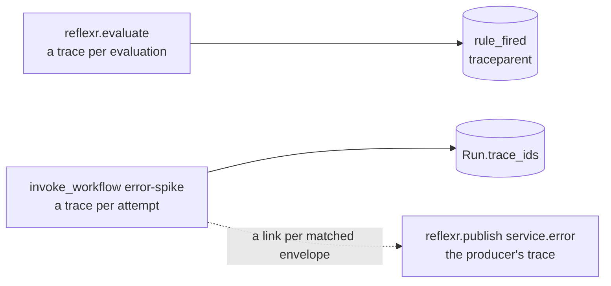

# Observability

reflexr traces every publish, evaluation pass, run attempt and graph step, and counts what happens in each workspace, through the OpenTelemetry API ([ADR-0018](../adr/0018-opentelemetry-observability-with-langfuse.md)). It never configures OpenTelemetry itself: until your application sets up the SDK, recording costs nothing and goes nowhere. This page shows how to turn it on, what is recorded, how one incident's traces hang together, and how to send them to Langfuse.

## Configuring OpenTelemetry

The `otel` extra sets up the OpenTelemetry SDK in one call. Call it once, as early as the application starts, before it creates its FastAPI app and agents:

```python
from reflexr.otel import configure_telemetry

telemetry = configure_telemetry(
    service_name="oncall",
    service_version="1.4.0",
    environment="production",
    otlp_endpoint="http://otel-collector:4318",  # or set OTEL_EXPORTER_OTLP_ENDPOINT
)

engine = create_async_engine("postgresql+asyncpg://db/oncall")
telemetry.instrument_engine(engine)

triage_agent = Agent(
    "anthropic:claude-sonnet-5-5",
    deps_type=Reaction[AppDeps],
    output_type=Triage,
    capabilities=[EventContext(emit=[IncidentOpened]), telemetry.capability()],
)
app = FastAPI(lifespan=lifespan)
telemetry.instrument_app(app)
```

It sets up:

- tracer, meter and logger providers, with `service.name`, `service.version` and `deployment.environment.name` on their resource, made global unless `set_global=False`
- OTLP over HTTP for traces, metrics and logs, to `otlp_endpoint` or wherever the `OTEL_EXPORTER_OTLP_*` environment variables point; `otlp_headers` adds a backend's credentials
- views that apply reflexr's metric cardinality policy at `metrics_detail` (see [Metrics](#metrics))
- a baggage span processor that copies a run attempt's session onto every span in it (see [Sessions and causal chains](#sessions-and-causal-chains))
- the open instrumentations reflexr advises, FastAPI, SQLAlchemy, httpx and httpx2, for whichever of them is installed, with the stable HTTP semantic conventions; `instrument=` names others, such as `asyncpg` for an application that queries with asyncpg directly (SQLAlchemy's spans already cover the queries reflexr makes through it)
- pydantic-ai's instrumentation settings: `telemetry.capability()` is its `Instrumentation` capability for your agents, with prompts, completions and tool arguments left out unless `include_content=True`
- an OTLP handler on the root logger, so `logging` records are exported with the trace and span they were logged in; `logs=False` leaves logging alone

Instrumentation patches libraries, which only reaches objects created through the patched names afterwards. Most applications import `FastAPI` and `create_async_engine` before they configure telemetry, so pass the application to `telemetry.instrument_app(app)` and each engine to `telemetry.instrument_engine(engine)`, or give existing engines as `engines=` when configuring.

The handle it returns shuts it all down: `telemetry.shutdown()` removes the instrumentation and flushes and shuts down the providers. It is also a context manager, which suits a FastAPI lifespan:

```python
@contextlib.asynccontextmanager
async def lifespan(app: FastAPI) -> AsyncIterator[None]:
    with telemetry:
        yield
```

### With artifactr, or other libraries

An application that uses artifactr too configures telemetry once, with artifactr's contribution ([ADR-0040](../adr/0040-telemetry-that-composes-across-libraries.md)):

```python
import artifactr.otel
from reflexr.otel import configure_telemetry

telemetry = configure_telemetry(artifactr.otel.telemetry(), service_name="app")
```

`reflexr.otel.telemetry()` is reflexr's contribution, and `configure_telemetry` always adds it. Each contribution brings its library's metric views, a span filter for its traces, and the instrumentations it advises. `configure_telemetry` installs every library's views, instruments what any of them advises, and, with Langfuse, keeps a span that any of them keeps. artifactr's `configure_telemetry` takes reflexr's contribution the same way, so either library's will do. An application can contribute its own metric views too, with a `Contribution`.

### Configuring the SDK yourself

`configure_telemetry` is a convenience: reflexr only ever records through the OpenTelemetry API, so any SDK configuration works. `Workspaces` records to the global providers, or to the ones you pass as `tracer_provider=` and `meter_provider=`, and everything built on it (the `Reactor`, `reflexr_router`) records through the same ones. To keep less metric detail, give your `MeterProvider` every library's `metric_views(detail)` ([ADR-0029](../adr/0029-metric-detail-through-sdk-views.md)); to trace agents, add pydantic-ai's capability yourself, `Instrumentation(settings=InstrumentationSettings(tracer_provider=..., meter_provider=...))`. Keep a parent-based sampler, the SDK's default, so that polling stays untraced (see [Polling](#polling)).

## Spans

| Span | Recorded when | Its own attributes |
|---|---|---|
| `reflexr.publish {type}` | An event is published; `reflexr.publish` for a batch. A producer span | `reflexr.event.type`, `reflexr.event.id`, `reflexr.event.seq`, `reflexr.event.count`, `reflexr.event.duplicate` |
| `reflexr.feedback {type}` | Feedback is given | `reflexr.feedback.type`, `reflexr.feedback.target`, `reflexr.event.id` |
| `reflexr.retry_run`, `reflexr.skip_run`, `reflexr.cancel_run` | Someone operates a run | `reflexr.run.id`, `reflexr.rule` |
| `reflexr.replay_rule` | A rule is replayed | `reflexr.rule` |
| `reflexr.evaluate` | The reactor evaluates a workspace's new envelopes; a check that finds none records nothing | `reflexr.evaluation.rules` (the rules that evaluated), `reflexr.evaluation.firings` |
| `invoke_workflow {rule}` | A run attempt | `gen_ai.operation.name`, `gen_ai.workflow.name`, `reflexr.rule`, `reflexr.scope`, `reflexr.run.id`, `reflexr.attempt` |
| `execute_step {node}` | A graph action runs a step | `reflexr.run.id` |
| `reflexr.checkpoint_run` | A graph run saves its progress after a step | `reflexr.run.id`, `reflexr.attempt` |
| `reflexr.schedule {name}` | A schedule's ticks are due in a workspace | `reflexr.schedule`, `reflexr.event.count` |
| `reflexr.stream` | A WebSocket connection, for as long as it is open. A server span | `reflexr.stream.close_code` |

When a graph action cannot resume its run's checkpoint and starts over, the attempt's `invoke_workflow` span gets a `reflexr.checkpoint.discarded` event. Its `reflexr.checkpoint.reason` says why: `format` (not a checkpoint, or another version of the format), `graph_changed` (the graph's nodes changed), `untyped` (the next node's input type is no longer known) or `invalid` (a saved value no longer validates as its type). For `invalid`, `reflexr.checkpoint.error` says what did not validate, by location and message, without the values ([Actions](actions.md#graphs)).

Every span reflexr records says where and who: `reflexr.tenant.id` and `reflexr.workspace.id`; for writes, `reflexr.actor.kind` (`user`, `agent`, `external_agent`, `system`, `source` or `evaluator`) and `user.id` when a person acted; and the causal chain's `session.id` and `gen_ai.conversation.id` wherever there is a chain. A failed attempt's `invoke_workflow` span has an error status carrying the error. reflexr's spans carry ids, types and counts, never event payloads; prompts and tool arguments appear only on pydantic-ai's spans, and only with `include_content`.

### One incident, three traces

An incident spreads over several traces, because publishing an event, deciding about it and acting on it happen at different times, often in different processes:

- **Publishing** happens in the producer's trace: an HTTP request, a webhook handler or a script. The envelope stores the W3C trace context of its `reflexr.publish` span as `traceparent`.
- **Each evaluation** of new envelopes is a `reflexr.evaluate` trace of its own, and the `rule_fired` facts it appends carry its `traceparent`, so feedback on a firing can find the evaluation that made it.
- **Each run attempt** is an `invoke_workflow {rule}` trace of its own, **linked** to the publishing spans of the envelopes that made the rule fire. Its trace id is added to the run's `trace_ids`, one per attempt, which is how feedback on a run finds its traces.



Inside an attempt of the `error-spike` rule, whose `triage` action is an agent with the `EventContext` capability and pydantic-ai's instrumentation, the trace looks like this:

```text
invoke_workflow error-spike              the reactor, linked to the three service.error publishes
└── invoke_agent triage                  pydantic-ai, with reflexr's attribution
    ├── chat claude-sonnet-5-5           pydantic-ai: one per model request
    ├── execute_tool emit_event          pydantic-ai
    │   └── reflexr.publish incident.opened
    └── chat claude-sonnet-5-5
```

The `EventContext` capability adds the tenant, workspace, rule, scope, run, attempt and session to pydantic-ai's `invoke_agent` span. A graph action's attempt holds an `execute_step {node}` span for each step instead, each followed by a `reflexr.checkpoint_run` span when its boundary is saved ([Graphs](actions.md#graphs)).

### Polling

The reactor polls storage every `poll_interval` for work: workspaces with new envelopes, due ticks and runs that can start. Subscriptions and the feedback mirror poll the log too. All of them poll untraced, inside `reflexr.telemetry.untraced()`, which makes every span started in it a child of a span that is never sampled. So the database instrumentation records no span for a poll, and an idle application exports none; the instrumentations' metrics, such as the connection pool's, are still recorded, and so is `reflexr.evaluation.lag`. What a poll finds is traced where it happens: an evaluation, a tick or a run attempt, each a trace of its own. Don't commit or publish inside `untraced()` yourself: its trace ids belong to the unsampled parent, so an envelope or a run would point at a trace that was never recorded. A sampler that ignores the parent, such as `always_on` or `traceidratio`, would trace each poll again.

## Metrics

reflexr's metrics are declared in a registry, `reflexr.telemetry.METRICS`, with the attributes each may carry; recording any other attribute raises, so a metric cannot grow one by accident. Every metric also carries `reflexr.tenant.id` and `reflexr.workspace.id`.

| Metric | Instrument | Unit | Attributes, besides tenant and workspace |
|---|---|---|---|
| `reflexr.events.published` | counter | `{event}` | `reflexr.event.type`, `reflexr.actor.kind`, `reflexr.event.duplicate` |
| `reflexr.evaluation.lag` | gauge | `{envelope}` | `reflexr.rule` |
| `reflexr.evaluation.duration` | histogram | `s` | |
| `reflexr.firings` | counter | `{firing}` | `reflexr.rule` |
| `reflexr.rule.errors` | counter | `{error}` | `reflexr.rule` |
| `reflexr.runs` | counter | `{run}` | `reflexr.rule`, `reflexr.run.status`, `reflexr.actor.kind`, `reflexr.run.reason` |
| `reflexr.run.duration` | histogram | `s` | `reflexr.rule`, `reflexr.run.status` |
| `reflexr.run.attempts` | counter | `{attempt}` | `reflexr.rule` |
| `reflexr.dead_letters` | counter | `{run}` | `reflexr.rule` |
| `reflexr.schedule.ticks` | counter | `{tick}` | `reflexr.schedule` |
| `reflexr.feedback` | counter | `{feedback}` | `reflexr.feedback.type`, `reflexr.feedback.target`, `reflexr.actor.kind` |
| `reflexr.stream.connections` | up-down counter | `{connection}` | |
| `reflexr.stream.disconnects` | counter | `{connection}` | `reflexr.stream.close_code` |

`reflexr.evaluation.lag` is how far each enabled rule was behind the head of the log each time the reactor checked the workspace: the first thing to watch when rules fall behind. `reflexr.evaluation.duration` times the evaluations that found new envelopes. A [disabled](reactor.md#disabling-a-rule) rule is left out, since it is behind by choice. `reflexr.runs` counts runs reaching each status, and its `reflexr.actor.kind` tells the reactor's transitions from an operator's retries and skips. A run that is retrying or dead-lettered after an attempt that failed with a reason also carries `reflexr.run.reason`, so dashboards can break failures down by cause: `timeout` and `abandoned` from the reactor, `guardrail_blocked` from the [LLM gateway](gateway.md), or the code an action gives when it raises `RunFailure(message, reason=..., permanent=...)` ([ADR-0036](../adr/0036-typed-run-failures.md)). Reasons are stable codes, so they are safe as a metric attribute; the message is for people, and stays on the run and its facts. The histograms advise bucket boundaries suited to them: a millisecond to ten seconds for evaluation, and fifty milliseconds to ten minutes for run attempts. Each `Metric` also names its Prometheus series (`prometheus_name`), which is what dashboards are tested against.

Run, firing, event, chain and scope values are never metric attributes; they are in the traces. Rule names are, since code bounds them. Tenant and workspace are recorded on every metric, which suits most deployments. With many workspaces, keep less detail ([ADR-0029](../adr/0029-metric-detail-through-sdk-views.md)):

```python
telemetry = configure_telemetry(service_name="oncall", metrics_detail="tenant")  # or "none"
```

`metrics_detail` becomes OpenTelemetry views, `metric_views(detail)`, that drop the workspace (or the tenant too) before aggregation. `kept_attributes(metric, detail)` states the same policy for one metric.

pydantic-ai's instrumentation records metrics of its own too, such as `gen_ai.client.token.usage` and `operation.cost` per model request, by model. The registry lists the ones reflexr's dashboards read in `EXTERNAL_METRICS`.

### Dashboards

Eight Grafana dashboards ship in [`deploy/grafana/dashboards/`](https://github.com/alexnodeland/reflexr/tree/main/deploy/grafana/dashboards):

| Dashboard | What it shows |
|---|---|
| Overview | Every tenant: events, firings, the failed share of run attempts, the worst rule lag, run outcomes and dead letters |
| Tenant | One tenant's busiest workspaces |
| Workspace | One workspace's events by type and by actor, duplicates, firings, runs and feedback |
| Rules | Lag, evaluation duration, firings and errors, by rule |
| Runs | Outcomes, failures by reason, retries, dead letters, attempt duration by rule and outcome, and operators' retries, skips and cancels |
| Agent and LLM | Tokens and cost by model, model requests and tokens per request; guardrail blocks and failing rules |
| Schedules | Ticks by schedule and workspace |
| Stream | Open WebSocket connections, and disconnects by close code |

They expect Prometheus with the data source uid `prometheus`, fed over OTLP (Prometheus's own OTLP receiver, or a Collector), which names the series as the registry predicts: `reflexr.firings` becomes `reflexr_firings_total`, `reflexr.run.duration` becomes `reflexr_run_duration_seconds`, and `service.name` becomes the `job` label. Every dashboard filters by service and environment (`deployment_environment_name`), and most by tenant and workspace. Latency panels show exemplars, which link to the trace of a slow attempt or evaluation. Rates assume the SDK's default export interval of a minute.

[stackr](https://github.com/alexnodeland/stackr) provisions them at the release it pins: each release attaches them as `reflexr-dashboards-<version>.tar.gz`. Elsewhere, import the JSON files, or download them from a release's assets. A test checks every query against the registry ([ADR-0038](../adr/0038-dashboards-generated-tested-and-released.md)), so a renamed metric or attribute cannot leave a dashboard behind.

## Sessions and causal chains

A **causal chain** is everything one triggering event led to: the events a run emitted, reflexr's facts about the run, the feedback given on it, and whatever those caused in turn. Its id, an envelope's `correlation_id`, is the id of the first event in it ([Causal chains](workspaces.md#causal-chains)). reflexr uses the chain as the **session**: every span with a chain carries it as `session.id` and `gen_ai.conversation.id`, and an agent action runs in the chain's pydantic-ai conversation. A backend that groups traces by session, as Langfuse does, shows one incident, from the error that completed the spike to the feedback on its triage, as one session.

During a run attempt the chain is also in OpenTelemetry baggage as `session.id`. `configure_telemetry` adds a `BaggageSpanProcessor` that copies it onto every span started in the attempt, so the database queries and HTTP calls an action makes carry the session too, not only reflexr's and pydantic-ai's spans. Baggage travels on outgoing HTTP requests, to model providers for example, so it holds only the chain's id: no tenant, user or content.

With the `litellm` extra, the [LLM gateway](gateway.md) goes one step further for model calls: it sends the chain as LiteLLM's `session_id`, with the tenant, workspace, rule, run and the attempt's trace, so the proxy's own logs join the run's trace and session.

## The run context

`Reactor(run_context=...)` takes a function of the attempt's `Reaction` that returns an async context manager. The reactor enters it around each run attempt, inside the attempt's `invoke_workflow` span and with the chain in baggage. It is a port ([ADR-0025](../adr/0025-ports-and-adapters.md)): a backend that attributes runs its own way implements it, and the reactor stays free of the backend. Langfuse's is `langfuse_run` ([Langfuse](#langfuse)); your own can add what only your application knows:

```python
import contextlib
from collections.abc import AsyncIterator
from typing import Any

from opentelemetry import trace

from reflexr.workspace import Reaction, Reactor

TEAMS = {"auth": "identity", "billing": "payments"}


@contextlib.asynccontextmanager
async def on_call_team(reaction: Reaction[Any]) -> AsyncIterator[None]:
    team = TEAMS.get(str(reaction.scope.get("service")), "platform")
    trace.get_current_span().set_attribute("app.team", team)  # the attempt's span
    yield


reactor = Reactor(workspaces, actions=actions, deps=deps, run_context=on_call_team)
```

A reactor has one run context. To use two, enter both in one:

```python
@contextlib.asynccontextmanager
async def run_context(reaction: Reaction[Any]) -> AsyncIterator[None]:
    async with langfuse_run(reaction), on_call_team(reaction):
        yield
```

## Langfuse

Langfuse is the primary backend for reflexr's traces and feedback ([ADR-0018](../adr/0018-opentelemetry-observability-with-langfuse.md)). With the `langfuse` extra, add it beside the Collector and give the reactor Langfuse's run context:

```python
from reflexr.langfuse import langfuse_run
from reflexr.otel import configure_telemetry

telemetry = configure_telemetry(service_name="oncall", langfuse="traces")  # keys: LANGFUSE_*
reactor = Reactor(workspaces, actions=actions, deps=deps, run_context=langfuse_run)
```

- **Whole traces.** Langfuse's default keeps only LLM spans. With `langfuse="traces"`, Langfuse also keeps every span a library's contribution keeps: for reflexr, the scopes in `reflexr.telemetry.TRACE_SCOPES`, which are reflexr's, pydantic-graph's, the MCP SDK's and the FastAPI, SQLAlchemy, asyncpg and httpx instrumentations'. So a run's trace in Langfuse shows its steps, queries and HTTP calls around the model calls. `langfuse_client(...)` installs the same filter for reflexr alone, `should_export_span`.
- **Sessions, users and names.** `langfuse_run` sets each attempt's trace attributes on every span in it: the chain as the session, the person whose event made the rule fire as the user (when a person published it), the rule's name as the trace name, tags for the tenant, the workspace and the rule (`tenant:acme`, `workspace:prod`, `rule:error-spike`), and reflexr's ids (run, scope and attempt) as metadata. Values are made ASCII and cut to 200 characters, as Langfuse requires; `run_attributes(reaction)` returns them, should you want them elsewhere.
- **Feedback as scores.** See [Scores](evaluation.md#scores).

Configuring the SDK yourself, create the client with `langfuse_client(tracer_provider=...)`: it adds Langfuse's span processor, with the filter, to your provider. Keys and the base URL come from the `LANGFUSE_*` environment variables or from keyword arguments, which are passed to `Langfuse(...)`; with `configure_telemetry`, pass them as `langfuse_options`.

When a Collector sends Langfuse the traces already, as stackr's does, send Langfuse no spans of your own, or each would arrive twice: `langfuse="scores"`. The client still sets each run's session, user and tags on its spans, which reach Langfuse through the Collector, and records scores. Configuring the SDK yourself, pass `langfuse_client(tracer_provider=..., should_export_span=no_spans)`.

## Attributing your own spans

An agent's tools run inside pydantic-ai's `execute_tool` span, and anything an action does runs inside its attempt's span, so most of your spans are already in the right trace. To attribute a span you start yourself, use the helpers reflexr uses:

```python
from opentelemetry import trace

from reflexr.telemetry import actor_attributes, chain_attributes, workspace_attributes

tracer = trace.get_tracer("oncall")


async def page(reaction: Reaction[AppDeps]) -> None:
    workspace = reaction.workspace
    with tracer.start_as_current_span("pager.notify") as span:
        span.set_attributes(
            {
                **workspace_attributes(workspace.tenant_id, workspace.workspace_id),
                **actor_attributes(workspace.actor),
                **chain_attributes(reaction.run.correlation_id),
            }
        )
        await reaction.deps.pager.notify(str(reaction.scope["service"]), reaction.run_id)
```

To hand the current trace to another system, so its records can point back at the run, `current_trace_id()` returns the current span's trace id as 32 hex digits, and `current_traceparent()` its W3C trace context; inside an action, that is the attempt's trace, the same id the run records in `trace_ids`.

## Testing

Assert on telemetry with the SDK's in-memory exporter and reader, passing their providers to `Workspaces` so tests never touch the global ones:

```python
from opentelemetry.sdk.metrics import MeterProvider
from opentelemetry.sdk.metrics.export import InMemoryMetricReader
from opentelemetry.sdk.trace import TracerProvider
from opentelemetry.sdk.trace.export import SimpleSpanProcessor
from opentelemetry.sdk.trace.export.in_memory_span_exporter import InMemorySpanExporter

spans = InMemorySpanExporter()
tracer_provider = TracerProvider()
tracer_provider.add_span_processor(SimpleSpanProcessor(spans))
reader = InMemoryMetricReader()
meter_provider = MeterProvider(metric_readers=[reader])

workspaces = Workspaces(storage, tracer_provider=tracer_provider, meter_provider=meter_provider)
```

`configure_telemetry` takes the same stand-ins, `span_exporter=`, `metric_reader=` and `log_exporter=`, with `set_global=False`, to test the whole setup without a Collector. [Testing your application](testing.md) covers the rest.
