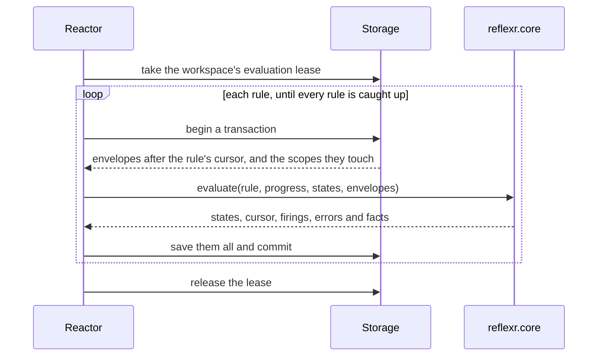
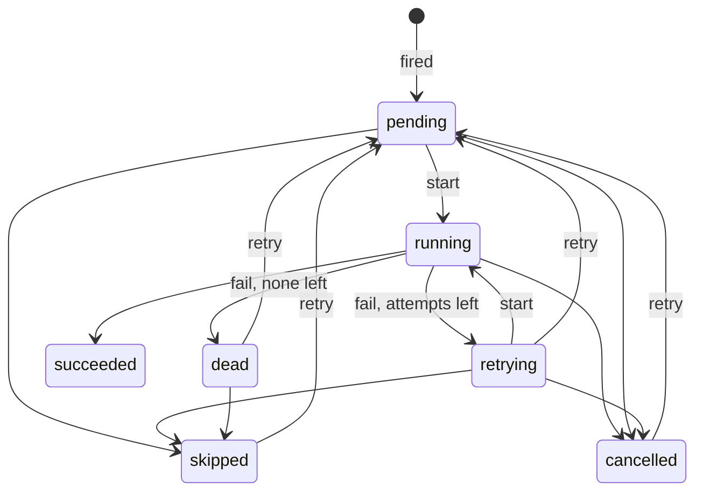

# The reactor

The `Reactor` is reflexr's runtime. It does two jobs with different guarantees: it **evaluates** rules over each workspace's log, exactly once per envelope and rule, and it **executes** the runs their firings create, at least once, with retries ([ADR-0005](../adr/0005-per-rule-cursors.md)). This page covers running it, what each half does, retries, ordering, replays, and running several reactors at once.

## Running the reactor

A reactor is built from the `Workspaces` that hold the rules, the actions those rules run by name, and the application's dependencies, which every action receives:

```python
from datetime import timedelta

from reflexr import F, Rule, by, on, run
from reflexr.workspace import InMemoryStorage, Reaction, Reactor, Workspaces

error_spike = Rule(
    name="error-spike",
    when=on(ServiceError).where(F.severity >= 7).count(at_least=3, within=timedelta(minutes=1)),
    scope=by(F.service),
    then=run("page"),
)


async def page(reaction: Reaction[AppDeps]) -> dict[str, str]:
    service = str(reaction.scope["service"])
    await reaction.deps.pager.notify(service, key=reaction.run_id)
    return {"paged": service}


workspaces = Workspaces(InMemoryStorage(), events=[ServiceError], rules=[error_spike])
reactor = Reactor(workspaces, actions={"page": page}, deps=AppDeps(pager=pager))
```

The reactor checks at construction that every rule's action is in `actions`, and raises `InvalidRule` if one is missing. Without `deps`, it is a `Reactor[None]`, and its actions receive a `Reaction[None]`.

In a service, run `serve()` for as long as the process lives, for example as a task started in your application's lifespan ([Serving](serving.md#mounting-the-router)). It ticks schedules, evaluates and executes in a loop, sleeping `poll_interval` (one second by default) between rounds, until it is stopped. A round that fails, as when the database is briefly unreachable, is logged on the `reflexr.reactor` logger and the next round tries again; leases and transactions leave nothing half done ([ADR-0027](../adr/0027-executing-runs.md)). A round checks for work untraced, so an idle reactor sends no traces; each evaluation, tick and run attempt it finds is traced ([Observability](observability.md#polling)).

To stop it, give it an `asyncio.Event` and set it:

```python
stop = asyncio.Event()
task = asyncio.create_task(reactor.serve(stop=stop, grace=timedelta(seconds=5)))
...
stop.set()
await task  # returns once the reactor has let go of everything
```

A stop never interrupts a transaction. Evaluation stops after its current batch, and the next reactor carries on from the cursor. Runs waiting for one of the `concurrency` places do not start. Running actions have `grace` (5 seconds by default) to end. Those that have not ended by then are cancelled, and each attempt is recorded as abandoned (the reason `abandoned`), a failed attempt that is retried under the rule's [policy](#retries-and-dead-letters); a graph resumes from its last checkpoint. Then the reactor releases its leases, and `serve` returns. An action is only ever cancelled between the storage calls it makes through its workspace, so one that is saving a checkpoint, publishing or reading the log finishes that first; a subscription is cancelled where it waits.

A signal handler can set the same event, as in a worker process that runs only the reactor:

```python
loop = asyncio.get_running_loop()
loop.add_signal_handler(signal.SIGTERM, stop.set)
await reactor.serve(stop=stop)
```

Without `stop`, `serve()` runs until its task is cancelled. Cancelling stops it wherever it is, in the middle of a transaction too, which on SQLite can leave the connection holding the database's write lock, so prefer `stop` in a service.

In tests and scripts, `settle()` does the same until nothing more happens now, and says what it did:

```python
monitor = await workspaces.open("acme", "prod", actor=SourceActor(name="monitor"))
for _ in range(3):
    await monitor.publish(ServiceError(service="auth", severity=8))

print(await reactor.settle())

for envelope in await monitor.read():
    print(envelope.seq, envelope.actor.kind, envelope.event_type)
```

```text
Settled(ticks=0, firings=1, attempts=1)
1 source service.error
2 source service.error
3 source service.error
4 system rule_fired
5 system run_started
6 system run_succeeded
```

`settle()` leaves runs that are waiting to retry later alone, and raises `RuntimeError` if work is still happening after `max_rounds` rounds (100), as when rules keep triggering each other within the depth limit ([Loop and spend safety](safety.md)). A round that finds a lease it needs held by another reactor, on a workspace to evaluate or a run to attempt, is not a round in which nothing happens: `settle()` waits a few milliseconds, longer each time up to a tenth of a second, and tries again. So several reactors settling on one database stop only when none of them has anything left to do ([Several processes](#several-processes)).

| Method | What it does |
|---|---|
| `serve(poll_interval=, stop=, grace=)` | `tick`, `evaluate` and `execute` in a loop, until `stop` is set (or the task is cancelled) |
| `settle(max_rounds=)` | The same, until a round does nothing and meets no lease another reactor holds; returns `Settled(ticks, firings, attempts)` |
| `tick()` | Publishes the [schedules](schedules.md)' due ticks; returns how many |
| `evaluate(workspace=None)` | Evaluates every enabled rule over new envelopes, in one workspace or in all; returns how many times rules fired |
| `execute(limit=100)` | Attempts up to `limit` due runs that can start; returns how many attempts finished |

| Option | Default | Meaning |
|---|---|---|
| `actions` | | What rules run, by the name they refer to them by |
| `deps` | `None` | The application's dependencies, in every action's `Reaction` |
| `holder` | a new random id | This reactor's name in leases; give each process its own |
| `batch_size` | 500 | How many envelopes one transaction evaluates for one rule |
| `lease_ttl` | 30 seconds | How long a lease lasts unless its holder renews it |
| `concurrency` | 10 | How many runs this reactor executes at once |
| `run_context` | `None` | A context entered around each run attempt ([Observability](observability.md#the-run-context)) |

## Evaluation

Deciding is exact. For each workspace with a log, the reactor takes the workspace's evaluation lease, so only one reactor evaluates it at a time. Then, for each rule, in one storage transaction, it:

1. reads the envelopes after the rule's cursor, up to `batch_size`
2. asks core which scopes they touch, and loads those scopes' state
3. lets core decide (`reflexr.core.evaluate`), which is pure: it reads no clock and does no I/O
4. saves the new scope states, the advanced cursor, a pending run for each firing, and the `rule_fired` and `rule_errored` facts



A crash before the commit means the same envelopes are evaluated again against the same state, so each envelope affects each rule exactly once. The reactor evaluates in passes until no rule has anything new, because one rule's facts (a `rule_fired`, a `run_succeeded`) can be what another rule watches. It renews its lease between batches and stops if it loses it. `batch_size` bounds each transaction, which holds the workspace's lock and so delays publishing while it runs.

When a rule cannot evaluate an envelope, because a predicate raised or the event lacks the rule's scope fields, the envelope is dead-lettered for that rule alone: it is recorded as a `rule_errored` fact and in `workspace.dead_letters()`, and the rule moves on. Other rules are not affected ([ADR-0017](../adr/0017-the-cores-evaluation-contract.md)).

## Where a rule starts

Each rule has its own cursor in each workspace, so rules start, catch up and reset independently ([ADR-0026](../adr/0026-the-reactors-evaluation.md)):

| Situation | Where the rule starts |
|---|---|
| A new workspace | Every registered rule starts at the workspace's first event |
| A rule added to workspaces that already have events | At the head of the log with `start="now"` (the default), or at the beginning with `start="beginning"` |
| A rule whose definition changed | Afresh at the head of the log, with a new generation and a `rule_reset` event (`reason: "changed"`) |
| A disabled rule added to workspaces that already have events | Nowhere until it is enabled; then as a rule added later |

A rule's definition is its condition and its scope; a hash of them is stored with its cursor. Changing its action, retry policy, ordering or timeout, or disabling it, does not reset it. To evaluate history again after a change, [replay the rule](#replaying-a-rule).

## Disabling a rule

A rule with `enabled=False` stays registered: `Workspaces` checks it, the reactor checks that its action is given, it is listed by `GET /rules`, and it can be replayed. The reactor leaves it be. It does not evaluate the rule, so the rule's cursor holds and it records no firings, and it does not claim the rule's pending or retrying runs, which wait without holding up any other rule's runs. A new workspace still meets it at its first event, as it meets every rule.

```python
error_spike = Rule(
    name="error-spike",
    when=on(ServiceError).where(F.severity >= 7).count(at_least=3, within=timedelta(minutes=1)),
    scope=by(F.service),
    then=run("page"),
    enabled=False,  # while the pager is being replaced
)
```

Enabling it again resumes it from its cursor: it evaluates everything that arrived while it was off and fires for what it finds, late, and its waiting runs are attempted. That is at least once, as everything the reactor does. `enabled` is not part of the rule's [definition](#where-a-rule-starts), so turning a rule off and on never resets its state. To skip the backlog instead, replay the rule quietly from the head of the log in each workspace, just before enabling it:

```python
await workspace.replay_rule("error-spike", from_seq=await workspace.head_seq(), mode="rebuild")
```

The workspace's rule status, `GET /v1/workspaces/{workspace_id}/rules` or the MCP `rule_status` tool, says whether each rule is enabled. A disabled rule's lag grows there, but the `reflexr.evaluation.lag` metric leaves it out, since it is behind by choice.

## Execution

Acting is at least once ([ADR-0027](../adr/0027-executing-runs.md)). A firing creates a pending **run** whose id is the firing's id. `execute()` finds the due runs of enabled rules that can start, across workspaces, and attempts up to `concurrency` of them at a time. With `ordering="scope"` that is the first unfinished run of each scope, so a backlog in one scope takes one place in `limit` and does not hold up the others ([Ordering](#ordering)). Each attempt has three steps:

1. **Claim.** Under the run's lease, one transaction checks that the run is still due and first in its scope, and appends `run_started`.
2. **Act.** The action runs outside any transaction, with a [`Reaction`](actions.md#the-reaction), inside an `invoke_workflow {rule}` span. The reactor renews the run's lease every third of `lease_ttl` while the action works.
3. **Record.** One transaction appends `run_succeeded`, `run_retrying` or `run_dead_lettered`, but only if the run is still running this attempt. An executor that lost its lease, or whose run an operator cancelled, cannot overwrite a newer state.

An action returns the run's output, or raises to fail the attempt. The output must be JSON-compatible data or a Pydantic model, which is dumped as JSON; anything else fails the attempt with "the action returned a value that is not JSON". A rule's `timeout` bounds each attempt: an action that runs longer is cancelled, and the attempt fails with "the action timed out after ..." and the reason `timeout`. Cancelling a running run (`workspace.cancel_run`) stops its action within a third of `lease_ttl`.

Every transition of a run is a pure function in `reflexr.core`, applied inside a transaction together with the fact it appends:



Runs whose rule is no longer registered are cancelled, with a reason, so they stop being due.

## Retries and dead letters

A failed attempt is retried under the rule's `RetryPolicy`, with exponential backoff:

| Field | Default | Meaning |
|---|---|---|
| `max_attempts` | 5 | Attempts before the run is dead-lettered |
| `backoff` | 1 second | The delay after the first failure |
| `multiplier` | 2.0 | Each further delay is this many times the last |
| `max_backoff` | 5 minutes | The longest delay |

```python
from reflexr import RetryPolicy

policy = RetryPolicy(max_attempts=3, backoff=timedelta(seconds=10))
[policy.delay(n) for n in (1, 2, 3)]  # 10, 20 and 40 seconds
```

A failure appends `run_retrying`, with the error and the time of the next attempt. When no attempts are left, the run's status becomes `dead` and `run_dead_lettered` is appended.

An action that knows why it failed says so by raising `RunFailure` with a **reason**: a short, stable code, as opposed to the message, which is for people ([ADR-0036](../adr/0036-typed-run-failures.md)). A failure that retrying cannot fix is **permanent**, and is dead-lettered at once, whatever the retry policy allows:

```python
from reflexr.workspace import RunFailure


async def page(reaction: Reaction[AppDeps]) -> None:
    service = str(reaction.scope["service"])
    if service == "legacy":
        raise RunFailure(f"{service} has no on-call rotation", reason="no_rotation", permanent=True)
    if not await reaction.deps.pager.is_up():
        raise RunFailure("the pager is down", reason="pager_down")
    await reaction.deps.pager.notify(service, key=reaction.run_id)
```

With the pager down, an error from `legacy` and one from `auth` leave their runs like this after one attempt each:

| Scope | Status | Attempts | Reason | Error |
|---|---|---|---|---|
| `legacy` | `dead` | 1 | `no_rotation` | legacy has no on-call rotation |
| `auth` | `retrying` | 1 | `pager_down` | the pager is down |

The reason is recorded on the run (`run.reason`, cleared when it succeeds), on its `run_retrying` and `run_dead_lettered` events, and as the `reflexr.run.reason` attribute of the `reflexr.runs` metric, so dashboards can break failures down by it. Keep reasons to a small set of codes, since each becomes a metric series. reflexr uses two of its own: `timeout`, for an attempt that exceeded the rule's `timeout`, and `abandoned`, for an attempt whose executor stopped. Any other exception fails the attempt without a reason, and is retried. The [LLM gateway](gateway.md)'s guardrail blocks are permanent failures of this kind, with the reason `guardrail_blocked`.

A dead-lettered run stays in storage, with its last error and reason, until someone acts on it:

```python
ada = workspace.as_actor(UserActor(id="ada"))
run = await ada.retry_run(run_id)  # pending again, with a fresh retry budget
```

| Operation | Applies to | Appends |
|---|---|---|
| `retry_run(run_id)` | Any run that is not running or succeeded; a finished one gets a fresh retry budget | `run_requeued` |
| `skip_run(run_id, reason=None)` | A pending, retrying or dead-lettered run, which then stops holding back its scope | `run_skipped` |
| `cancel_run(run_id, reason=None)` | A pending, running, retrying or dead-lettered run, stopping its action if it is running | `run_cancelled` |

Each operation is attributed to the handle's actor, so the log records who intervened, and each is also a protocol command over [REST and the WebSocket](serving.md) and [MCP](mcp.md).

Dead-lettered runs are not the same as the dead letters of evaluation: `workspace.runs(status="dead")` lists runs whose action kept failing, and `workspace.dead_letters()` lists envelopes a rule could not evaluate.

## Ordering

With the default `ordering="scope"`, the runs of one rule and one scope execute in firing order, one at a time. A run that fails and waits to retry holds back the later runs of its scope, and nothing else. Here a rule pages for every error, and the pager fails once, on the first `auth` run:

```text
auth 1 retrying RuntimeError: the pager is down
auth 2 pending None
billing 3 succeeded None
```

The second `auth` run waits behind the first; `billing` is another scope and goes ahead. When the retry succeeds, the second `auth` run follows.

| Option | Values | Meaning |
|---|---|---|
| `ordering` | `"scope"` (default), `"none"` | In firing order per scope, or in parallel |
| `on_dead_letter` | `"continue"` (default), `"block"` | After a run of a scope is dead-lettered, later runs of the scope continue, or wait until an operator retries or skips it |

Use `ordering="none"` for actions whose runs are independent, such as notifications, and `on_dead_letter="block"` when later runs must not act on a state that the failed run should have changed.

## Replaying a rule

Replaying resets a rule so that the reactor evaluates the log again from a given position. It is how history is reprocessed after a fix ([ADR-0026](../adr/0026-the-reactors-evaluation.md)):

```python
await workspace.replay_rule("error-spike", from_seq=0, mode="rebuild")
await reactor.settle()
```

| Mode | What it does |
|---|---|
| `"rebuild"` (default) | Recomputes the rule's state up to the head of the log without recording firings or errors, then carries on as normal. Nothing in the past is acted on again. |
| `"refire"` | Fires again for everything it finds, as new runs with new ids. |

`replay_rule` clears the rule's scope states, saves its new progress with a new generation, and appends `rule_reset` (`reason: "replayed"`, with `from_seq` and `silent_through`, the position up to which a rebuild records nothing), attributed to whoever asked. The reactor does the evaluating. `from_seq` must be between 0 and the head of the log, or the replay is rejected with `validation_failed`.

## Several processes

Any number of reactors, in any number of processes, can share the work, as long as they share a storage that works across processes, such as [SQL storage](storage.md#sql-storage); in-memory storage lives in one process. Leases divide the work:

- **One evaluator per workspace.** A reactor that finds another holding a workspace's evaluation lease skips that workspace for now; in `settle()`, it looks again shortly.
- **One executor per run.** A run's lease is taken before its attempt and renewed while the action works. A reactor that finds a run leased leaves it to the other; in `settle()`, it looks again shortly, since the other may be about to find that the run cannot start yet and let it go.
- **One publisher per tick.** Ticks have ids derived from the schedule and the time, so replicas never publish one twice.

A lease lapses when its holder stops renewing it for `lease_ttl`. If a reactor dies, or is cancelled, in the middle of a run, the run becomes due again once its lease lapses or is released, and the next claim records the abandoned attempt as a failed one ("the attempt was abandoned: its executor stopped", with the reason `abandoned`). A reactor [stopped](#running-the-reactor) with `stop` records the same itself, for the actions it had to cancel, and releases their leases, so another reactor retries them after the rule's backoff without waiting for a lease to lapse. So the retry policy also bounds actions that keep crashing their process. Give each process its own `holder`, so the leases say which process holds what.
