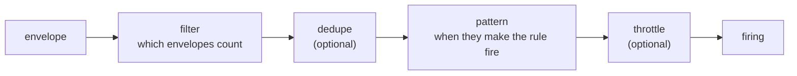

# Rules

A rule says what to watch for in a workspace's log, how to partition what it watches, and which action to run when its condition holds. Rules are typed, serializable data rather than code ([ADR-0006](../adr/0006-rules-as-typed-serializable-data.md)), so they can be listed, diffed, validated, stored as JSON and written by an agent as easily as by a person. This page covers a rule's fields, its condition (filters, dedupe, patterns and throttle), scopes, how rules measure time, how they are checked, their JSON form, and rules stored in a workspace at runtime.

## A rule is data

A `Rule` is a frozen Pydantic model. This one runs the `triage` action when a service logs three severe errors within a minute, at most once every fifteen minutes per service:

```python
from datetime import timedelta

from reflexr import F, Rule, by, on, run

error_spike = Rule(
    name="ops:error-spike",
    description="Three severe errors from one service within a minute",
    when=on(ServiceError)
    .where(F.severity >= 7)
    .count(at_least=3, within=timedelta(minutes=1))
    .at_most(1, per=timedelta(minutes=15)),
    scope=by(F.service),
    then=run("triage"),
)
```

| Field | Default | Meaning |
|---|---|---|
| `name` | required | The rule's identity, qualified like an event type: a namespace, a `:` and a name of lowercase letters, digits, `.`, `_` and `-`, such as `ops:error-spike`, at most 100 characters. The `reflexr` namespace is reserved. Its state, cursor and runs are stored under it |
| `description` | `""` | What the rule is for. An agent action is told it in its prompt |
| `when` | required | The condition: a filter, and optionally dedupe, a pattern and a throttle ([Conditions](#conditions)) |
| `scope` | the whole workspace | The event fields that partition the rule's state and ordering ([Scopes](#scopes)) |
| `then` | required | The action to run, by name: `run("triage")`, or `run(triage)` given the action itself, with the params it takes, if any: `run("notify", thread_id="thr_4")` ([Parameters](actions.md#parameters)) |
| `retry` | `RetryPolicy()` | How a failed run is retried: 5 attempts, backing off from 1 second, doubling, up to 5 minutes ([Retries and dead letters](reactor.md#retries-and-dead-letters)) |
| `ordering` | `"scope"` | `"scope"` runs one scope's runs in firing order; `"none"` runs them in parallel ([Ordering](reactor.md#ordering)) |
| `on_dead_letter` | `"continue"` | Whether a scope's later runs continue past a dead-lettered run, or `"block"` until someone retries or skips it |
| `start` | `"now"` | Where the rule starts in a workspace whose log already has events: its head, or `"beginning"` ([Where a rule starts](reactor.md#where-a-rule-starts)) |
| `timeout` | `None` | How long one attempt of the action may take before it is cancelled and counts as failed |
| `enabled` | `True` | Whether the reactor evaluates the rule and executes its runs. A disabled rule stays registered and checked, its cursor holds, and its runs wait ([Disabling a rule](reactor.md#disabling-a-rule)) |

Actions are code, so a rule refers to its action by name, and the [reactor](reactor.md) is given the actions by the same names. Rules are registered on `Workspaces`, which checks them when it is built ([Checking rules](#checking-rules)); every workspace evaluates every registered rule that is enabled.

## Conditions

A rule's `when` is a `Condition`: a pipeline of stages, evaluated per scope.



The builder names each stage, and each call returns a new condition:

| Builder | Stage | What it does |
|---|---|---|
| `on(ServiceError, Deploy)` | filter | Start a condition on envelopes of these types, by class or by name |
| `.where(F.severity >= 7, service="auth")` | filter | Narrow the filter: every filter given, and every field equal to its keyword |
| `.distinct(F.message, within=...)` | dedupe | Drop an envelope whose key fields were already seen within the window |
| `.count(at_least=3, within=...)` | pattern | Fire when enough envelopes pass within the window |
| `.absent(within=...)` | pattern | Fire when nothing has passed for the window |
| `sequence(step, step, within=...)` | pattern | Fire when envelopes match the steps in order |
| `.at_most(1, per=...)` | throttle | Allow at most so many firings per scope in any period |

A condition has one pattern: calling `.count` on a condition that already counts raises `ValueError`. Without a pattern, every envelope that gets through the filter fires.

## Filters

Filters are stateless: they decide from one envelope alone whether it counts. Field references start at `F`, and comparisons build filters:

```python
from reflexr import F, on

on(ServiceError).where(F.severity >= 7)
on(ServiceError).where(F.service.eq("auth"))  # the same as .where(service="auth")
on(ServiceError).where(F.service.is_in(["auth", "billing"]), F.message.contains("timeout"))
```

| Operator | Built with | Matches when the field |
|---|---|---|
| `eq`, `ne` | `F.x.eq(v)`, `F.x.ne(v)`, or `where(x=v)` | equals, or exists and does not equal, the value |
| `lt`, `le`, `gt`, `ge` | `F.x < v`, `<=`, `>`, `>=` | compares with the value: numbers with numbers, strings with strings |
| `in` | `F.x.is_in([...])` | equals one of the values |
| `contains` | `F.x.contains(v)` | is a list containing the value, or a string containing it |
| `matches` | `F.x.matches(pattern)` | is a string the regular expression finds a match in |
| `exists` | `F.x.exists()`, `F.x.exists(False)` | is present, or absent |

A missing field matches nothing except `exists(False)`, and an ordering between a number and a string is false rather than an error. Equality is spelled `eq` because `==` has to return a bool. Nested fields are dotted, as in `F.labels.env`, and `field("contains")` (from `reflexr`) refers to a field whose name clashes with one of the methods.

Several filters given to `where` must all match. For either-or and negation, build the filter models directly:

```python
from reflexr.core import AnyFilter, NotFilter

on(ServiceError).where(
    AnyFilter(of=(F.service.eq("auth"), F.service.eq("billing"))),
    NotFilter(filter=F.message.matches(r"^healthcheck")),
)
```

Anything the filters cannot express can be a **predicate**: a pure Python function over the event, registered by name on `Workspaces(predicates={"business_hours": business_hours})` and used as `.where(PredicateFilter(name="business_hours"))`. The rule stays data, since it names the predicate rather than containing it. A predicate that raises is an evaluation error for that rule and that envelope.

Field references are checked when the condition is built, against the event types that can reach them, so a typo fails at once:

```text
ValueError: no field 'severty' on ops:service.error
```

A field is checked only on the types its own conjunction admits: the types of the `on` filters beside it in an `AllFilter`, or, without one, the types the enclosing filter admits. An either-or of `on(ServiceError).where(F.severity >= 7)` and `on(Deploy)` checks the severity on `ops:service.error` alone, while a `where` beside an either-or of both types must be a field of both. A `NotFilter` takes away the types it rejects whatever their fields, and a `where` with no `on` to go by is not checked. At run time, a field an envelope does not have compares as false, never as an error.

## Patterns

The pattern decides when the envelopes that pass the filter make the rule fire. Each scope has its own pattern state.

| Pattern | Fires | State |
|---|---|---|
| each (the default) | For every envelope that passes | None |
| `.count(at_least=3, within=timedelta(minutes=1))` | When that many envelopes pass within the window. The firing consumes them, so the count starts again | The envelopes counted so far |
| `sequence(on(Deploy), on(ServiceError), within=timedelta(minutes=10))` | When envelopes match the steps in order, all within the window of the first. A new first step while a sequence waits starts it again from there, so the latest start counts | How far through its steps it is |
| `.absent(within=timedelta(minutes=5))` | Once, when a scope that has been seen goes quiet for the window, and again only after the next matching envelope rearms it | The last envelope that passed |

The other two rules of the incident-response example use them:

```python
from reflexr import sequence

deploy_regression = Rule(
    name="ops:deploy-regression",
    when=sequence(on(Deploy), on(ServiceError), within=timedelta(minutes=10)),
    scope=by(F.service),
    then=run("runbook"),
)

heartbeat_lost = Rule(
    name="ops:heartbeat-lost",
    when=on(Heartbeat).absent(within=timedelta(minutes=5)),
    scope=by(F.service),
    then=run("page"),
)
```

A sequence's steps are filter-only conditions, such as `on(Deploy)`; a step with its own pattern, dedupe or throttle raises `ValueError`. Each step may filter on the fields of its own types: in `sequence(on(Deploy), on(ServiceError).where(F.severity >= 7), within=timedelta(minutes=10))` the severity is checked on service errors only. An absence can only fire for scopes it has seen: a service that never sent a heartbeat never goes quiet. Its firing matches the last envelope it saw, the last heartbeat, not the event that happened to pass the deadline.

## Dedupe and throttle

The two optional stages keep a noisy source from firing too often, and both are per scope:

```python
on(ServiceError).distinct(F.message, within=timedelta(minutes=5))  # dedupe
on(ServiceError).at_most(1, per=timedelta(minutes=15))  # throttle
```

- **Dedupe** drops an envelope whose key fields (here the message) were already seen within the window, before the pattern sees it. Four errors with the messages `timeout`, `timeout`, `refused`, `timeout` fire twice.
- **Throttle** allows at most so many firings per scope in any period. A firing over the limit is dropped, not delayed, and for a count the envelopes it matched are still consumed. With `ops:error-spike`, seven severe errors from `auth` five seconds apart fire once: the second group of three completes within the fifteen minutes and is dropped.

A throttle is also a spending limit: it bounds how often a rule can start an agent ([Loop and spend safety](safety.md#throttles)).

## Scopes

`scope=by(F.service)` gives a rule independent state and ordering per service. Three errors from `auth` and two from `billing` are two separate counts, and a slow run for `auth` never delays `billing`'s runs. Scope by several fields with `by(F.service, F.region)`. Without a scope, the whole workspace is one scope.

Each scope is identified by its **scope key**, the canonical JSON of its field values, such as `["auth"]` or `["auth","eu"]`. Firings, runs and the `reflexr:rule_fired` event carry the key and the values, and the values are what an action sees as `reaction.scope`.

An envelope that passes a rule's filter but lacks one of its scope fields cannot be evaluated by that rule. The rule records `reflexr:rule_errored`, dead-letters the envelope for itself alone, and moves on; other rules are unaffected. `workspace.dead_letters()` lists such envelopes. [Checking rules](#checking-rules) catches the usual cause, a scope field the event types do not have, at startup.

## Time

Rules measure time by the log, never by a clock ([ADR-0007](../adr/0007-rule-state-as-pure-reducers.md)). Each envelope's `ts` is assigned when it is appended and never decreases within a workspace, and windows, sequences, absences, dedupe and throttles all compare those timestamps. Evaluating the same log with the same rules therefore always decides the same firings, with the same ids, which is what makes rules testable without I/O and safe to [replay](reactor.md#replaying-a-rule).

Every envelope moves a rule's clock forward, including envelopes its filter rejects. When the clock passes an `absence` deadline, the rule fires for every scope whose window has ended. So a deploy from another service, or a schedule's tick, lets `ops:heartbeat-lost` notice that `auth` went quiet, even though neither is a heartbeat and neither has anything to do with `auth`. In a workspace with nothing else going on, a [schedule](schedules.md#keeping-time-moving) keeps time moving.

## Checking rules

A rule names event types, fields, predicates and an action that live elsewhere, and a typo in any of them would make it silently never match. So rules are checked before they run. `Rule.check` lists every problem at once:

```python
from reflexr.core import PredicateFilter

bad = Rule(
    name="ops:bad",
    when=on("ops:service.eror").where(PredicateFilter(name="business_hours")),
    then=run("triage"),
)
bad.check(events={"ops:service.error": ServiceError}, actions={"page"})
```

```text
reflexr.core.errors.InvalidRule: rule 'ops:bad' is invalid: no event type 'ops:service.eror'; no predicate 'business_hours'; no action 'triage'
```

`InvalidRule` is a `ValueError`, and its `problems` attribute lists the problems one by one, each once. A name without a namespace fails before that, as the rule is built or loaded: `on("service.error")` raises `ValidationError` with `event type 'service.error' has no namespace; did you mean 'ops:service.error'?`.

You rarely call it yourself:

- **`Workspaces(storage, events=[...], rules=[...], predicates={...})`** checks every rule against the event types it accepts (or every type in its registry, without an allowlist) and the predicates, and raises `InvalidRule` at startup. reflexr's own events, such as `reflexr:rule_fired` and `reflexr:tick`, are always available to rules. Two rules with the same name raise `ValueError`.
- **`Reactor(workspaces, actions={...})`** checks that every rule's action is among the actions it was given, and that the rule's params validate as the action's params model ([Parameters](actions.md#parameters)).

Fields are checked on the types that can reach them, as [the builder](#filters) checks them: a `where` on the types of its own conjunction, a sequence's steps on the types its filter admits, and the scope and dedupe fields on every type the filter admits. They are checked through nested Pydantic models. A path through a `dict` field cannot be checked, and is accepted.

## Rules as JSON

A rule serializes to plain JSON, with durations as ISO 8601 strings. This is `ops:error-spike`, written by hand; fields left out take their defaults:

```json
{
  "name": "ops:error-spike",
  "description": "Three severe errors from one service within a minute",
  "when": {
    "filter": {"kind": "all", "of": [
      {"kind": "on", "types": ["ops:service.error"]},
      {"kind": "where", "field": "severity", "op": "ge", "value": 7}
    ]},
    "pattern": {"kind": "count", "at_least": 3, "within": "PT1M"},
    "throttle": {"at_most": 1, "per": "PT15M"}
  },
  "scope": {"fields": ["service"]},
  "then": {"action": "triage"}
}
```

`Rule.model_validate_json(text)` reads it back, equal to the rule the builder made, and `rule.model_dump_json()` writes it, with every field. The JSON Schema of a rule is generated from the models into [`schemas/reflexr.rules.v1.json`](https://github.com/alexnodeland/reflexr/blob/main/schemas/reflexr.rules.v1.json), so a form or an agent that writes rules can validate them before they reach `Rule.check` ([JSON Schemas](../reference/schema.md)).

Code rules are registered when the application starts. `rule.definition()` is a hash of what the rule decides, its condition and its scope. When a deployed rule's definition changes, its old state no longer applies, so it starts afresh; changing its action, its params, retries or ordering, or disabling and enabling it, keeps its state ([Where a rule starts](reactor.md#where-a-rule-starts)).

## Stored rules

A stored rule is the same `Rule`, installed in one workspace at runtime rather than registered in code, as when a person accepts a rule drafted in chat ([RFC-0003](../rfcs/0003-managing-rules-at-runtime.md)). Stored rules are off unless `Workspaces` is given a `StoredRules`:

```python
from reflexr.core import Actor, AgentActor, RuleChange, StoredRules, TenantId, WorkspaceId


async def allow(
    tenant_id: TenantId, workspace_id: WorkspaceId, actor: Actor, change: RuleChange
) -> bool:
    return isinstance(actor, AgentActor) and actor.rule == "relayr:install-rule"


workspaces = Workspaces(
    storage,
    rules=[...],
    stored_rules=StoredRules(allow=allow, actions={"notify": NotifyParams}, namespaces={"chat"}),
)
```

- **`allow`** is asked about every change, as `authorize` is about a workspace, with the `RuleChange`: which command, which rule, and the new rule. A refusal is `forbidden`.
- **`actions`** are the only actions a stored rule may run, each with the params model it declares, or `None`. The reactor checks when it is built that each is among its actions and declares that model.
- **`namespaces`** are the rule namespaces stored rules may use. `Workspaces` refuses a code rule in one of them, so a stored rule never shares a code rule's name. A deploy that drops a namespace hides its stored rules, as one without `StoredRules` hides them all, and the reactor cancels their runs; they can still be archived.

Everything else is fixed, the same for every tenant, and `check_stored(rule, config)` lists every way a rule breaks it: a throttle is required, allowing at most 60 firings in any hour; there are no scope fields, predicates or `matches`; `ordering` is `"none"`, `on_dead_letter` `"continue"` and `start` `"now"`, and the rule is enabled; and retries, the timeout, windows, the description and the rule's JSON are bounded. A change's provenance may have at most 4 KiB of JSON (`check_provenance`), and a workspace at most 50 active stored rules.

A workspace handle changes them, as its actor:

```python
relayr = await workspaces.open("acme", "prod", actor=installer)
installed = await relayr.install_rule(rule, provenance={"artifact": "art_rule_7"})
await relayr.update_rule(changed, expected_version=installed.stored.version)
await relayr.archive_rule(rule.name, reason="the artifact was archived")
```

- **`install_rule`** stores version 1, or the next version of an archived rule. The rule starts at its own `reflexr:rule_installed` fact, which carries the whole rule and its provenance, so it acts only on what is logged after it.
- **`update_rule`** stores the next version of an active rule. A new condition or scope resets it at its fact, with `reflexr:rule_reset`, as a changed code rule is reset; any other change keeps its state. With `expected_version`, a rule someone else changed first is `invalid_state`, naming its version.
- **`archive_rule`** is the only way to stop one. In one transaction it cancels the rule's unfinished runs, clears its state, and appends `reflexr:rule_archived`, which counts the runs it cancelled. Its progress stays, so a rule installed again under the name starts afresh in its next generation and never reuses a firing id.

Each returns a `RuleVersion`: the stored rule as the change left it, and the `seq` of its fact. A change that would leave the rule as it is appends nothing and is a `duplicate`, even with an out-of-date `expected_version`, so a retry of a change that succeeded is safe. Installing and updating check the rule as `Workspaces` checks code rules, then with `check_stored` and `check_provenance`, and a rule with problems is `validation_failed`, listing them all. The same commands, `install_rule`, `update_rule` and `archive_rule`, go through `reflexr.workspace.execute` like every other ([Commands](../protocol.md#commands)), so clients make the same changes over [REST and the WebSocket](serving.md#stored-rules) and [MCP](mcp.md#stored-rules).

`Workspaces.rules_in` is the one way to find a workspace's rules: its code rules, then its active stored rules in the configured namespaces. The reactor reads them for every pass, batch and claim, with no cache, so a rule installed while reactors serve fires on the next matching event, and a run executes the version its claim reads. `get_rule` returns one rule, with a stored rule's version and provenance, and `rule_statuses` reports each rule's `origin` and `version`. A rule never sees the facts about its own changes; other rules can watch them.
