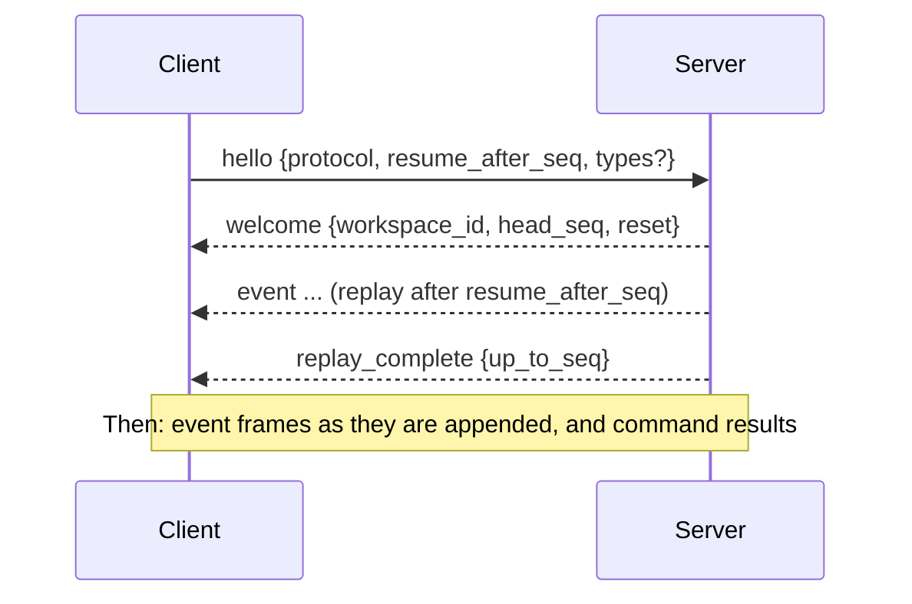

# Stream protocol v1

> **Status:** implemented. The frames and commands are in `reflexr.core.protocol`, and their JSON Schema is generated into [`schemas/reflexr.v1.json`](https://github.com/alexnodeland/reflexr/blob/main/schemas/reflexr.v1.json); one handler, `reflexr.workspace.execute`, carries out every command. REST and the WebSocket are served by `reflexr.fastapi`, and MCP by `reflexr.mcp` (phase 5 of [RFC-0001](rfcs/0001-v0.1-implementation-plan.md)). The structure is settled by [ADR-0016](adr/0016-tenants-and-workspaces-like-artifactr.md), [ADR-0005](adr/0005-per-rule-cursors.md) and [ADR-0011](adr/0011-surfaces.md). Its shape deliberately matches artifactr's thread protocol, so one client library can speak both.

Clients publish events into a workspace, read its log with resume, and operate rules and runs. The same commands are available over REST, over a WebSocket, and as MCP tools, and every surface hands them to the same handler, so they behave identically.

## Commands

A command is a JSON object with a `type`. Over REST and WebSocket it travels in a frame that carries a client-chosen `command_id`; a retried `command_id` returns the original result without running again.

```json
{"type": "command", "command_id": "cmd_7", "command": {"type": "publish", "event": {"type": "service.error", "service": "auth", "severity": 8, "message": "token check failed"}}}
```

| Command | Fields | Outcome |
|---|---|---|
| `publish` | `event` (with its `type`), `id?`, `correlation_id?` | `published`: `{seq, id, duplicate}`. Publishing an `id` that is already in the workspace returns the existing `seq` with `duplicate: true`. `correlation_id` joins an existing causal chain by the id of its first event: an id not in the log is `not_found`, and the id of a later event in a chain is `validation_failed`, with a message naming the chain it belongs to. A type the server does not accept is `not_found`; reflexr's own event types are `forbidden`. |
| `give_feedback` | `feedback_type`, `target`, `value` | `recorded`: `{seq, id}`. The value is validated against the feedback type, which must allow the target's kind; the target must exist, and a chain target must name its chain's first event, as `publish` does. |
| `retry_run` | `run_id` | The run becomes runnable now, whatever its status except `succeeded` and `running`, and `run_requeued` is appended. |
| `skip_run` | `run_id`, `reason?` | A pending, retrying or dead-lettered run is marked skipped, unblocking its scope. |
| `cancel_run` | `run_id` | A running run is cancelled and recorded as cancelled. |
| `replay_rule` | `rule`, `from_seq`, `mode` (`rebuild` or `refire`) | Resets the rule's cursor to `from_seq` and appends `rule_reset`. `rebuild` recomputes state up to the head of the log (`silent_through`) and appends no `rule_fired` or `rule_errored` events for it and creates no runs; `refire` records the firings found and creates runs for them, with new ids. `from_seq` beyond the head is `validation_failed`. |

Run commands answer with `run`: the run as it now is; `replay_rule` answers with `rule`: `{rule, progress}`. Each outcome has a `type` naming which it is.

Rejections carry a stable `type` and a `message`: `not_found`, `invalid_state`, `validation_failed` (with Pydantic's `errors`), `forbidden`, `depth_exceeded` (a publish beyond the causation limit), and `unsupported_protocol`.

## REST

`reflexr.fastapi` serves REST under a prefix the application chooses (`/v1` below).

| Method and path | Purpose |
|---|---|
| `POST /v1/workspaces/{workspace_id}/commands` | One command frame; the response body is its `command_result`. A repeated `command_id` returns the first result. |
| `POST /v1/workspaces/{workspace_id}/events` | Publish `{"event": {...}, "id"?}`, or `{"events": [{"event", "id"?}, ...], "correlation_id"?}` atomically and in order. A convenience for producers and webhooks, equivalent to `publish` commands; the response lists each `published` outcome. |
| `GET /v1/workspaces/{workspace_id}/events?after_seq=&limit=&type=` | A page of the log, as envelopes. `type` may repeat. |
| `GET /v1/rules` | The registered rules, as JSON. Rules are the application's, shared by every tenant, so every authenticated client of any tenant gets them all, and `authorize` is not asked. |
| `GET /v1/workspaces/{workspace_id}/rules` | Whether each rule is `enabled`, and its `cursor`, `lag` behind the head, `generation`, and `dead_letters` count. A disabled rule's cursor holds. |
| `GET /v1/workspaces/{workspace_id}/runs?rule=&scope_key=&status=&limit=` | Runs, newest first. |
| `GET /v1/workspaces/{workspace_id}/runs/{run_id}` | A run, with its attempts, last error and checkpoint. |
| `GET /v1/workspaces/{workspace_id}/dead-letters?rule=` | The envelopes rules could not evaluate. |
| `GET /v1/schedules` | The registered schedules, shared by every tenant as rules are, and visible to every authenticated client of any tenant, with the workspaces they target. |
| `GET /v1/workspaces/{workspace_id}/schedules` | Each schedule targeting the workspace, with its `last_tick` and `next_tick`. |

Rejections map to HTTP status codes: `not_found` → 404, `invalid_state` → 409, `validation_failed` and `depth_exceeded` → 422, `forbidden` → 403, `unsupported_protocol` → 400. A body that does not validate, such as an event whose fields do not match its type, is 422. Authentication is the host's: `resolve_actor(request)` returns the tenant and actor, or raises `Unauthorized` (401); an optional `authorize(tenant, workspace, actor)` refuses a workspace (403).

## WebSocket

`GET /v1/workspaces/{workspace_id}/stream`, subprotocol `reflexr.v1`.

### Handshake and resume



```json
{"type": "hello", "protocol": "reflexr.v1", "resume_after_seq": 41, "types": ["service.error", "rule_fired", "run_succeeded"]}
```

- `resume_after_seq` is the last `seq` the client has; the server replays everything after it. A client ahead of the log gets `reset: true` and a replay from the beginning.
- `types` filters which events are sent; `null` sends all. `replay_complete` is decided on the unfiltered log, so it always arrives.

### Server frames

- `event`: an envelope, `{"type": "event", "seq", "id", "ts", "workspace_id", "actor", "causation", "correlation_id", "traceparent", "event": {...}}`. `traceparent` is the W3C trace context of the span that published the event, or `null`.
- `command_result`: `{"type": "command_result", "command_id", "ok", "outcome" | "rejection"}`.
- `replay_complete`: `{"type": "replay_complete", "up_to_seq"}`.
- `error`: `{"type": "error", "message"}`, for a frame that is not a valid command. The connection stays open.

reflexr's own events, alongside the application's:

| `event.type` | Fields |
|---|---|
| `rule_fired` | `rule`, `scope`, `firing_id`, `matched` (the `seq`s of the matched envelopes) |
| `rule_errored` | `rule`, `seq`, `error` |
| `rule_reset` | `rule`, `generation`, `reason` (`changed` or `replayed`), `from_seq`, `silent_through` |
| `run_started` | `run_id`, `rule`, `scope`, `scope_key`, `attempt` |
| `run_progressed` | `run_id`, `step` (a graph step completed and was checkpointed) |
| `run_retrying` | `run_id`, `attempt`, `error`, `next_attempt_at`, `reason?` (a stable code, such as `timeout`) |
| `run_succeeded` | `run_id`, `output?` |
| `run_dead_lettered` | `run_id`, `attempts`, `error`, `reason?` (such as `guardrail_blocked`, which is never retried) |
| `run_cancelled`, `run_skipped` | `run_id`, `reason?` |
| `run_requeued` | `run_id` (someone made the run runnable again; the actor says who) |
| `feedback_given` | `feedback_type`, `target` (`{kind: run, run_id}`, `{kind: firing, firing_id}` or `{kind: chain, correlation_id}`), `value` |
| `tick` | `schedule`, `at` |

`actor.kind` is `user`, `agent` (`rule`, `run_id`, `name`), `external_agent` (`client_id`, `name?`), `system` (`name`), `source` (`name`) or `evaluator` (`name`, `version`). `causation` is `{firing_id, run_id, depth}` for an event a run emitted and for reflexr's facts about a firing or run (one step deeper than what fired), and `null` otherwise.

### Close codes

| Code | Meaning | Client should |
|---|---|---|
| `4400` | Bad `hello` or unsupported protocol | fix and reconnect |
| `4401` | Not authenticated | re-authenticate |
| `4403` | Actor may not access this workspace | stop |
| `4408` | `hello` not received in time | reconnect |
| `4429` | The client did not read frames fast enough | reconnect and resume |

## MCP

`reflexr.mcp` serves the same commands and reads to MCP clients, with the host's `resolve(ctx)` returning the client's tenant and `ExternalAgentActor`. An optional `authorize(tenant, workspace, actor)`, the same hook as REST's, is asked on every tool call and resource read that names a workspace, and a refusal is a tool error carrying the `forbidden` rejection's message. Commands go through the same handler as REST and the WebSocket; a rejection is a tool error carrying its message.

| MCP | reflexr |
|---|---|
| Tools `publish_event`, `read_events` | Publish and read, with the same idempotency and filters. |
| Tools `list_rules`, `rule_status`, `replay_rule` | Inspect and replay rules. `list_rules`, like `GET /v1/rules`, gives every rule to every authenticated client of any tenant. |
| Tools `list_runs`, `get_run`, `retry_run`, `skip_run`, `cancel_run`, `list_dead_letters` | Operate runs. |
| Tool `give_feedback` | Typed feedback on a run, a firing or a chain. |
| Resource template `reflexr://{tenant_id}/{workspace_id}/runs/{run_id}` | A run's current JSON, with resource-updated notifications as it progresses. Readable only by clients of that tenant. |

## Versioning and schema

- The protocol identifier is `reflexr.v1`, also the WebSocket subprotocol. Within v1, changes are additive: new optional fields and new event types. Clients ignore unknown fields and keep unknown event types as opaque envelopes, since they still carry a `seq`.
- JSON Schemas for every frame, and for rules, are generated from the Pydantic models into `schemas/` and checked in. CI fails if they drift.
