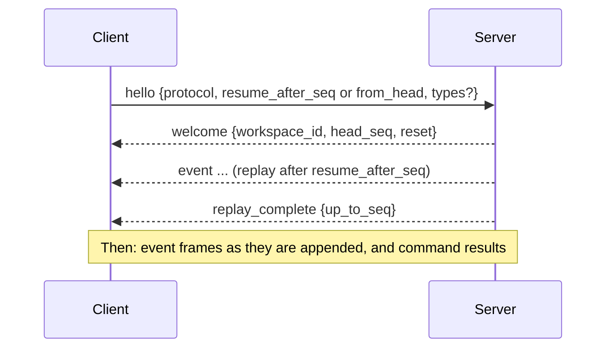

# Stream protocol v1

> **Status:** implemented. The frames and commands are in `reflexr.core.protocol`, and their JSON Schema is generated into [`schemas/reflexr.v1.json`](https://github.com/alexnodeland/reflexr/blob/main/schemas/reflexr.v1.json); one handler, `Workspaces.execute`, carries out every command, once per `command_id`. REST and the WebSocket are served by `reflexr.fastapi`, and MCP by `reflexr.mcp` (phase 5 of [RFC-0001](rfcs/0001-v0.1-implementation-plan.md)). The structure is settled by [ADR-0016](adr/0016-tenants-and-workspaces-like-artifactr.md), [ADR-0005](adr/0005-per-rule-cursors.md), [ADR-0044](adr/0044-surfaces.md) and [ADR-0047](adr/0047-commands-carried-out-once-per-id.md). Its shape deliberately matches artifactr's thread protocol, so one client library can speak both.

Clients publish events into a workspace, read its log with resume, and operate rules and runs. The same commands are available over REST, over a WebSocket, and as MCP tools, and every surface hands them to the same handler, so they behave identically.

Every event type and rule name is qualified by its owner's namespace: `ops:service.error`, `reflexr:rule_fired`, `ops:error-spike` ([ADR-0039](adr/0039-namespaced-event-types.md)). A type name is a namespace, a `:` and a local name, matching `^[a-z][a-z0-9_]*:[a-z][a-z0-9_]*(\.[a-z][a-z0-9_]*)*$`. A name without a namespace, in a publish or a type filter, is `validation_failed`, and its message names the qualified type with that local name: `event type 'rule_fired' has no namespace; did you mean 'reflexr:rule_fired'?`.

## Commands

A command is a JSON object with a `type`. Over REST and WebSocket it travels in a frame that carries a client-chosen `command_id`, which an MCP tool takes as an argument; a retried `command_id` returns the original result without running again ([Deduplication](#deduplication)).

```json
{"type": "command", "command_id": "cmd_7", "command": {"type": "publish", "event": {"type": "ops:service.error", "service": "auth", "severity": 8, "message": "token check failed"}}}
```

| Command | Fields | Outcome |
|---|---|---|
| `publish` | `event` (with its `type`), `id?`, `correlation_id?` | `published`: `{seq, id, duplicate}`. Publishing an `id` that is already in the workspace returns the existing `seq` with `duplicate: true`. `correlation_id` joins an existing causal chain by the id of its first event: an id not in the log is `not_found`, and the id of a later event in a chain is `validation_failed`, with a message naming the chain it belongs to. A type the server does not accept is `not_found`, and a name without a namespace `validation_failed`; reflexr's own event types, the `reflexr` namespace, are `forbidden`. |
| `give_feedback` | `feedback_type`, `target`, `value` | `recorded`: `{seq, id}`. The value is validated against the feedback type, which must allow the target's kind; the target must exist, and a chain target must name its chain's first event, as `publish` does. |
| `retry_run` | `run_id` | The run becomes runnable now, whatever its status except `succeeded` and `running`, and `reflexr:run_requeued` is appended. |
| `skip_run` | `run_id`, `reason?` | A pending, retrying or dead-lettered run is marked skipped, unblocking its scope. |
| `cancel_run` | `run_id` | A running run is cancelled and recorded as cancelled. |
| `replay_rule` | `rule`, `from_seq`, `mode` (`rebuild` or `refire`) | Resets the rule's cursor to `from_seq` and appends `reflexr:rule_reset`. `rebuild` recomputes state up to the head of the log (`silent_through`) and appends no `reflexr:rule_fired` or `reflexr:rule_errored` events for it and creates no runs; `refire` records the firings found and creates runs for them, with new ids. `from_seq` beyond the head is `validation_failed`. |
| `install_rule` | `rule` (the whole rule), `provenance?` | Installs a stored rule in the workspace: version 1, or the next version of an archived rule. It starts at its `reflexr:rule_installed` fact. An active rule of that name is `invalid_state`, and a workspace with 50 active stored rules is `validation_failed`. |
| `update_rule` | `rule`, `expected_version?`, `provenance?` | A new version of an active stored rule, reset at its fact, with `reflexr:rule_reset`, if its condition or scope changed. A rule at another version than `expected_version` is `invalid_state`, and the message names its version; so is an archived rule. |
| `archive_rule` | `rule` (the name), `expected_version?`, `reason?` | Archives a stored rule, cancels its unfinished runs, and appends `reflexr:rule_archived`. |

Run commands answer with `run`: the run as it now is; `replay_rule` answers with `rule`: `{rule, progress}`; and the stored-rule commands with `rule_version`: `{rule, version, seq, duplicate}`, where `seq` is the change's fact. Each outcome has a `type` naming which it is.

Stored rules are off unless the application configures them, and then its `allow` hook is asked about each change after `authorize`: without either, the change is `forbidden`, as it is for a code rule's name. `provenance` is an opaque JSON object of at most 4 KiB, kept on the rule and its fact. A rule that fails `Rule.check` or `check_stored`, or provenance over 4 KiB, is `validation_failed`, with every problem in `errors`. Updating or archiving a name no stored rule has is `not_found`. A change that would leave the rule as it is appends nothing and answers `duplicate: true`, checked before `expected_version`, so a retried change is no conflict; its `seq` is the head of the log.

Rejections carry a stable `type` and a `message`: `not_found`, `invalid_state`, `validation_failed` (with Pydantic's `errors`), `forbidden`, `depth_exceeded` (a publish beyond the causation limit), and `unsupported_protocol`.

### Deduplication

Every surface hands a command with its id to `Workspaces.execute`, which carries it out the first time the id is seen and remembers the result in the workspaces' `CommandResults`. A command is known by the tenant and workspace it was sent to, the sender (its actor's `participant`, so a changed display name does not matter) and its `command_id`; a repeated id returns the first result, outcome or rejection, whatever command it comes with. By default the workspaces remember the 10,000 most recent results in their process (`InMemoryCommandResults`), so a retry that reaches another process, or arrives after the result was forgotten, runs again, and so does one that arrives while the first is still being carried out.

Beyond that memory, the log deduplicates what carries an id, whichever process a retry reaches: a `publish` with an event `id` appends once, and a stored-rule change that would leave the rule as it is answers `duplicate: true`.

## REST

`reflexr.fastapi` serves REST under a prefix the application chooses (`/v1` below).

| Method and path | Purpose |
|---|---|
| `POST /v1/workspaces/{workspace_id}/commands` | One command frame; the response body is its `command_result`. A repeated `command_id` returns the first result. |
| `POST /v1/workspaces/{workspace_id}/events` | Publish `{"event": {...}, "id"?}`, or `{"events": [{"event", "id"?}, ...], "correlation_id"?}` atomically and in order. A convenience for producers and webhooks, equivalent to `publish` commands; the response lists each `published` outcome. |
| `GET /v1/workspaces/{workspace_id}/events?after_seq=&before_seq=&type=&limit=&last=` | A page of the log, as envelopes, oldest first: the window `after_seq < seq < before_seq` (to the head without `before_seq`), of the event types `type` names (it may repeat), and of those the first `limit` or the last `last`. `last` is the tail of the log; `last` with `before_seq` set to the oldest `seq` a client has pages backwards. Both `limit` and `last`, or a negative number, is `validation_failed`. |
| `GET /v1/rules` | The rules registered in code, as JSON. They are the application's, shared by every tenant, so every authenticated client of any tenant gets them all, and `authorize` is not asked. A workspace's stored rules are not among them. |
| `GET /v1/workspaces/{workspace_id}/rules` | Each of the workspace's rules, code rules first: its `origin` (`code` or `stored`) and a stored rule's `version`, whether it is `enabled`, and its `cursor`, `lag` behind the head, `generation`, and `dead_letters` count. A disabled rule's cursor holds. |
| `GET /v1/workspaces/{workspace_id}/rules/{rule}` | One of the workspace's rules: `rule`, its definition, as the rules schema has it; its `origin`; and a stored rule's `version` and `provenance`, both `null` for a code rule. A name the workspace has no rule of is `not_found`, as is an archived stored rule, or one installed in another workspace or tenant. |
| `GET /v1/workspaces/{workspace_id}/runs?rule=&scope_key=&status=&limit=` | Runs, newest first. |
| `GET /v1/workspaces/{workspace_id}/runs/{run_id}` | A run, with its attempts, last error and checkpoint. |
| `GET /v1/workspaces/{workspace_id}/dead-letters?rule=` | The envelopes rules could not evaluate. |
| `GET /v1/schedules` | The registered schedules that tick in the caller's tenant, shared by every tenant as rules are. A schedule that targets particular workspaces lists only the caller's tenant's; one that targets none of them is left out. |
| `GET /v1/workspaces/{workspace_id}/schedules` | Each schedule targeting the workspace, with its `last_tick` and `next_tick`. |

Rejections map to HTTP status codes: `not_found` → 404, `invalid_state` → 409, `validation_failed` and `depth_exceeded` → 422, `forbidden` → 403, `unsupported_protocol` → 400. A body that does not validate, such as an event whose fields do not match its type, is 422. Authentication is the host's: `resolve_actor(request)` returns the tenant and actor, or raises `Unauthorized` (401); an optional `authorize(tenant, workspace, actor)` refuses a workspace (403, with the `forbidden` rejection as the body's `detail`, as every rejection has).

## WebSocket

`GET /v1/workspaces/{workspace_id}/stream`, subprotocol `reflexr.v1`.

### Handshake and resume



```json
{"type": "hello", "protocol": "reflexr.v1", "resume_after_seq": 41, "types": ["ops:service.error", "reflexr:rule_fired", "reflexr:run_succeeded"]}
```

- `resume_after_seq` is the last `seq` the client has; the server replays everything after it. A client ahead of the log gets `reset: true` and a replay from the beginning.
- `from_head: true` starts at the head of the log instead: nothing is replayed, `replay_complete` (`up_to_seq` is `head_seq`) follows `welcome` at once, and `reset` is `false`. The client's position is then `welcome.head_seq`, and it reconnects with `resume_after_seq` from there. A `hello` with `from_head` and a nonzero `resume_after_seq` closes with `4400`.
- `types` filters which events are sent, by qualified name; `null` sends all. A name without a namespace closes the connection with `4400`, as any bad `hello` does. `replay_complete` is decided on the unfiltered log, so it always arrives.

### Server frames

- `event`: an envelope, `{"type": "event", "seq", "id", "ts", "workspace_id", "actor", "causation", "correlation_id", "traceparent", "event": {...}}`. `traceparent` is the W3C trace context of the span that published the event, or `null`.
- `command_result`: `{"type": "command_result", "command_id", "ok", "outcome" | "rejection"}`.
- `replay_complete`: `{"type": "replay_complete", "up_to_seq"}`.
- `error`: `{"type": "error", "message"}`, for a frame that is not a valid command. The connection stays open.

reflexr's own events, alongside the application's:

| `event.type` | Fields |
|---|---|
| `reflexr:rule_fired` | `rule`, `scope`, `firing_id`, `matched` (the `seq`s of the matched envelopes) |
| `reflexr:rule_errored` | `rule`, `seq`, `error` |
| `reflexr:rule_reset` | `rule`, `generation`, `reason` (`changed` or `replayed`), `from_seq`, `silent_through` |
| `reflexr:rule_installed` | `rule`, `version`, `spec` (the rule), `provenance` (a stored rule was installed or updated) |
| `reflexr:rule_archived` | `rule`, `version`, `reason?`, `cancelled` (how many unfinished runs archiving cancelled) |
| `reflexr:run_started` | `run_id`, `rule`, `scope`, `scope_key`, `attempt` |
| `reflexr:run_progressed` | `run_id`, `step` (a graph step completed and was checkpointed) |
| `reflexr:run_retrying` | `run_id`, `attempt`, `error`, `next_attempt_at`, `reason?` (a stable code, such as `timeout`) |
| `reflexr:run_succeeded` | `run_id`, `output?` |
| `reflexr:run_dead_lettered` | `run_id`, `attempts`, `error`, `reason?` (such as `guardrail_blocked`, which is never retried) |
| `reflexr:run_cancelled`, `reflexr:run_skipped` | `run_id`, `reason?` |
| `reflexr:run_requeued` | `run_id` (someone made the run runnable again; the actor says who) |
| `reflexr:feedback_given` | `feedback_type`, `target` (`{kind: run, run_id}`, `{kind: firing, firing_id}` or `{kind: chain, correlation_id}`), `value` |
| `reflexr:tick` | `schedule`, `at` |

`actor.kind` is `user`, `agent` (`rule`, `run_id`, `name`), `external_agent` (`client_id`, `name?`), `system` (`name`), `source` (`name`) or `evaluator` (`name`, `version`). `causation` is `{firing_id, run_id, depth}` for an event a run emitted and for reflexr's facts about a firing or run (one step deeper than what fired), and `null` otherwise.

### Close codes

| Code | Meaning | Client should |
|---|---|---|
| `4400` | Bad `hello` or unsupported protocol | fix and reconnect |
| `4401` | Not authenticated | re-authenticate |
| `4403` | Actor may not access this workspace | stop |
| `4408` | `hello` not received in time | reconnect |
| `4429` | The client did not read frames fast enough | reconnect and resume |

## MCP

`reflexr.mcp` serves the same commands and reads to MCP clients, with the host's `resolve(ctx)` returning the client's tenant and `ExternalAgentActor`. An optional `authorize(tenant, workspace, actor)`, the same hook as REST's, is asked on every tool call, resource read and resource subscription that names a workspace, and a refusal is a tool error, or a failed read or subscription, carrying the `forbidden` rejection's message. Commands go through the same handler as REST and the WebSocket; a rejection is a tool error carrying its message, followed, for a `validation_failed` that lists problems, by its `errors` as JSON.

| MCP | reflexr |
|---|---|
| Tools `publish_event`, `read_events` | Publish and read, with the same idempotency, window, filter and tail as REST. `read_events` returns 50 when given neither `limit` nor `last`. |
| Tools `list_rules`, `rule_status`, `get_rule`, `replay_rule` | Inspect and replay rules. `list_rules`, like `GET /v1/rules`, gives every code rule to every authenticated client of any tenant. `rule_status` reports what `GET /v1/workspaces/{workspace_id}/rules` does, as a line per rule, and `get_rule` returns what `GET /v1/workspaces/{workspace_id}/rules/{rule}` does. |
| Tools `install_rule`, `update_rule`, `archive_rule` | Change a stored rule: the commands, with their fields as arguments, answering `rule_version` as JSON. Served only when stored rules are on. A change retried under a new `command_id`, or none, answers as a `duplicate`, and changes nothing; give `expected_version` so a retry after someone else's change is refused rather than applied. |
| Tool `schedule_status` | Each schedule targeting the workspace, with its last and next tick, as `GET /v1/workspaces/{workspace_id}/schedules` reports them. |
| Tools `list_runs`, `get_run`, `retry_run`, `skip_run`, `cancel_run`, `list_dead_letters` | Operate runs. `list_runs` and `list_dead_letters` take the filters REST's reads do. |
| Tool `give_feedback` | Typed feedback on a run, a firing or a chain. |
| Resource template `reflexr://{tenant_id}/{workspace_id}/runs/{run_id}` | A run's current JSON, with resource-updated notifications as it progresses. Readable only by clients of that tenant, in a workspace `authorize` allows. |
| `subscriptions/listen` and resource-updated notifications | Published for every run fact in each workspace a client has used through a tool. A `listen` request that names a run of another tenant, or of a workspace `authorize` refuses, fails with `INVALID_PARAMS` and the message a read of it would fail with; the error's data carries the URI and the `forbidden` rejection. |

Every tool that changes something (`publish_event`, `give_feedback`, `retry_run`, `skip_run`, `cancel_run`, `replay_rule`, `install_rule`, `update_rule` and `archive_rule`) takes an optional `command_id`, the command frame's idempotency key: a retry with the same id returns the first result ([Deduplication](#deduplication)). A call without one is carried out every time, and an empty one is refused, as in a command frame. The MCP request id cannot serve, since a retry is a new request.

## Versioning and schema

- The protocol identifier is `reflexr.v1`, also the WebSocket subprotocol. Within v1, changes are additive: new optional fields and new event types. Clients ignore unknown fields and keep unknown event types as opaque envelopes, since they still carry a `seq`.
- Qualified names were the one change to v1 that was not additive, made before its first release: every event type and rule name gained its namespace, and reflexr's own facts moved to `reflexr:` ([ADR-0039](adr/0039-namespaced-event-types.md)).
- JSON Schemas for every frame, and for rules, are generated from the Pydantic models into `schemas/` and checked in. CI fails if they drift.
