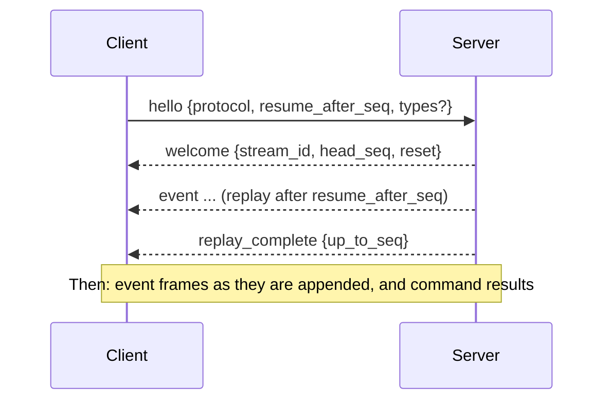

# Stream protocol v1

> **Status:** draft, part of [RFC-0001](rfcs/0001-v0.1-implementation-plan.md). Field names may change until phase 5 implements it; the structure is settled by [ADR-0004](adr/0004-tenant-scoped-streams.md), [ADR-0005](adr/0005-per-rule-cursors.md) and [ADR-0011](adr/0011-surfaces.md). Its shape deliberately matches artifactr's thread protocol, so one client library can speak both.

Clients publish events, read a stream's log with resume, and operate rules and runs. The same commands are available over REST, over a WebSocket, and as MCP tools, and every surface hands them to the same handler, so they behave identically.

## Commands

A command is a JSON object with a `type`. Over REST and WebSocket it travels in a frame that carries a client-chosen `command_id`; a retried `command_id` returns the original result without running again.

```json
{"type": "command", "command_id": "cmd_7", "command": {"type": "publish", "event": {"type": "service.error", "service": "auth", "severity": 8, "message": "token check failed"}}}
```

| Command | Fields | Outcome |
|---|---|---|
| `publish` | `event` (with its `type`), `id?` | `{seq, id, duplicate}`. Publishing an `id` that is already in the stream returns the existing `seq` with `duplicate: true`. |
| `retry_run` | `run_id` | The run becomes runnable now, whatever its status except `succeeded`. |
| `skip_run` | `run_id`, `reason?` | A pending, retrying or dead-lettered run is marked skipped, unblocking its scope. |
| `cancel_run` | `run_id` | A running run is cancelled and recorded as cancelled. |
| `replay_rule` | `rule`, `from_seq`, `mode` (`rebuild` or `refire`) | Resets the rule's cursor to `from_seq`. `rebuild` recomputes state without creating runs; `refire` creates runs for the firings found, with new ids. |

Rejections carry a stable `type` and a `message`: `not_found`, `invalid_state`, `validation_failed` (with Pydantic's `errors`), `forbidden`, `depth_exceeded` (a publish beyond the causation limit), and `unsupported_protocol`.

## REST

`reflexr.fastapi` serves REST under a prefix the application chooses (`/v1` below).

| Method and path | Purpose |
|---|---|
| `POST /v1/streams/{stream_id}/commands` | One command frame; the response body is its `command_result`. |
| `POST /v1/streams/{stream_id}/events` | Publish one event, or `{"events": [...]}` in order. A convenience for producers and webhooks, equivalent to `publish` commands. |
| `GET /v1/streams/{stream_id}/events?after_seq=&limit=&type=` | A page of the log, as envelopes. `type` may repeat. |
| `GET /v1/rules` | The registered rules, as JSON. |
| `GET /v1/streams/{stream_id}/rules` | Each rule's cursor, lag behind the head, number of scopes, and dead-letter count. |
| `GET /v1/streams/{stream_id}/runs?rule=&scope=&status=&limit=` | Runs, newest first. |
| `GET /v1/streams/{stream_id}/runs/{run_id}` | A run, with its attempts, last error and checkpoint summary. |
| `GET /v1/streams/{stream_id}/dead-letters?rule=` | Evaluation errors and dead-lettered runs. |
| `GET /v1/schedules` | Schedules, with their next tick. |

Rejections map to HTTP status codes: `not_found` → 404, `invalid_state` → 409, `validation_failed` and `depth_exceeded` → 422, `forbidden` → 403. Authentication is the host's: `resolve_actor(request)` returns the tenant and actor, or raises `Unauthorized` (401).

## WebSocket

`GET /v1/streams/{stream_id}/live`, subprotocol `reflexr.v1`.

### Handshake and resume



```json
{"type": "hello", "protocol": "reflexr.v1", "resume_after_seq": 41, "types": ["service.error", "rule_fired", "run_succeeded"]}
```

- `resume_after_seq` is the last `seq` the client has; the server replays everything after it. A client ahead of the log gets `reset: true` and a replay from the beginning.
- `types` filters which events are sent; `null` sends all. `replay_complete` is decided on the unfiltered log, so it always arrives.

### Server frames

- `event`: an envelope, `{"type": "event", "seq", "id", "ts", "stream_id", "actor", "causation", "correlation_id", "event": {...}}`.
- `command_result`: `{"type": "command_result", "command_id", "ok", "outcome" | "rejection"}`.
- `replay_complete`: `{"type": "replay_complete", "up_to_seq"}`.
- `error`: `{"type": "error", "message"}`, for a frame that is not a valid command. The connection stays open.

reflexr's own events, alongside the application's:

| `event.type` | Fields |
|---|---|
| `rule_fired` | `rule`, `scope`, `firing_id`, `matched` (the `seq`s of the matched envelopes) |
| `rule_errored` | `rule`, `seq`, `error` |
| `run_started` | `run_id`, `rule`, `scope`, `attempt` |
| `run_progressed` | `run_id`, `step` (a graph step completed and was checkpointed) |
| `run_retrying` | `run_id`, `attempt`, `error`, `next_attempt_at` |
| `run_succeeded` | `run_id`, `output?` |
| `run_dead_lettered` | `run_id`, `attempts`, `error` |
| `run_cancelled`, `run_skipped` | `run_id`, `reason?` |
| `tick` | `schedule`, `at` |

`actor.kind` is `user`, `agent` (`rule`, `run_id`, `name`), `external_agent` (`client_id`, `name?`), `system` (`name`) or `source` (`name`). `causation` is `{firing_id, run_id, depth}` for an event a run emitted, and `null` otherwise.

### Close codes

| Code | Meaning | Client should |
|---|---|---|
| `4400` | Bad `hello` or unsupported protocol | fix and reconnect |
| `4401` | Not authenticated | re-authenticate |
| `4403` | Actor may not access this stream | stop |
| `4408` | `hello` not received in time | reconnect |
| `4429` | The client did not read frames fast enough | reconnect and resume |

## MCP

`reflexr.mcp` serves the same commands and reads to MCP clients, with the host's `resolve(ctx)` returning the client's tenant and `ExternalAgentActor`.

| MCP | reflexr |
|---|---|
| Tools `publish_event`, `read_events` | Publish and read, with the same idempotency and filters. |
| Tools `list_rules`, `rule_status`, `replay_rule` | Inspect and replay rules. |
| Tools `list_runs`, `get_run`, `retry_run`, `skip_run`, `cancel_run`, `list_dead_letters` | Operate runs. |
| Resource template `reflexr://{tenant_id}/{stream_id}/runs/{run_id}` | A run's current JSON, with resource-updated notifications as it progresses. Readable only by clients of that tenant. |

## Versioning and schema

- The protocol identifier is `reflexr.v1`, also the WebSocket subprotocol. Within v1, changes are additive: new optional fields and new event types. Clients ignore unknown fields and keep unknown event types as opaque envelopes, since they still carry a `seq`.
- JSON Schemas for every frame, and for rules, are generated from the Pydantic models into `schemas/` and checked in. CI fails if they drift.
