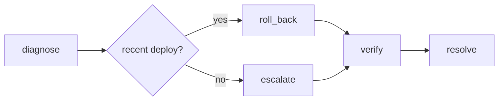

# The reference implementation

[`examples/oncall`](https://github.com/alexnodeland/reflexr/tree/main/examples/oncall) is a small, complete application built on reflexr: incident response. Monitoring fires alerts, CI reports deploys, and services send heartbeats. A burst of severe alerts runs a triage agent, which opens an incident; an opened incident runs a runbook graph, which rolls back a recent deploy or pages a person, then resolves the incident; and a service that stops sending heartbeats is paged. It uses only the library's public API, a test enforces that, and it is held to the same quality gates as the library ([ADR-0015](adr/0015-reference-implementation-oncall.md), [ADR-0031](adr/0031-the-reference-implementations-events-and-rules.md)). Read it when you want to see every piece of this documentation working together.

## What it contains

| Piece | Source | What it shows |
|---|---|---|
| Events | [`events.py`](https://github.com/alexnodeland/reflexr/blob/main/examples/oncall/src/oncall/events.py) | Five `Event` types: `alert.fired`, `deploy.completed` and `service.heartbeat`, which producers publish, and `incident.opened` and `incident.resolved`, which the workflows emit |
| Rules | [`rules.py`](https://github.com/alexnodeland/reflexr/blob/main/examples/oncall/src/oncall/rules.py) | `triage`, a count of severe alerts per service within five minutes; `runbook`, every opened incident per service, with its own retry policy; `silence`, no heartbeat from a service for two minutes; and a `Schedule` whose ticks keep time moving |
| Triage agent | [`triage.py`](https://github.com/alexnodeland/reflexr/blob/main/examples/oncall/src/oncall/triage.py) | A pydantic-ai `Agent` over `Reaction[OncallDeps]` with the `EventContext` capability, allowed to emit `incident.opened` only, with a structured verdict, usage limits, and the LiteLLM gateway when a proxy is configured |
| Runbook graph | [`runbook.py`](https://github.com/alexnodeland/reflexr/blob/main/examples/oncall/src/oncall/runbook.py) | A pydantic-graph `GraphBuilder` graph with a decision, checkpointed after every step, that reads the log and emits through the `Reaction` |
| Paging | [`actions.py`](https://github.com/alexnodeland/reflexr/blob/main/examples/oncall/src/oncall/actions.py) | A plain async function, idempotent by its run id, and the table of actions by the names rules use |
| Services | [`services.py`](https://github.com/alexnodeland/reflexr/blob/main/examples/oncall/src/oncall/services.py) | The pager and deployer the workflows act on: in-memory fakes, given to every action as `reaction.deps` |
| Server | [`app.py`](https://github.com/alexnodeland/reflexr/blob/main/examples/oncall/src/oncall/app.py) | FastAPI with REST and the WebSocket stream at `/v1` and MCP at `/mcp`, the reactor in its lifespan, in-memory or SQL storage, and OpenTelemetry and Langfuse from the environment |
| Terminal client | [`cli.py`](https://github.com/alexnodeland/reflexr/blob/main/examples/oncall/src/oncall/cli.py) | Publishes events, follows the stream live, and operates runs: a template for a client in any language |
| Tests | [`tests/`](https://github.com/alexnodeland/reflexr/tree/main/examples/oncall/tests) | The whole stack end to end with a scripted model and a clock the tests move, inside the coverage gate |

## How it fits together

```mermaid
graph LR
    alert[/alert.fired/] --> triage{{"triage<br/>3 alerts of severity 7+<br/>for a service in 5 min"}}
    triage --> agent["triage agent<br/>pydantic-ai"]
    agent -- emit_event --> opened[/incident.opened/]
    opened --> runbook{{"runbook<br/>each incident,<br/>per service"}}
    runbook --> graph["runbook graph<br/>pydantic-graph"]
    deploy[/deploy.completed/] -. read from the log .-> graph
    graph --> resolved[/incident.resolved/]
    heartbeat[/service.heartbeat/] --> silence{{"silence<br/>no heartbeat from<br/>a service for 2 min"}}
    tick[/"tick, every 30 s"/] -. moves time .-> silence
    silence --> page["page<br/>function"]
    page --> alert
```

Events are slanted boxes, rules hexagons and actions rectangles. The workflows chain through events rather than through one rule: the agent decides whether alerts are an incident, and the runbook works any incident, whoever opened it (the agent, a person over REST, or an MCP client). Everything one alert leads to is in its causal chain, so the triage run, the incident, the runbook run and the resolution share its `correlation_id` and appear as one session in a trace backend ([Observability](guides/observability.md#sessions-and-causal-chains)).

The runbook graph diagnoses from the log (a deploy of the service shortly before the incident, and the version before it), decides, rolls back or escalates, verifies and resolves:



`verify` fails the attempt if the service is still unhealthy. The retry resumes at `verify` from the checkpoint, so the service is not rolled back twice ([Graphs](guides/actions.md#graphs)).

## Run it

oncall is a member of the repository's uv workspace, so it runs against the library in the same checkout. From the repository root, with an Anthropic key:

```bash
uv sync --all-packages          # or: make install
export ANTHROPIC_API_KEY=...
uv run oncall-serve             # in one terminal
uv run oncall watch             # in another
```

In a third terminal, deploy twice, then fire three severe alerts:

```bash
uv run oncall --user ci deploy api --version v1
uv run oncall --user ci deploy api --version v2
uv run oncall --user monitor alert api --severity 8 --message "5xx rate above 5%"
uv run oncall --user monitor alert api --severity 9 --message "p99 latency above 2s"
uv run oncall --user monitor alert api --severity 8 --message "5xx rate above 5%"
```

The watch shows the alerts, the triage rule firing, the agent opening an incident, the runbook's steps as they are checkpointed, and the resolution. The [README](https://github.com/alexnodeland/reflexr/blob/main/examples/oncall/README.md) shows a whole session and lists every client command and flag.

To use another provider, set `ONCALL_MODEL` to any [pydantic-ai model name](https://ai.pydantic.dev/models/) and that provider's key. The server listens on `127.0.0.1:8000`; set `ONCALL_HOST` and `ONCALL_PORT` to change it.

| Setting | What it does | Guide |
|---|---|---|
| `ONCALL_DATABASE_URL` | Keeps workspaces in SQLite or PostgreSQL instead of memory, migrating the database when the server starts | [Storage](guides/storage.md#sql-storage) |
| `OTEL_EXPORTER_OTLP_ENDPOINT` | Reports traces, metrics and logs over OTLP, with each run attempt an `invoke_workflow {rule}` span | [Observability](guides/observability.md#configuring-opentelemetry) |
| `LANGFUSE_PUBLIC_KEY`, with its secret key and host | Files each run in Langfuse, under its rule and in its causal chain's session | [Observability](guides/observability.md#langfuse) |
| `ONCALL_LITELLM_URL` | Sends the triage agent's requests through a LiteLLM proxy, with the tenant, chain and trace on each | [The LLM gateway](guides/gateway.md) |

[stackr](https://github.com/alexnodeland/stackr) runs a Collector, Langfuse and the proxy.

The same server speaks the other surfaces too: REST under `/v1` (the demo trusts an `x-user` header, as in `curl -H 'x-user: alice' localhost:8000/v1/workspaces/prod/runs`), and MCP at `http://127.0.0.1:8000/mcp/` for external agents. Opening an incident by hand over REST runs the runbook as well.

!!! warning "Demo authentication"

    oncall trusts whichever user the `x-user` header or `user` query parameter names, and puts everyone in one tenant. It shows where authentication plugs in, not how to do it. See [Multi-tenancy and security](guides/security.md).

## Test it

The tests run the whole stack with a scripted model, so they need no API key. They drive the reactor with `reactor.settle()` and a clock they move by hand, so nothing waits on timing:

```bash
uv run pytest examples/oncall/tests
```

[Testing your application](guides/testing.md) explains the patterns.

## How it maps to the guides

| oncall | Guide |
|---|---|
| `AlertFired`, `DeployCompleted`, `Heartbeat`, `IncidentOpened`, `IncidentResolved` | [Events and envelopes](guides/events.md) |
| `triage_rule`, `runbook_rule`, `silence_rule` | [Rules](guides/rules.md) |
| `Oncall`, its `Workspaces` and `Reactor` | [Workspaces and the log](guides/workspaces.md), [The reactor](guides/reactor.md) |
| The triage agent, the runbook graph and `page` | [Actions](guides/actions.md) |
| `heartbeat_check` | [Schedules](guides/schedules.md) |
| The FastAPI app and `resolve_actor` | [Serving over REST and WebSocket](guides/serving.md) |
| `ReflexrMcp` and `resolve_client` | [External agents over MCP](guides/mcp.md) |
| The terminal client | The [stream protocol](protocol.md) |
