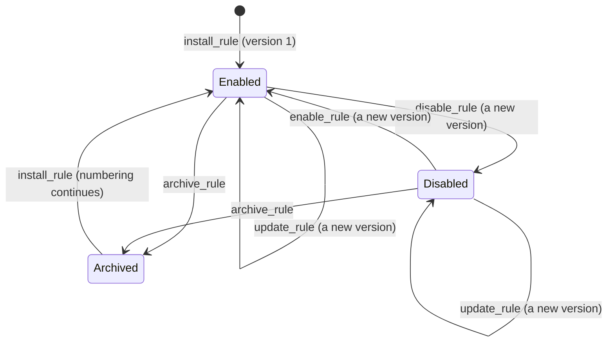

# RFC-0003: Managing rules at runtime

**Status:** Discussion
**Author:** Alex Nodeland
**Created:** 2026-09-29
**Discussion:** [#75](https://github.com/alexnodeland/reflexr/pull/75), from [issue #21][issue-21]
**Siblings:**

- [stackr RFC-0002][s-rfc-0002], the combined system, accepted on 2026-09-29. Its phase 5 installs rules that people accept in chat through the API proposed here. Its decision D5 makes the artifact the reviewed record and reflexr's store the running definition.
- [ADR-0039][adr-0039] namespaces event types for [#45][issue-45], as the maintainer [decided][issue-45-decided] on 2026-09-29, and [#74][pr-74] records it. Every event type is qualified, as in `artifactr:proposal_resolved`, and this RFC writes events, facts and rules in those terms.

## Summary

Rules are typed, serializable data ([ADR-0006][adr-0006]), but they're registered in code, and every tenant's workspaces evaluate the same ones ([ADR-0016][adr-0016], as amended). This RFC proposes **stored rules**. A stored rule belongs to one workspace and is versioned. It is installed, changed, disabled and archived through the protocol's commands, and running reactors pick up each change at their next batch.

The recommendations, taken together:

- A stored rule belongs to **one workspace**. Its name is **qualified**, such as `chat:prod-deploy-failures`, in a namespace the policy grants, so it can never clash with the application's rules, which keep bare names.
- **Every change is a new, immutable version.** A new condition or scope resets the rule, through the same generation and `reflexr:rule_reset` machinery code rules use. Installing replays nothing unless asked to rebuild.
- Stored rules run only **registered actions** that an application **policy** allows, with **typed parameters** that each action declares. They watch only the **event namespaces** the policy grants, resolved in the registry of their `Workspaces`.
- Five **commands** go through the one handler: `install_rule`, `update_rule`, `disable_rule`, `enable_rule` and `archive_rule`. A **policy hook** on `Workspaces` authorizes each change, and refuses everything unless configured. Each version records its **provenance** in typed fields.
- Each change is a **fact in the workspace's log**, written in the same transaction as the rule. Reactors read a workspace's stored rules **from storage** on every pass and cache each version, so no process runs a replaced definition.
- A stored rule needs a **cap**, a new throttle across all of its scopes. The policy bounds retries, timeouts, windows and the number of rules. It may lower the depth limit, and nothing can raise it.
- `GET /v1/rules` still lists only code rules. Stored rules are listed **only within their workspace**, behind `authorize`.
- Metrics record stored rules under a **bounded label** by default, so the dashboards don't grow a series per stored rule.

**This RFC waits for the maintainer's decisions** on the questions in [Decision points](#decision-points). Nothing is built until then.

## Motivation

### Where things stand

- `Workspaces(storage, rules=[...])` takes the rules and checks them at construction, and every workspace of every tenant evaluates them ([ADR-0026][adr-0026]). Changing a rule means a deploy.
- By design, every authenticated client of any tenant can read every rule, over `GET /v1/rules` and MCP's `list_rules`. So a rule can hold nothing tenant-specific.
- ADR-0006 left runtime rule management for after v0.1, as an additive change. The architecture's open questions list it first.

### Why now

stackr's RFC-0002 was accepted on 2026-09-29. In its first scenario:

1. In a thread, a person writes: "Whenever a deploy to production fails, tell me here."
2. The chat agent drafts a `rule` artifact: a reflexr `Rule` as JSON, which arrives as a proposal.
3. A person accepts it.
4. relayr, the bridge, re-reads artifactr to confirm the acceptance. Then it installs the rule in reflexr through this RFC's API, with its provenance: the artifact and its version, the proposal, and who approved it.

Its phase 5 waits for this RFC. The RFC also sets requirements:

- **D5.** The artifact is the reviewed record, and reflexr's store holds the running definition, with provenance both ways. If an operator changes the rule in reflexr, relayr proposes the same change to the artifact, so the two don't drift apart silently.
- **Tenancy.** A tenant's rules are never listed to other tenants, unlike code rules.
- **Limits on chat rules.** A throttle is required, and the depth limit can't be raised. reflexr's usage limits and the tenant's gateway budget apply. Rules may use only registered actions from an allowlist, never code.
- **An open question it leaves here:** whether a chat rule reaches one workspace or the whole tenant.

Nothing below is specific to chat. An admin UI, a CLI or an operator's script uses the same API.

## Design

### An example

The rule from the scenario, installed over REST (`POST /v1/workspaces/prod/commands`). The WebSocket takes the same frame, and MCP's `install_rule` tool the same `rule` and `provenance`:

```json
{
  "type": "command",
  "command_id": "install-prp_12",
  "command": {
    "type": "install_rule",
    "rule": {
      "name": "chat:prod-deploy-failures",
      "description": "Whenever a deploy to production fails, tell me here.",
      "when": {
        "filter": {"kind": "all", "of": [
          {"kind": "on", "types": ["oncall:deploy.completed"]},
          {"kind": "where", "field": "environment", "op": "eq", "value": "production"},
          {"kind": "where", "field": "status", "op": "eq", "value": "failed"}
        ]},
        "throttle": {"at_most": 1, "per": "PT15M"},
        "cap": {"at_most": 10, "per": "PT1H"}
      },
      "scope": {"fields": ["service"]},
      "then": {"action": "notify", "params": {"thread_id": "thr_4"}},
      "timeout": "PT1M"
    },
    "provenance": {
      "source": "artifactr",
      "record": "art_rule_7",
      "record_version": 3,
      "approval": "prp_12",
      "approved_by": {"kind": "user", "id": "ada"}
    }
  }
}
```

Three parts are new: the qualified `name` ([D1b](#d1b-names-and-code-rules-of-the-same-name)), the `cap` across scopes ([D6a](#d6a-the-required-throttle)) and the action's `params` ([D3b](#d3b-parameters)). The event type is qualified, as every type is under ADR-0039, and the policy must let the rule watch the `oncall` namespace ([D3c](#d3c-which-event-types-a-stored-rule-may-watch)).

The outcome:

```json
{"type": "rule_version", "rule": "chat:prod-deploy-failures", "version": 1, "seq": 812, "duplicate": false}
```

In the same transaction, the workspace's log gains a fact. relayr installs from a run of its own `install-rule` rule, a code rule that fires on `artifactr:proposal_resolved`. So the actor is that run, and the fact continues the chain of the acceptance that caused it:

```json
{
  "type": "event", "seq": 812,
  "actor": {"kind": "agent", "rule": "install-rule", "run_id": "fir_5c1e", "name": "install-rule"},
  "causation": {"firing_id": "fir_5c1e", "run_id": "fir_5c1e", "depth": 2},
  "event": {
    "type": "reflexr:rule_installed",
    "rule": "chat:prod-deploy-failures",
    "version": 1,
    "previous_version": null,
    "definition": "4be1c0a79d2e3f18",
    "reset": false,
    "spec": {"name": "chat:prod-deploy-failures", "when": {"...": "..."}, "then": {"...": "..."}},
    "provenance": {"source": "artifactr", "record": "art_rule_7", "record_version": 3, "approval": "prp_12", "approved_by": {"kind": "user", "id": "ada"}}
  }
}
```

The rule's cursor starts at 812, its own fact, so it acts only on deploys logged after it was installed.

### A stored rule's life



- **Enabled** rules are evaluated, and their runs executed.
- **Disabled** rules behave as a disabled code rule does. The cursor holds, nothing is evaluated, and waiting runs wait.
- **Archived** rules are gone from evaluation and listings. Their unfinished runs are cancelled, and their scope states cleared. The versions and the generation are kept, so a rule installed again under the same name continues its numbering and never reuses a firing id.

### Where the pieces go

| Piece | Package |
|---|---|
| `Provenance`, `RuleVersion`, `RuleLimits` and its pure check, the `cap` stage, `ActionRef.params`, the `reflexr:rule_installed` and `reflexr:rule_archived` facts | `reflexr.core` |
| Stored rules and their versions, in memory and in SQL, and due runs that see them | the storage port, `InMemoryStorage`, `reflexr.sql` |
| `Workspaces(rule_policy=)`, the handle's changes and reads, and the reactor and executor reading stored rules | `reflexr.workspace` |
| The commands, reads and tools | `reflexr.fastapi`, `reflexr.mcp` |
| The stored-rule metric attribute, the views and the dashboards | `reflexr.telemetry`, `reflexr.otel`, `deploy/grafana/` |

## Decision points

Each question below has options, their trade-offs, and a recommendation in bold. The maintainer decides each one. This RFC is then updated to the decisions and accepted, and ADRs record them as they are built.

| # | Question | Recommendation |
|---|---|---|
| D1a | How far a stored rule reaches | One workspace |
| D1b | Names, and code rules of the same name | Qualified names for stored rules. Code rules keep bare names and can't be overridden |
| D2a | What a version is | Every change is a new, immutable version |
| D2b | What resets a rule | `Rule.definition()`, as today: a new condition or scope. The reset happens in the change's transaction |
| D2c | Replay on install | None, unless the installer asks to rebuild. Never refire |
| D2d | Which version a waiting run executes | The current one. The run records the version that fired it |
| D3a | Which actions a stored rule may use | The allowlist the rule policy returns, per tenant, workspace and installer |
| D3b | Parameters | Typed: each action declares a parameters model, checked at install |
| D3c | Which event types a stored rule may watch | The namespaces, and single types, the rule policy grants. Types resolve in the `Workspaces` registry, at install and again when a reactor loads the version |
| D4a | The commands | Five: install, update, disable, enable, archive |
| D4b | Who may change rules | A `rule_policy` hook on `Workspaces`, asked for every change, refusing everything by default |
| D4c | Idempotency | A change that matches the current version is a duplicate, and changes may carry `expected_version` |
| D4d | Provenance | Typed, generic fields, plus a small map |
| D5 | How running reactors learn of changes | Read from storage on every pass, cached by version. Facts in the log for everyone else |
| D6a | The required throttle | A cap across all of the rule's scopes |
| D6b | The depth limit | No field on rules. The policy may lower the limit for stored rules |
| D6c | Where the limits live | In the limits the policy returns, with defaults |
| D6d | How many rules | A limit per workspace, enforced by reflexr. A tenant-wide limit is the policy's |
| D7 | Listing and tenancy | `GET /v1/rules` unchanged. Stored rules only in their workspace's reads |
| D8 | Rules as a metric label | A bounded label for stored rules. Their names go in a separate attribute, which views keep only when asked |

### D1. Where stored rules live, and how they're scoped

#### D1a: how far a stored rule reaches

| Option | Commands and `authorize` | Its facts | Its rows | Reaching every workspace |
|---|---|---|---|---|
| **One workspace (recommended)** | The workspace's own commands, which `authorize` already guards | In the workspace's log, in the change's transaction | Keyed by tenant and workspace, as every table is ([ADR-0030][adr-0030]) | Install it in each |
| The tenant | A tenant-level route and a new hook. Nothing asks `authorize` without a workspace today | No single log. Written to every workspace, or to none | Keyed by tenant only, with no workspace lock to serialize a change with evaluation | Automatic, including workspaces created later |
| The tenant, with target workspaces, as schedules have | As for the tenant | As for the tenant | As for the tenant | Chosen per rule |

**Recommended: one workspace.** A draft is written in one artifactr workspace, and the reflexr workspace with the same id is the one it's about. Everything a rule does in a workspace is already the workspace's: its cursor, state, runs and dead letters ([ADR-0016][adr-0016]). A change takes the workspace's lock, so it is atomic with its fact and the rule's progress, and serialized with evaluation. A tenant that wants the same rule everywhere installs it in each workspace. Tenant-wide rules are left as an [unresolved question](#unresolved-questions).

#### D1b: names, and code rules of the same name

A rule's name keys its progress, scope states, runs, dead letters and firing ids, and appears in metrics, spans and the D2 actor of stackr's RFC-0002 (`reflexr:<rule>`). Within a workspace, a stored rule and a code rule can't share one.

ADR-0039 qualifies every event type. It says nothing about rule names, which are a separate matter.

| Option | A clash at install | A later deploy adds a code rule a stored rule already has | Seen at a glance |
|---|---|---|---|
| One name space; installing a code rule's name is refused | Refused | No good answer. Either the stored rule is shadowed, or startup fails because of a tenant's data. A tenant can take names the application will want | No |
| **Qualified names for stored rules; code rules stay bare (recommended)** | Can't happen | Can't happen | Yes: in logs, runs, spans and dashboards |
| Every rule name qualified, as every event type now is: code rules in the application's namespace, stored rules in namespaces the policy grants | Refused if the policy grants a namespace code rules use | The same squatting as the first option, unless rule namespaces are declared as event namespaces are | Yes |
| A stored rule overrides the code rule of the same name in its workspace | Intended | The code rule quietly stops running in that workspace | No |

**Recommended: qualified names for stored rules, bare names for code rules.**

- A stored rule's name is `namespace:name`, such as `chat:prod-deploy-failures`, with ADR-0039's `:` and namespace grammar.
- Code rules keep bare names. The rule name pattern already refuses a `:`, so no code rule is renamed, and nothing keyed by a code rule's name has to migrate: progress, runs, dead letters, metrics, Langfuse traces and LiteLLM tags.
- The two have different owners. The application is the only owner of code rules, while stored rules come from many installers, and the namespace says which.
- Rule namespaces aren't event namespaces. `chat:` says where a rule came from, and `artifactr:` who publishes a type. The rule policy says which rule namespaces an installer may use: relayr would use `chat`. The `reflexr` namespace is reserved.
- #72's publish policy sees a run's `AgentActor`, whose `rule` is qualified for a stored rule. So the policy can refuse runs of stored rules a namespace that code rules' runs may publish into.
- Code rules can't be overridden or changed through the API: a change that names one is `forbidden`. Turning a code rule off in one workspace is an [unresolved question](#unresolved-questions).

The stored grammar is `^[a-z][a-z0-9_]*:[a-z0-9][a-z0-9._-]*$`, at most 100 characters in all, as today. stackr's actor for the example becomes `reflexr:chat:prod-deploy-failures`, which artifactr treats as an opaque string.

### D2. Versioning

#### D2a: what a version is

| Option | History | Drift detection (D5) | Cost |
|---|---|---|---|
| **Every change is a new, immutable version, enabling and disabling included (recommended)** | Every version, with who made it and its provenance | relayr compares the current version with the one it installed | A row per change |
| Only changes to the rule's definition are versions. `enabled` and the policy fields change in place | Partial | Changes made in place show only in the log | Fewer rows |
| The current rule only; the log's facts are the history | In the log, until retention compacts it | From the log | Least storage |

**Recommended: every change is a version.** Versions count from 1 for each workspace and name, and are never reused. A run records the version that fired it (`Run.rule_version`, `null` for code rules), so feedback, acceptance rates and dead letters can be told apart by version. Rolling back is installing an earlier version's rule again, which makes a new version.

#### D2b: what resets a rule

`Rule.definition()` hashes the condition and the scope. When the hash changes, the rule's state no longer applies. The rule starts a new generation at the head of the log, and `reflexr:rule_reset` records it ([ADR-0026][adr-0026]).

| Option | Behaviour |
|---|---|
| **`Rule.definition()`, as for code rules (recommended)** | A new condition or scope resets. The action, parameters, retries, ordering, timeout, description and `enabled` don't |
| Any change resets | Fixing a typo in the description loses a half-counted window |
| The definition and the action | The action doesn't change what the rule decides, and waiting runs would run the new action anyway ([D2d](#d2d-which-version-a-waiting-run-executes)) |

**Recommended: the definition, as today.** One difference from code rules: the reset happens eagerly, in the change's transaction, rather than when the reactor next notices the hash. The log reads `reflexr:rule_installed`, then `reflexr:rule_reset` (reason `changed`). The generation goes up by one, the cursor moves to the fact, and the scope states are cleared. The reactor's lazy check stays as a backstop, and still serves code rules.

#### D2c: replay on install

| Option | A new count or sequence window | Acts on the past |
|---|---|---|
| **None by default, with `rebuild_from_seq` on request (recommended)** | Empty, unless rebuilt | Never |
| Always rebuild from a window, such as the last day | Warm | Never |
| Refire allowed, through `start="beginning"` or a replay in `refire` mode | Warm | Yes. A chat rule would act on the whole history |

**Recommended: none by default.**

- A stored rule's `start` must be `now`.
- `install_rule` and `update_rule` take an optional `rebuild_from_seq`. It rebuilds the rule's state quietly from that `seq` up to its fact, with `silent_through`, as `replay_rule(mode="rebuild")` does.
- The policy bounds how far back a rebuild may go.
- `replay_rule` works on stored rules as on code rules, but for a stored rule it is a change the rule policy authorizes. So refiring is for operators the policy allows, never chat.

#### D2d: which version a waiting run executes

| Option | Behaviour |
|---|---|
| **The current version (recommended)** | A fix to the action or its parameters reaches runs already waiting, as a deploy does for code rules. Disabling holds them |
| The version that fired it | Each run does exactly what was approved when it fired, but a fix never reaches the runs already waiting |

**Recommended: the current version.** The executor reads it in the claim's transaction. The run keeps the version that fired it, and the attempt's span records the version that ran it (`reflexr.rule.version`).

### D3. What a stored rule may use

Stored rules name registered actions and never carry code ([ADR-0006][adr-0006]). The questions are which actions, how their inputs are checked, and which events a rule may watch.

#### D3a: the allowlist

| Option | Who decides | Varies by tenant or installer |
|---|---|---|
| One list on `Workspaces`, such as `stored_actions={"notify"}` | The application, once | No |
| **The allowlist the rule policy returns for each change (recommended)** | The application, per change | Yes |
| The installer sends the list with each install | The installer | Yes, but it limits nothing, since whoever installs chooses |

**Recommended: the rule policy returns it**, in the `RuleLimits` it answers each change with ([D4b](#d4b-who-may-change-rules)). A fixed list is a policy that returns the same limits for everyone.

- **Predicates** are registered code too, so they follow the same allowlist. It's empty by default.
- **Checking** reuses `Rule.check(events=, actions=, predicates=)`, with the allowlist as the registered names. So a draft gets the same `InvalidRule` list of problems a code rule does, and relayr's artifact type can check a draft before it's proposed.
- **Rolling deploys.** Actions are registered on the reactor, which may not be in the process that installs ([ADR-0026][adr-0026]). A reactor that meets a stored rule whose action it doesn't have declines its runs, and doesn't cancel them. The workspace's rule status lists the problem.
- **A policy that later narrows** doesn't touch rules already installed. It applies from their next change.

#### D3b: parameters

`ActionRef` names an action and nothing else, so today one action can't serve rules that differ only in a thread or a channel.

| Option | Checked | "Tell me here" |
|---|---|---|
| None: one registered action per behaviour | Nothing to check | An action per thread, or the thread in the description for an agent to find |
| Free JSON, passed to the action | By the action, when it runs | Works, but a bad draft fails only when it fires |
| **Typed: each action declares a parameters model (recommended)** | At install, and when code rules are registered | `{"action": "notify", "params": {"thread_id": "thr_4"}}` |

**Recommended: typed parameters.**

- An action declares a Pydantic model, as in `FunctionAction(notify, params=NotifyParams)` and `AgentAction(..., params=...)`. Code rules write `run(notify, thread_id="thr_4")`.
- Actions receive the validated model as `Reaction.params`.
- The policy's allowlist maps each action to its model, so an install is checked without a reactor. With a fixed policy, the reactor confirms at startup that each model is the one its action declares.
- Parameters aren't part of the definition, so changing them never resets the rule.
- An action treats its parameters as untrusted input, as it treats events. Its model should constrain them, so that a URL or an id can't reach what the rule's tenant shouldn't.

#### D3c: which event types a stored rule may watch

A stored rule sees only its own workspace's log, which everyone who may use the workspace can read anyway. But what it watches decides what it acts on, and how often. A chat rule on `reflexr:run_dead_lettered` would act on every failure of every rule in the workspace. And an application may keep a namespace for its own rules, such as a payments integration's.

| Option | For | Against |
|---|---|---|
| Any type the `Workspaces` accepts, as for code rules | Nothing new | A chat rule may react to anything, reflexr's facts included |
| **The namespaces, and single types, the rule policy grants (recommended)** | Least privilege, per tenant and installer. The same shape as #72's publish policy: namespaces, with per-type exceptions | One more list in `RuleLimits` |
| The namespaces the tenant may publish into, from #72's policy | One policy for both | Watching isn't publishing. Chat rules watch `artifactr:` types, which only relayr may publish |

**Recommended: what the rule policy grants**, closed by default.

- `RuleLimits.watch` names namespaces, such as `artifactr` and `oncall`, and single types, such as `reflexr:run_succeeded`.
- Every type a stored rule's filter or sequence steps name must be granted.
- A stored rule's filter must name its types. A filter that admits every type, such as one with no `on`, or a `not` around one, is refused. `admitted` already computes what a filter admits.
- A rule never sees facts about itself, whatever it watches ([D5](#d5-how-running-reactors-learn-of-changes)).

**Where types resolve.** ADR-0039 gives each `Workspaces` its own registry, with the global one as the default. A stored rule is data in storage, and any reactor over that storage may evaluate it:

- At install, the rule's types and fields are checked against the registry, and the accepted and emitted types, of the `Workspaces` the change goes through, as code rules are at construction.
- When a reactor loads a version, it checks the rule again against its own `Workspaces`, and caches the result with the version.
- The two agree in a correct deployment. If they don't, the rule isn't evaluated, and its status lists the problem, as for a missing action ([D3a](#d3a-the-allowlist)). That happens when two `Workspaces` with different registries share a storage, or a deploy removes a type.
- A name the registry doesn't know is refused with ADR-0039's "did you mean" hint. A draft that writes `deploy.completed` learns that it means `oncall:deploy.completed`.

### D4. The API

#### D4a: the commands

| Option | For | Against |
|---|---|---|
| **Five commands on the one handler (recommended)** | Each change is checked and recorded as what it is. Same on every surface ([ADR-0011][adr-0011]) | Five commands to learn |
| One `put_rule` upsert, with `enabled` and `archived` in the body | One command | An update meant for an existing rule silently creates one, and archiving becomes a field |
| REST resources: `PUT` and `DELETE` on `/rules/{name}` | Familiar REST | A second path beside the commands, and nothing over the WebSocket or MCP |

**Recommended: five commands**, through `reflexr.workspace.execute` like every other command, and as `Workspace` methods in process:

| Command | Fields | Outcome |
|---|---|---|
| `install_rule` | `rule`, `provenance?`, `rebuild_from_seq?` | `rule_version`: `{rule, version, seq, duplicate}`. Version 1, or the next version of an archived rule. An active rule of that name is `invalid_state` |
| `update_rule` | `rule`, `expected_version?`, `provenance?`, `rebuild_from_seq?` | `rule_version`. A new version, reset if the definition changed |
| `disable_rule`, `enable_rule` | `rule` (the name), `expected_version?`, `provenance?`, `reason?` | `rule_version`. A new version with `enabled` changed |
| `archive_rule` | `rule`, `expected_version?`, `provenance?`, `reason?` | `rule_version`. The rule is archived, and its unfinished runs cancelled |

Rejections are the protocol's own:

- `forbidden`: the policy refused the change, or the name is a code rule's.
- `not_found`: no stored rule has that name.
- `invalid_state`: the name is taken, or the current version isn't `expected_version`. The message names the current version.
- `validation_failed`: the rule doesn't check, or breaks a limit. Each problem is listed in `errors`.

#### D4b: who may change rules

| Option | For | Against |
|---|---|---|
| Reuse `authorize(tenant, workspace, actor)` | Nothing new | Anyone who may use a workspace could install behaviour that runs in it |
| **A `rule_policy` on `Workspaces`, asked for every change, refusing everything by default (recommended)** | Holds in process and on every surface. It also returns the change's limits | One more hook |
| Allow some actor kinds, such as users but not external agents | Simple | Too coarse. relayr installs from a run, and a user isn't necessarily allowed to |

**Recommended: a `rule_policy` hook.**

```python
RulePolicy = Callable[[TenantId, WorkspaceId, Actor, RuleChange], Awaitable[RuleLimits | None]]
```

- `RuleChange` says what is being done (install, update, disable, enable, archive or replay), to which rule, and the new rule, if there is one.
- The hook returns the limits the change must meet ([D3a](#d3a-the-allowlist), [D6](#d6-limits)), or `None` to refuse it with `forbidden`.
- `Workspaces` without a policy refuses every change, so no application gets stored rules without choosing to.
- The surfaces ask `authorize` first, as for any command that names a workspace.
- The policy sees the actor that makes the change. For relayr that is its `install-rule` run's `AgentActor`, and the person who approved goes in the provenance ([D4d](#d4d-provenance)).

#### D4c: idempotency

| Option | Durable | Surfaces |
|---|---|---|
| `command_id` only | No: it's kept in memory, per process | REST and the WebSocket. MCP and in-process calls have none |
| **A change that matches the current version is a duplicate, and changes may carry `expected_version` (recommended)** | Yes | All, and in process |
| An explicit idempotency key per change, stored with the version | Yes | All, but with one more column and lookup |

**Recommended: match the current version, and check `expected_version`.**

- A change whose resulting rule equals the current version's creates nothing, appends nothing, and answers with the current version and `duplicate: true`. That's checked before `expected_version`, so a retry of a change that succeeded is a duplicate, not a conflict.
- `expected_version` is optimistic concurrency. relayr passes the version it last installed, and an `invalid_state` tells it someone else changed the rule. That is D5's drift detection from the artifact's side ([D5](#d5-how-running-reactors-learn-of-changes)).

#### D4d: provenance

| Option | reflexr knows | Finding a rule from its source |
|---|---|---|
| An opaque map, `metadata: {str: str}` | Nothing | Not possible |
| **Typed, generic fields, plus a small map (recommended)** | Where the rule came from and who approved it, without naming artifactr | Indexed by source and record |
| Typed artifactr fields, such as `artifact_id` and `proposal_id` | Exactly | Names artifactr in reflexr, against [ADR-0003][adr-0003] |

**Recommended: typed, generic fields.**

```python
class Provenance(BaseModel):
    source: str  # the system the rule came from: "artifactr", "admin-ui"
    record: str | None = None  # its id there: the artifact
    record_version: int | None = None  # the record's version
    approval: str | None = None  # what approved it: the proposal
    approved_by: Actor | None = None  # who approved it
    metadata: dict[str, str] = {}  # anything else, bounded in size
```

Provenance is what the installer says. reflexr stores it and doesn't check it against the source. The installer itself is the envelope's actor, which reflexr authenticated.

### D5. How running reactors learn of changes

Today each reactor holds the rules in memory from startup, and evaluation takes the workspace's lock one batch at a time ([ADR-0005][adr-0005]).

| Option | Staleness | Cost | SQLite and PostgreSQL alike |
|---|---|---|---|
| Each process loads stored rules into memory, and reloads them on a timer | Up to the timer. A process can evaluate a replaced or archived version | A query per timer | Yes |
| **Read each workspace's stored rules from storage on every pass, caching each parsed version (recommended)** | None: each batch reads its rule in its own transaction | One indexed query per workspace per pass, and one row per batch | Yes |
| Follow the facts in each log | None, once read | The reactor would scan every log for facts that every rule's cursor has passed | Yes |
| PostgreSQL `LISTEN/NOTIFY` | Immediate | A connection and a dialect branch | No ([ADR-0030][adr-0030]) |

**Recommended: read from storage, and cache by version.** Versions never change, so a parsed and checked rule is cached by tenant, workspace, name and version for as long as the process lives. A pass reads only which versions are current.

The effects on leases, cursors and runs:

- **No new lease.** A change takes the workspace's lock, as a publish does. It lands between two of the evaluator's batches, never inside one, and doesn't wait for the evaluation lease.
- **Batches read their rule.** Each batch reads the stored rule's current version inside its transaction. A rule changed or archived after the pass began is seen at its next batch.
- **Where a rule's cursor goes.**
  - A new rule starts at its own fact.
  - A rule whose definition changed resets there too ([D2b](#d2b-what-resets-a-rule)).
  - An update that keeps the definition keeps the cursor, state and generation.
  - A disabled rule's cursor holds.
- **A rule doesn't see its own changes.** Its `reflexr:rule_installed` and `reflexr:rule_archived` are facts about it, so it never sees them, as with its other facts ([ADR-0010][adr-0010]). Other rules can watch them, if they may ([D3c](#d3c-which-event-types-a-stored-rule-may-watch)).
- **Due runs.** `Storage.due_runs` takes a `RunPolicy` of rule names, since storage doesn't see code rules. It can see stored rules, so for them it reads `enabled`, `ordering` and `on_dead_letter` from the stored rule itself, in the same query. The claim reads the current version in its transaction and remains the authority.
- **No orphan races.** Today the executor cancels a run whose rule it doesn't know. For a stored rule it never does. `archive_rule` cancels the runs, in its own transaction, so a process that hasn't seen a new rule can't cancel its runs.
- **Latency.** A change takes effect at the next pass: within `serve()`'s poll interval, one second by default.
- **Everyone else follows the log.** The facts are for observers: the WebSocket, an audit, and relayr's drift detection. A relayr rule that watches `reflexr:rule_installed` and finds a version it didn't make proposes the same change to the artifact. That is D5's drift detection from reflexr's side.

### D6. Limits

#### D6a: the required throttle

A throttle limits firings **per scope**. A rule scoped by service, with a throttle of one firing per 15 minutes, still fires 200 times when 200 services fail at once.

| Option | Bounds a burst across scopes | Change |
|---|---|---|
| A per-scope throttle is required, as stackr's RFC-0002 words it | No | None |
| **A cap across the rule's scopes is required (recommended)** | Yes | A new optional stage in core, with conformance cases |
| A rate limit on the rule's runs, in the executor | Spend, yes. But firings and waiting runs still pile up | The executor's per-rule limits, which are still to come |

**Recommended: a required cap.**

- `cap: {at_most, per}` allows at most so many firings of the rule, across all its scopes, in any period of `per`. The builder is `.capped(10, per=hour)`.
- Its state is the times of its recent firings, at most `at_most` of them, in `RuleProgress`. It's saved with the cursor and decided by the log's clock, so replays still reproduce firings.
- A firing over the cap is dropped, as a throttled one is.
- The per-scope throttle stays optional, and the policy may require it too.
- Code rules may use the cap as well.

#### D6b: the depth limit

Rules have no depth field. `Workspaces(max_depth=8)` holds the limit, so a stored rule can't raise it.

| Option | Behaviour |
|---|---|
| **No field on rules, and the policy may set a lower limit for stored rules (recommended)** | The reactor passes the lower limit to `evaluate(max_depth=)`, which already takes one |
| A per-rule `max_depth` that may only lower the limit | A field on every rule, for what the policy can do |
| Nothing: the workspace's limit applies | Chat rules that answer each other get all eight steps |

**Recommended: the policy may lower it.** A firing beyond the lower limit is refused and dead-lettered, as at the workspace's limit.

#### D6c: where the limits live

| Option | For | Against |
|---|---|---|
| Fixed limits in core | One set, easy to document | The same for every tenant and plan |
| **The limits the policy returns, with defaults (recommended)** | Per tenant, plan or installer. The defaults are safe for chat | Applications can loosen them |
| Documented only | Nothing to build | Nothing enforced |

**Recommended: `RuleLimits`, with these defaults.** A pure function in core checks a rule against them and lists every problem.

| Limit | Default | Why |
|---|---|---|
| Actions and predicates | None allowed | D3a |
| Event namespaces and types watched | None allowed, and the filter must name its types | D3c |
| Namespaces | None allowed | D1b |
| `cap` | Required, at most 60 firings an hour | D6a |
| `retry.max_attempts` | At most 5 | Retries repeat spend |
| `timeout` | Required, at most 5 minutes | An attempt can't run forever |
| Windows: `within`, a dedupe window, a throttle's or cap's `per` | At most 1 day | Keeps per-scope state small |
| `count.at_least`, sequence steps, filter nodes | At most 1,000, 10 and 50 | Keeps state and evaluation small. Evaluation holds the workspace's lock |
| The `matches` operator | Not allowed | Python's `re` has no timeout, and a pathological pattern would hold the lock |
| `start` | `now` only | D2c |
| `rebuild_from_seq` | At most 10,000 envelopes back | D2c |
| `description` | At most 2,000 characters | It goes into agent prompts |
| The rule's JSON | At most 16 KiB | |
| Depth | The workspace's limit | D6b |
| Active rules per workspace | 50 | D6d |

Usage limits aren't part of a rule. They belong to the registered action, such as `AgentAction(usage_limits=...)`, and the tenant's gateway budget applies through the `[litellm]` extra, so a stored rule can't raise either.

#### D6d: how many rules

| Option | Enforced | Races |
|---|---|---|
| **Per workspace, by reflexr, with a tenant-wide limit in the policy (recommended)** | In the change's transaction, under the workspace's lock | None per workspace. The tenant-wide count is a soft limit |
| Per tenant, by reflexr | Across the tenant's workspaces | No lock spans them, so two installs in different workspaces can both pass |
| No limit | | Rules, series and evaluation time grow without bound |

**Recommended: per workspace, by reflexr.** Active rules count, disabled included and archived not. reflexr gives the policy a count of a tenant's stored rules, for a tenant-wide limit of its own.

### D7. Listing and tenancy

| Option | Code rules | Stored rules |
|---|---|---|
| **`GET /v1/rules` unchanged; stored rules only in the workspace's reads, behind `authorize` (recommended)** | Every authenticated client, as today | Only those who may use the workspace |
| `GET /v1/rules` adds the caller's tenant's stored rules | As today | The whole tenant, without `authorize`, so every workspace's rules to anyone in the tenant |
| A tenant-level route listing every workspace's stored rules | As today | Needs a tenant-level authorization hook, which doesn't exist |

**Recommended: only in the workspace's reads.** Stored rules are keyed by tenant and workspace, so no read can reach another tenant's.

| Read | REST | MCP |
|---|---|---|
| Code rules, for every tenant | `GET /v1/rules`, unchanged | `list_rules`, unchanged |
| Each rule's status: `enabled`, cursor, lag, generation, dead letters, and now `origin` (`code` or `stored`), `version` and any `problems` | `GET /v1/workspaces/{workspace_id}/rules` | `rule_status` |
| One rule: its current definition, and for a stored rule its version, provenance, and who made it and when | `GET /v1/workspaces/{workspace_id}/rules/{rule}` | `get_rule` |
| Versions, newest first, by rule, or by provenance `source` and `record` | `GET /v1/workspaces/{workspace_id}/rule-versions?rule=&source=&record=&limit=` | `rule_versions` |

Where else a stored rule's name appears:

- in the workspace's log, in facts about it
- in spans, Langfuse traces (named after the rule) and LiteLLM metadata (tagged `rule:<name>`)
- in metrics, only as D8 says

Those are operators' tools, not tenants'. The security guide will say that a stored rule's name and description may reach them, so tenants shouldn't put secrets there.

### D8. Rules as a metric label

The registry's cardinality policy allows rule names as metric attributes, "since code bounds them". Stored rules aren't bounded by code.

- **Seven metrics carry `reflexr.rule`:** `reflexr.evaluation.lag`, `reflexr.firings`, `reflexr.rule.errors`, `reflexr.runs`, `reflexr.run.duration`, `reflexr.run.attempts` and `reflexr.dead_letters`.
- **About 60 series per rule and workspace.** Most come from the duration histogram's buckets by status. So 1,000 workspaces with 20 stored rules each would add about 1.2 million series to Prometheus.
- **Every name ever used stays.** Under cumulative temporality, the SDK keeps a series for each attribute set for the life of the process. A rule archived and installed again under another name leaves both behind.

| Option | Series per stored rule | Per-rule detail in Grafana | Change |
|---|---|---|---|
| Record stored names as `reflexr.rule`, bounded by D6d's limit | About 60 per workspace | Yes | None |
| Record every stored rule as one value, such as `stored` | None of its own | No: traces, Langfuse and the status read have it | The value |
| **A bounded `reflexr.rule` for stored rules, with the name in a separate attribute that views keep only when asked (recommended)** | None by default. About 60 per workspace when kept | When the deployment asks | A new attribute, a detail setting, the views and a dashboard row |

**Recommended: a bounded label, and the name kept only when asked.**

- A stored rule records `reflexr.rule` as its namespace, such as `chat:*`, which the policy's namespaces bound.
- A new attribute, `reflexr.rule.stored`, holds the full name. Code rules don't record it.
- `kept_attributes` drops `reflexr.rule.stored` unless the deployment asks for it, with `configure_telemetry(stored_rule_detail=True)`. The SDK views do the dropping, as they do for tenant and workspace ([ADR-0029][adr-0029]), so reflexr still records every declared attribute.
- The Rules and Runs dashboards keep their queries: stored rules show as one series per namespace. A new "Stored rules" row, keyed on `reflexr.rule.stored`, fills in when it's kept. The dashboard test checks the new label like any other ([ADR-0038][adr-0038]).
- Spans keep the full name. Tempo's span metrics, if a deployment derives them from span names such as `invoke_workflow {rule}`, need the same care in Tempo's own configuration.

## Storage

### Port

The storage port gains what stored rules need, and the behaviour suite covers it on every adapter:

- **`Transaction`:**
  - `stored_rule(name)`: the current version, or `None`
  - `stored_rules()`: every active rule, for counting
  - `save_stored_rule(rule, version)`: the current rule and its new version, in one call
- **`Storage`:**
  - `stored_rules(workspace)`: the names and current versions, for the reactor's pass
  - `rule_versions(workspace, rule=, source=, record=, limit=)`
  - `count_stored_rules(tenant_id)`: for a tenant-wide limit in the policy
- **`due_runs`** reads stored rules' `enabled`, `ordering` and `on_dead_letter` itself ([D5](#d5-how-running-reactors-learn-of-changes)).

### Schema sketch

Two tables, with keys led by tenant and workspace, as every table's are ([ADR-0030][adr-0030]):

| Table | Primary key | Columns beside the JSON |
|---|---|---|
| `reflexr_rules`: one row per stored rule, holding its current version | tenant, workspace, `name` | `version`, `status` (`active` or `archived`), `enabled`, `ordering`, `on_dead_letter`, `position` |
| `reflexr_rule_versions`: every version, never changed | tenant, workspace, `name`, `version` | `definition`, `source`, `record`, `seq` (of its fact), `at` |

- `reflexr_rules.rule` holds the current version's `Rule` as JSON. `enabled`, `ordering` and `on_dead_letter` are copied beside it for `due_runs`, which joins the table for runs of stored rules.
- `reflexr_rule_versions` holds the version's `rule`, `provenance` and `actor` as JSON.
- Indexes:
  - `ix_reflexr_rules_active` on tenant, workspace and `status`, for the reactor's pass
  - `ix_reflexr_rule_versions_record` on tenant, workspace, `source` and `record`, for finding a rule from where it came from
- `position` comes from the workspace row's counter, as for runs, so listings keep the order rules were installed in.
- A rule's progress row, in `reflexr_rule_progress`, isn't deleted when the rule is archived. It keeps the generation ([D2b](#d2b-what-resets-a-rule)).

`InMemoryStorage` keeps the same records in dictionaries.

### Migrations

- **One new migration** creates both tables and their indexes. It changes no existing rows: code rules, runs and progress are untouched, and a run's `rule_version` lives in its JSON.
- **Its number.** ADR-0039's migration 0004 rewrites the stored event types to qualified names. This one is 0005.
- **Its downgrade** drops the tables, and with them every stored rule and version. Their facts stay in the logs. The migration's docstring and the storage guide say so.
- **The order with #45.** #45 is decided, and stackr's RFC-0002 builds it before relayr's phase 1, while this RFC serves its phase 5. So stored rules are born with qualified type names, and migration 0004 has nothing of theirs to rewrite. If this were built first, 0004 would also have to rewrite the type names inside stored rules, their versions and their facts, and every stored rule whose `on` filters changed would reset.

## Protocol and JSON Schema changes

| Where | Change |
|---|---|
| Commands | `install_rule`, `update_rule`, `disable_rule`, `enable_rule`, `archive_rule` ([D4a](#d4a-the-commands)) |
| Outcomes | `rule_version`: `{rule, version, seq, duplicate}` |
| reflexr's facts | `reflexr:rule_installed`: `rule`, `version`, `previous_version`, `definition` (the hash), `reset` (whether a `reflexr:rule_reset` follows), `spec` (the rule), `provenance`. `reflexr:rule_archived`: `rule`, `version`, `reason?`, `cancelled` (how many runs) |
| `Run` | `rule_version`: the version that fired it, or `null` for a code rule |
| Rule statuses | `origin`, `version` and `problems` |
| Rules schema | A rule name may be `namespace:name`. `ActionRef` gains `params`, and `Condition` gains `cap`. Type names in `on` filters already carry ADR-0039's pattern |
| Protocol schema | The above, and `Provenance`. `StoredRule` and `RuleVersion` for the reads |
| REST | `GET .../rules/{rule}` and `GET .../rule-versions` ([D7](#d7-listing-and-tenancy)) |
| MCP | `install_rule`, `update_rule`, `disable_rule`, `enable_rule`, `archive_rule`, `get_rule`, `rule_versions` |
| Rejections | None new |

Every change is additive, so the protocol stays `reflexr.v1`. Widening the rule name pattern accepts more than before. A client that validates rule names against the old schema should regenerate its types. Both schemas are regenerated with `make schema`, and CI's drift check covers them.

## Security

- **Tenancy is structural.** A stored rule's key starts with its tenant and workspace, and every read and write goes through a handle bound to them. Stored rules never appear in `GET /v1/rules` or `list_rules`.
- **Closed by default.** Without a `rule_policy`, every change is `forbidden`. With one, the surfaces still ask `authorize` first.
- **Only registered code runs.** A stored rule names allowlisted actions and predicates and passes them checked parameters. The allowlist shouldn't include actions that change rules, and stackr's D7 keeps turn-starting a per-rule permission in relayr.
- **Bounded cost.** The cap, the retry and timeout limits, the windows and the rule count bound what a rule can spend. Refusing `matches` avoids regular expressions that could hold a workspace's lock.
- **Loops stay bounded.** Facts about a firing are one step deeper than what fired ([ADR-0026][adr-0026]), `reflexr:rule_installed` continues the chain of the run that installed it, and the policy can lower the depth limit for stored rules.
- **Untrusted text.** A rule's description reaches agent prompts, and was drafted from what people typed. The rule's gateway guardrails apply as for any run. Names and descriptions are length-limited, and may reach operators' tools ([D7](#d7-listing-and-tenancy)).
- **Provenance is a claim.** reflexr records who installed a rule and what they said about it. It doesn't verify an approval. relayr re-reads artifactr before installing, as stackr's RFC-0002 requires.
- **Forged triggers (#72).** relayr's `install-rule` fires on `artifactr:proposal_resolved`. #45's decision puts who may publish into a namespace in a policy on `Workspaces`, which [#72][issue-72] builds, so the `artifactr` namespace can be reserved to relayr. Until then, any client allowed to publish could forge one. Either way, installing needs the rule policy's consent, and relayr never installs on a bridged event alone, so a forged event costs a re-read, not a rule.
- **Watching is granted.** A stored rule watches only the namespaces and types the policy grants ([D3c](#d3c-which-event-types-a-stored-rule-may-watch)), and #72's publish policy can refuse runs of stored rules, whose names are qualified, a namespace that code rules' runs may publish into.

## What the siblings need

- **relayr** (stackr RFC-0002, phase 5):
  - installs with provenance and `expected_version`
  - maps an archived artifact to `disable_rule`, as the RFC says
  - watches `reflexr:rule_installed` for versions it didn't make, and proposes them to the artifact
  - gives its drafts the policy's allowlist and each action's parameters schema
- **artifactr:** nothing.
- **stackr:**
  - RFC-0002's unresolved "How far does a chat rule reach?" is answered by D1a
  - its prerequisite row for #21 points here
  - the template's `bridge` option passes a `rule_policy`

## Dependencies on #45 and #72

#45 was [decided][issue-45-decided] on 2026-09-29, and this RFC is written in its terms:

- **Every event type is qualified.** The example watches `oncall:deploy.completed`, and relayr's install rule `artifactr:proposal_resolved`. Install checks names against ADR-0039's grammar, which both schemas carry, and refuses an unknown one with its "did you mean" hint.
- **reflexr's facts are in `reflexr:`.** This RFC adds `reflexr:rule_installed` and `reflexr:rule_archived`, beside `reflexr:rule_reset`.
- **A registry per `Workspaces`.** A stored rule's types resolve in the registry of the `Workspaces` it's installed through, and again in each reactor's when it loads the version ([D3c](#d3c-which-event-types-a-stored-rule-may-watch)).
- **Namespaces for watching.** The rule policy grants namespaces, with per-type exceptions, the same shape as the publish policy #45 decided (D3c).
- **The separator.** Stored rule names use ADR-0039's `:` and namespace grammar. ADR-0039 doesn't decide rule names: D1b keeps code rules bare, and lists qualifying every rule name as an option.
- **The order.** #45 is built first, so its migration 0004 has nothing of this RFC's to rewrite, and this RFC's migration is 0005 ([Migrations](#migrations)).

[#72][issue-72] builds the publish policy per namespace. This RFC doesn't need it to be built, but the chat flow's security leans on it, as [Security](#security) says.

## Drawbacks

- **Tenants get behaviour that runs.** It is bounded by allowlists, limits, review and a policy that is closed by default, but it is a new surface to defend.
- **Two kinds of rule.** Readers learn which is which, though qualified names make it plain.
- **More work per pass.** The reactor makes one more query per workspace per pass, and one more read per batch and per claim.
- **Less detail in metrics.** Per-rule metrics for stored rules are off by default. Their detail is in traces, Langfuse and the status reads.
- **More in core.** The `cap` stage, typed parameters and the name grammar change core and both schemas, and each needs conformance cases.
- **A bigger log.** Every change appends a fact that carries the whole rule.
- **Downgrading loses stored rules.** A deployment that rolls back past the migration drops them.

## Alternatives

- **Tenant-wide rules.** See D1a. They could come later as a helper that installs into each workspace, or as their own RFC.
- **Hot-reloading code rules.** The application rebuilds `Workspaces` from a file or table when it changes. That means no per-tenant rules, no versions and no facts, and every process must restart or swap state.
- **Rules only in the log.** Here the table would be a projection of `reflexr:rule_installed` facts. It's the same data, but the executor's due runs across workspaces would have to scan logs. The recommended table is that projection, written in the same transaction.
- **reflexr reads rules from artifactr.** stackr's D5 and reflexr's ADR-0003 rule this out.
- **A separate rule service.** Another process and API, and a network hop between a rule and the lock it's evaluated under.
- **Code in stored rules**, such as sandboxed Python, WebAssembly or an expression language. ADR-0006 keeps rules as data with named escape hatches. The allowlisted predicates are that escape hatch.
- **Only a rate limit on execution.** See D6a: it bounds spend, but not firings or waiting runs.

## Unresolved questions

- **Tenant-wide rules**, installed once for every workspace, and perhaps for workspaces created later.
- **Turning a code rule off in one workspace.** Today `enabled` is the code's, for every workspace.
- **A preview read.** relayr previews a draft by replaying the recent log through `core.evaluate`. A read-only `preview_rule`, which evaluates a draft over a window of the log and saves nothing, would serve any client.
- **Retention of versions.** Versions are kept forever. The architecture's open question on retention applies to them and to their facts.
- **How often a rule may change.** Each change appends a fact, and a changed definition resets state. The policy could limit changes per hour.
- **Counting what throttles and caps drop.** Neither is visible in a metric today, and a rule held at its cap is worth an alert.
- **Suspended rules.** How a stored rule that no longer checks is shown and brought back, such as one whose action a deploy removed. The status's `problems` is the proposal here.

## Phases

Each phase is a series of small pull requests to `main`.

| Phase | Deliverable | Exit criteria |
|---|---|---|
| 1. Core | `Provenance`, `RuleVersion`, the stored name grammar, `ActionRef.params` and actions' parameters models, the `cap` stage, the `reflexr:rule_installed` and `reflexr:rule_archived` facts, `RuleLimits` and its pure check | Conformance cases for the cap, replayed in any batching. A table of bad rules, each refused with every problem listed |
| 2. Storage | The port's additions, in memory and in SQL, the migration, and due runs that see stored rules | The behaviour suite passes on memory, SQLite and PostgreSQL. The migrations don't drift from the models |
| 3. Workspace and reactor | `Workspaces(rule_policy=)`, the five changes and the reads on `Workspace`, eager resets, the reactor's pass and the executor's claims reading stored rules with the version cache, and archiving | A rule installed while two reactors serve fires on the next matching event. An archived rule's runs are cancelled, and a rule installed again under its name never reuses a firing id |
| 4. Surfaces | The commands, outcomes and facts in the protocol and its schema, the REST reads, the MCP tools | Contract tests for each command's outcomes and rejections on every surface. No surface lists a stored rule to another tenant or another workspace |
| 5. Telemetry and dashboards | `reflexr.rule.stored`, the detail setting and its views, and the dashboards' stored-rules row | The dashboard test passes. At the default detail, a thousand stored rules add no series of their own |
| 6. Docs and oncall | ADRs for the decisions, and the architecture, protocol and guides (rules, reactor, security, serving, MCP, observability). oncall installs a stored rule | `make docs` passes. oncall's smoke test installs a rule over REST and sees it fire |

## Tracking

- [ ] The maintainer decides D1 to D8, and this RFC is updated to the decisions and accepted
- [x] #45 decided (2026-09-29), and this RFC written in its terms
- [ ] #45 built, with migration 0004, before phase 2
- [ ] Phase 1: core
- [ ] Phase 2: storage and the migration
- [ ] Phase 3: workspace and reactor
- [ ] Phase 4: surfaces
- [ ] Phase 5: telemetry and dashboards
- [ ] Phase 6: docs, ADRs and oncall
- [ ] stackr RFC-0002's prerequisite row for #21 marked done, unblocking its phase 5

[adr-0003]: ../adr/0003-independent-sibling-of-artifactr.md
[adr-0005]: ../adr/0005-per-rule-cursors.md
[adr-0006]: ../adr/0006-rules-as-typed-serializable-data.md
[adr-0010]: ../adr/0010-loop-and-spend-safety.md
[adr-0011]: ../adr/0011-surfaces.md
[adr-0016]: ../adr/0016-tenants-and-workspaces-like-artifactr.md
[adr-0026]: ../adr/0026-the-reactors-evaluation.md
[adr-0029]: ../adr/0029-metric-detail-through-sdk-views.md
[adr-0030]: ../adr/0030-sql-storage.md
[adr-0038]: ../adr/0038-dashboards-generated-tested-and-released.md
[adr-0039]: https://github.com/alexnodeland/reflexr/blob/docs/event-namespaces/docs/adr/0039-namespaced-event-types.md
[issue-21]: https://github.com/alexnodeland/reflexr/issues/21
[issue-45]: https://github.com/alexnodeland/reflexr/issues/45
[issue-45-decided]: https://github.com/alexnodeland/reflexr/issues/45#issuecomment-5899233517
[issue-72]: https://github.com/alexnodeland/reflexr/issues/72
[pr-74]: https://github.com/alexnodeland/reflexr/pull/74
[s-rfc-0002]: https://github.com/alexnodeland/stackr/blob/main/docs/rfcs/0002-the-combined-system.md
