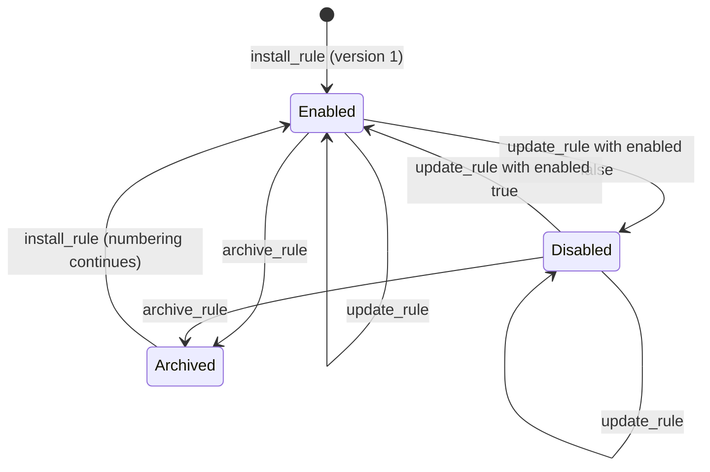

# RFC-0003: Managing rules at runtime

**Status:** Discussion
**Author:** Alex Nodeland
**Created:** 2026-09-29
**Discussion:** [#75](https://github.com/alexnodeland/reflexr/pull/75), from [issue #21][issue-21]
**Siblings:**

- [stackr RFC-0002][s-rfc-0002], the combined system, accepted on 2026-09-29. Its phase 5 installs rules that people accept in chat through the API proposed here. Its decision D5 makes the artifact the reviewed record and reflexr's store the running definition.
- [ADR-0039][adr-0039] namespaces event types for [#45][issue-45], as the maintainer [decided][issue-45-decided] on 2026-09-29, and [#74][pr-74] records it. Every event type is qualified, as in `artifactr:proposal_resolved`, and this RFC writes events, facts and rules in those terms.

## Summary

Rules are typed, serializable data ([ADR-0006][adr-0006]), but they're registered in code, and every tenant's workspaces evaluate the same ones ([ADR-0016][adr-0016], as amended). This RFC proposes **stored rules**: the same `Rule`, kept in storage for one workspace, installed and changed through the protocol's commands, and picked up by running reactors at their next batch.

It aims at the smallest design that serves stackr RFC-0002's rules from chat. It reuses the machinery reflexr has: the `Rule` model and `Rule.check`, `begin`, `reset`, generations and `reflexr:rule_reset`, `enabled`, `replay_rule`, the command handler, and the storage port's contract for due runs. The recommendations, taken together:

- A stored rule belongs to **one workspace**. Its name is **qualified**, such as `chat:prod-deploy-failures`, so it can never clash with the application's rules, which keep bare names.
- A change to its condition or scope **resets it as a code rule is reset**, but in the change's own transaction, so no event is missed. Installing replays nothing, and `replay_rule` warms a rule when asked.
- It runs only **registered actions** that the application's **policy** allows, with **typed parameters** each action declares. It watches only the **event namespaces** the policy grants.
- **Three commands** go through the one handler: `install_rule`, `update_rule` and `archive_rule`. Disabling is an update of `enabled`. A **`rule_policy`** on `Workspaces` authorizes each change, and refuses everything unless configured.
- Each change is a **`reflexr:rule_installed` fact** carrying the rule and its provenance. The log is the history, and one table holds each rule's current version.
- Reactors read a workspace's stored rules **from storage** on every pass, so no process runs a replaced definition.
- A stored rule needs a **throttle**. It has no scope fields unless the policy allows them, so the throttle bounds the whole rule. Nothing can raise the depth limit.
- `GET /v1/rules` still lists only code rules. Stored rules are listed **only within their workspace**.
- Metrics record a stored rule under its **namespace**, so the dashboards don't grow a series per stored rule.
- Everything else is **[deferred](#deferred)** until something needs it.

**This RFC waits for the maintainer's decisions** on the questions in [Decision points](#decision-points). Nothing is built until then.

## Motivation

### Where things stand

- `Workspaces(storage, rules=[...])` takes the rules and checks them at construction, and every workspace of every tenant evaluates them ([ADR-0026][adr-0026]). Changing a rule means a deploy.
- By design, every authenticated client of any tenant can read every rule, over `GET /v1/rules` and MCP's `list_rules`. So a rule can hold nothing tenant-specific.
- ADR-0006 left runtime rule management for after v0.1, as an additive change. The architecture's open questions list it first.

### Why now

stackr's RFC-0002 was accepted on 2026-09-29. In its first scenario:

1. In a thread, a person writes: "Whenever a deploy to production fails, tell me here."
2. The chat agent drafts a `rule` artifact: a reflexr `Rule` as JSON, which arrives as a proposal.
3. A person accepts it.
4. relayr, the bridge, re-reads artifactr to confirm the acceptance. Then it installs the rule in reflexr through this RFC's API, with its provenance: the artifact and its version, the proposal, and who approved it.

Its phase 5 waits for this RFC. The RFC also sets requirements:

- **D5.** The artifact is the reviewed record, and reflexr's store holds the running definition, with provenance both ways. If an operator changes the rule in reflexr, relayr proposes the same change to the artifact, so the two don't drift apart silently.
- **Tenancy.** A tenant's rules are never listed to other tenants, unlike code rules.
- **Limits on chat rules.** A throttle is required, and the depth limit can't be raised. reflexr's usage limits and the tenant's gateway budget apply. Rules may use only registered actions from an allowlist, never code.
- **An open question it leaves here:** whether a chat rule reaches one workspace or the whole tenant.

Nothing below is specific to chat. An admin UI, a CLI or an operator's script uses the same API.

## Design

### An example

The rule from the scenario, installed over REST (`POST /v1/workspaces/prod/commands`). The WebSocket takes the same frame, and MCP's `install_rule` tool the same `rule` and `provenance`:

```json
{
  "type": "command",
  "command_id": "install-prp_12",
  "command": {
    "type": "install_rule",
    "rule": {
      "name": "chat:prod-deploy-failures",
      "description": "Whenever a deploy to production fails, tell me here.",
      "when": {
        "filter": {"kind": "all", "of": [
          {"kind": "on", "types": ["oncall:deploy.completed"]},
          {"kind": "where", "field": "environment", "op": "eq", "value": "production"},
          {"kind": "where", "field": "status", "op": "eq", "value": "failed"}
        ]},
        "throttle": {"at_most": 1, "per": "PT15M"}
      },
      "then": {"action": "notify", "params": {"thread_id": "thr_4"}},
      "timeout": "PT1M"
    },
    "provenance": {
      "source": "artifactr",
      "artifact": "art_rule_7",
      "artifact_version": 3,
      "proposal": "prp_12",
      "approved_by": "user:ada"
    }
  }
}
```

Two parts of the rule are new: the qualified `name` ([D1b](#d1b-names-and-code-rules-of-the-same-name)) and the action's `params` ([D3b](#d3b-parameters)). The rest is a rule as reflexr has it today. Its event type is qualified, as every type is under ADR-0039, and the policy must let the rule watch the `oncall` namespace ([D3c](#d3c-which-event-types-a-stored-rule-may-watch)). The provenance is relayr's, and reflexr stores it as given ([D4d](#d4d-provenance)).

The outcome:

```json
{"type": "rule_version", "rule": "chat:prod-deploy-failures", "version": 1, "seq": 812, "duplicate": false}
```

In the same transaction, the workspace's log gains a fact. relayr installs from a run of its own `install-rule` rule, a code rule that fires on `artifactr:proposal_resolved`. So the actor is that run, and the fact continues the chain of the acceptance that caused it:

```json
{
  "type": "event", "seq": 812,
  "actor": {"kind": "agent", "rule": "install-rule", "run_id": "fir_5c1e", "name": "install-rule"},
  "causation": {"firing_id": "fir_5c1e", "run_id": "fir_5c1e", "depth": 2},
  "event": {
    "type": "reflexr:rule_installed",
    "rule": "chat:prod-deploy-failures",
    "version": 1,
    "reset": false,
    "spec": {"name": "chat:prod-deploy-failures", "when": {"...": "..."}, "then": {"...": "..."}},
    "provenance": {"source": "artifactr", "artifact": "art_rule_7", "artifact_version": 3, "proposal": "prp_12", "approved_by": "user:ada"}
  }
}
```

The rule's cursor starts at 812, its own fact, so it acts only on deploys logged after it was installed.

### A stored rule's life



- **Enabled** rules are evaluated, and their runs executed.
- **Disabled** rules behave as a disabled code rule does, through the same `enabled` field. The cursor holds, nothing is evaluated, and waiting runs wait.
- **Archived** rules are gone from evaluation and listings. Their unfinished runs are cancelled, and their scope states cleared. The rule's progress row is kept, and with it its generation, so a rule installed again under the same name never reuses a firing id. Its version numbering continues too.

Every change makes a new version, numbered from 1 for each workspace and name.

### Where the pieces go

| Piece | Package |
|---|---|
| The stored name pattern, `ActionRef.params`, `RuleLimits` and its pure check, the `reflexr:rule_installed` and `reflexr:rule_archived` facts | `reflexr.core` |
| One table of stored rules, in memory and in SQL, and due runs that see them | the storage port, `InMemoryStorage`, `reflexr.sql` |
| `Workspaces(rule_policy=)`, the handle's changes and read, and the reactor and executor reading stored rules | `reflexr.workspace` |
| The commands, the read and the tools | `reflexr.fastapi`, `reflexr.mcp` |

## Decision points

Each question below has options, their trade-offs, and a recommendation in bold. Options that add surface without a present need are marked **deferred**, with what would bring them back, and [Deferred](#deferred) collects them. The maintainer decides each question. This RFC is then updated to the decisions and accepted, and ADRs record them as they are built.

| # | Question | Recommendation |
|---|---|---|
| D1a | How far a stored rule reaches | One workspace |
| D1b | Names, and code rules of the same name | Qualified names for stored rules. Code rules keep bare names and can't be overridden |
| D2a | What is kept of versions | The current rule and its version number. The log's facts are the history |
| D2b | What resets a rule | `Rule.definition()`, as today, with the existing `begin` and `reset` called in the change's transaction |
| D2c | Replay on install | None. `replay_rule` exists for warming a rule |
| D2d | Which version a waiting run executes | The current one, as for code rules |
| D3a | Which actions a stored rule may use | The allowlist the rule policy returns, per tenant, workspace and installer |
| D3b | Parameters | Typed: each action declares a parameters model, checked at install |
| D3c | Which event types a stored rule may watch | The namespaces the rule policy grants. Types resolve in the `Workspaces` registry, as for code rules |
| D4a | The commands | Three: install, update, archive |
| D4b | Who may change rules | A `rule_policy` hook on `Workspaces`, refusing everything by default |
| D4c | Idempotency | A change that matches the current version is a duplicate, and changes may carry `expected_version` |
| D4d | Provenance | An opaque, bounded map, stored and returned |
| D5 | How running reactors learn of changes | Read from storage on every pass. Facts in the log for everyone else |
| D6a | The required throttle | The existing per-scope throttle, required, with no scope fields unless the policy allows them |
| D6b | The depth limit | Nothing new: rules have no depth field, so none can raise it |
| D6c | Where the limits live | In the limits the policy returns, with defaults |
| D6d | How many rules | A limit per workspace, enforced by reflexr |
| D7 | Listing and tenancy | `GET /v1/rules` unchanged. Stored rules only in their workspace's reads |
| D8 | Rules as a metric label | A stored rule's namespace, such as `chat:*` |

### D1. Where stored rules live, and how they're scoped

#### D1a: how far a stored rule reaches

| Option | Commands and `authorize` | Its facts | Its rows | Reaching every workspace |
|---|---|---|---|---|
| **One workspace (recommended)** | The workspace's own commands, which `authorize` already guards | In the workspace's log, in the change's transaction | Keyed by tenant and workspace, as every table is ([ADR-0030][adr-0030]) | Install it in each |
| The tenant. **Deferred** until a tenant needs one rule in every workspace | A tenant-level route and a new hook. Nothing asks `authorize` without a workspace today | No single log. Written to every workspace, or to none | Keyed by tenant only, with no workspace lock to serialize a change with evaluation | Automatic, including workspaces created later |
| The tenant, with target workspaces, as schedules have. **Deferred**, as above | As for the tenant | As for the tenant | As for the tenant | Chosen per rule |

**Recommended: one workspace.** A draft is written in one artifactr workspace, and the reflexr workspace with the same id is the one it's about. Everything a rule does in a workspace is already the workspace's: its cursor, state, runs and dead letters ([ADR-0016][adr-0016]). A change takes the workspace's lock, so it is atomic with its fact and the rule's progress, and serialized with evaluation. A tenant that wants the same rule everywhere installs it in each workspace.

#### D1b: names, and code rules of the same name

A rule's name keys its progress, scope states, runs, dead letters and firing ids, and appears in metrics, spans and the D2 actor of stackr's RFC-0002 (`reflexr:<rule>`). Within a workspace, a stored rule and a code rule can't share one. ADR-0039 qualifies every event type, but it says nothing about rule names, which are a separate matter.

| Option | A clash at install | A later deploy adds a code rule a stored rule already has | Seen at a glance |
|---|---|---|---|
| One name space; installing a code rule's name is refused | Refused | No good answer. Either the stored rule is shadowed, or startup fails because of a tenant's data. A tenant can take names the application will want | No |
| **Qualified names for stored rules; code rules stay bare (recommended)** | Can't happen | Can't happen | Yes: in logs, runs, spans and dashboards |
| Every rule name qualified, as every event type now is | Refused if the policy grants a namespace code rules use | The same squatting as the first option, unless rule namespaces are declared as event namespaces are | Yes |
| A stored rule overrides the code rule of the same name in its workspace | Intended | The code rule quietly stops running in that workspace | No |

**Recommended: qualified names for stored rules, bare names for code rules.**

- A stored rule's name is `namespace:name`, such as `chat:prod-deploy-failures`, with ADR-0039's `:` and namespace grammar. The pattern is `^[a-z][a-z0-9_]*:[a-z0-9][a-z0-9._-]*$`, at most 100 characters in all, as today.
- Code rules keep bare names. The rule name pattern already refuses a `:`, so no code rule is renamed, and nothing keyed by a code rule's name has to migrate.
- The rule policy says which namespaces an installer may use: relayr would use `chat`. The `reflexr` namespace is reserved. Rule namespaces aren't event namespaces: `chat:` says where a rule came from, and `artifactr:` who publishes a type.
- It costs a pattern, and it's what lets D8 bound the metric label without a new attribute.
- Code rules can't be overridden or changed through the API: a change that names one is `forbidden`.

stackr's actor for the example becomes `reflexr:chat:prod-deploy-failures`, which artifactr treats as an opaque string.

### D2. Versioning

#### D2a: what is kept of versions

| Option | History | Drift detection (D5) | Cost |
|---|---|---|---|
| **The current rule and its version number; the log's facts are the history (recommended)** | Every version, in its `reflexr:rule_installed` fact, with who made it and its provenance | `expected_version`, and the facts | One row per rule |
| Every version in a table of its own as well. **Deferred** until retention compacts logs, since the facts hold everything until then | The same, and kept after compaction | The same | A second table, and reads and a route for it |
| Versions only for definition changes; `enabled` changes in place | Partial | Changes made in place show only as facts | Two kinds of change |

**Recommended: the current rule and its version number.**

- Every change is a new version, enabling and disabling included. Versions count from 1 for each workspace and name, and are never reused.
- Each version is a `reflexr:rule_installed` fact that carries the whole rule and its provenance, attributed to whoever made it. So the log answers "which version fired this run": the latest fact for the rule before the run's firing.
- Rolling back is an `update_rule` with an earlier version's rule, taken from its fact.
- Recording the version on each run (`Run.rule_version`) is **deferred**, since the log already answers it.

#### D2b: what resets a rule

`Rule.definition()` hashes the condition and the scope. When the hash changes, the rule's state no longer applies. The rule starts a new generation, and `reflexr:rule_reset` records it ([ADR-0026][adr-0026]).

| Option | Behaviour |
|---|---|
| **`Rule.definition()`, applied in the change's transaction (recommended)** | The same `begin` and `reset` from core, called where `meet_rules` and `replay_rule` already call them. The rule starts or resets at its own fact, so nothing published after the change is missed |
| `Rule.definition()`, applied lazily by the reactor, as for code rules | No new call site. But the reactor starts or resets a rule at the head of the log when it next looks, so events published in between are skipped: the gap ADR-0026 closed for new workspaces |
| Any change resets | Fixing a typo in the description loses a half-counted window |

**Recommended: the definition, in the change's transaction.** A new condition or scope resets; the action, parameters, retries, ordering, timeout, description and `enabled` don't, as for code rules. The log reads `reflexr:rule_installed`, then `reflexr:rule_reset` (reason `changed`). The reactor's lazy check stays, and still serves code rules.

#### D2c: replay on install

| Option | A new count or sequence window | Acts on the past |
|---|---|---|
| **None; `replay_rule` in `rebuild` mode warms a rule when needed (recommended)** | Empty, unless replayed | Never |
| `rebuild_from_seq` on install and update. **Deferred**: a second way to do what `replay_rule` does | Warm | Never |
| Refire allowed, through `start="beginning"` | Warm | Yes. A chat rule would act on the whole history |

**Recommended: none.** A stored rule's `start` must be `now`. `replay_rule` works on stored rules as on code rules. Like every operator command, it's guarded by `authorize` ([ADR-0024][adr-0024]), and an application that must keep some actors from refiring a rule checks the command in its route, as the security guide already says for run operations.

#### D2d: which version a waiting run executes

| Option | Behaviour |
|---|---|
| **The current version (recommended)** | The executor reads the rule when it claims a run, as it does for code rules. A fix to the action or its parameters reaches runs already waiting, and disabling holds them |
| The version that fired it. **Deferred** with the versions table it needs | Each run does exactly what was approved when it fired, but a fix never reaches the runs already waiting |

**Recommended: the current version**, read in the claim's transaction.

### D3. What a stored rule may use

Stored rules name registered actions and never carry code ([ADR-0006][adr-0006]). The questions are which actions, how their inputs are checked, and which events a rule may watch.

#### D3a: the allowlist

| Option | Who decides | Varies by tenant or installer |
|---|---|---|
| One list on `Workspaces`, such as `stored_actions={"notify"}` | The application, once | No |
| **The allowlist the rule policy returns for each change (recommended)** | The application, per change | Yes |
| The installer sends the list with each install | The installer | Yes, but it limits nothing, since whoever installs chooses |

**Recommended: the rule policy returns it**, in the `RuleLimits` it answers each change with ([D4b](#d4b-who-may-change-rules)). A fixed list is a policy that returns the same limits for everyone, so the first option is a case of this one.

- **Predicates** are registered code too, so they follow the same allowlist. It's empty by default.
- **Checking** is `Rule.check(events=, actions=, predicates=)`, with the allowlist as the registered names. So a draft gets the same `InvalidRule` list of problems a code rule does, and relayr's artifact type can check a draft before it's proposed.
- **Rolling deploys.** Actions are registered on the reactor, which may not be in the process that installs ([ADR-0026][adr-0026]). A reactor that loads a stored rule checks it against its own actions. If the action is missing, the reactor doesn't evaluate the rule, declines its runs rather than cancelling them, and logs why. Showing that in the rule status is **deferred**.
- **A policy that later narrows** doesn't touch rules already installed. It applies from their next change.

#### D3b: parameters

`ActionRef` names an action and nothing else. "Tell me here" needs the rule to name its thread: the chain begins at a deploy, not in a thread, and stackr's RFC-0002 lets a run act "in one [thread] the rule names".

| Option | Checked | "Tell me here" |
|---|---|---|
| None: one registered action per behaviour | Nothing to check | An action per thread, which a chat rule can't register |
| Free JSON, passed to the action | By the action, when it runs | Works, but a draft a person accepted fails only when it fires |
| **Typed: each action declares a parameters model (recommended)** | By `Rule.check`, at install and when code rules are registered | `{"action": "notify", "params": {"thread_id": "thr_4"}}` |

**Recommended: typed parameters.**

- An action declares a Pydantic model, as in `FunctionAction(notify, params=NotifyParams)`. Code rules write `run(notify, thread_id="thr_4")`.
- Actions receive the validated model as `Reaction.params`.
- The policy's allowlist maps each action to its model, so an install is checked without a reactor. With a fixed policy, the reactor confirms at startup that each model is the one its action declares.
- Parameters aren't part of the definition, so changing them never resets the rule.
- An action treats its parameters as untrusted input, as it treats events. Its model should constrain them, so that a URL or an id can't reach what the rule's tenant shouldn't.

#### D3c: which event types a stored rule may watch

A stored rule sees only its own workspace's log, which everyone who may use the workspace can read anyway. But what it watches decides what it acts on, and how often. A chat rule on `reflexr:run_dead_lettered` would act on every failure of every rule in the workspace.

| Option | For | Against |
|---|---|---|
| Any type the `Workspaces` accepts, as for code rules | Nothing new | A chat rule may react to anything, reflexr's facts included |
| **The namespaces the rule policy grants (recommended)** | Least privilege, per tenant and installer. It reuses the names `Rule.check` already collects from `on` filters | One set in `RuleLimits` |
| Namespaces, with grants of single types as well. **Deferred** until a chat rule needs one type of a namespace it may not otherwise watch | Finer, the same shape as #72's publish policy | More to configure |
| The namespaces the tenant may publish into, from #72's policy | One policy for both | Watching isn't publishing. Chat rules watch `artifactr:` types, which only relayr may publish |

**Recommended: the namespaces the rule policy grants**, none by default.

- `RuleLimits.watch` names namespaces, such as `artifactr` and `oncall`. Every type a stored rule's filter or sequence steps name must be in one of them.
- A stored rule's filter must name its types. A filter that admits every type, such as one with no `on`, or a `not` around one, is refused. `admitted` already computes what a filter admits.
- A rule never sees facts about itself, whatever it watches.

**Where types resolve.** ADR-0039 gives each `Workspaces` its own registry, with the global one as the default. Nothing new is needed here:

- At install, `Rule.check` resolves the rule's types and fields in the registry, and the accepted and emitted types, of the `Workspaces` the change goes through, as it does for code rules at construction.
- A reactor checks a stored rule again when it loads it, against its own `Workspaces`. In a correct deployment the two are the same. If they aren't, as when a deploy removes a type, the rule isn't evaluated, as for a missing action ([D3a](#d3a-the-allowlist)).
- A name the registry doesn't know is refused with ADR-0039's "did you mean" hint. A draft that writes `deploy.completed` learns that it means `oncall:deploy.completed`.

### D4. The API

#### D4a: the commands

| Option | For | Against |
|---|---|---|
| **Three commands on the one handler: install, update, archive (recommended)** | Each change is checked and recorded as what it is, the same on every surface ([ADR-0011][adr-0011]). Disabling reuses the rule's own `enabled` | Disabling means sending the whole rule |
| Five, with `disable_rule` and `enable_rule` as well. **Deferred**: relayr sends whole rules, and an operator who must stop a rule at once can archive it | A change without sending the rule | Two more commands, tools and contract tests |
| One `put_rule` upsert, with `archived` in the body | One command | An update meant for an existing rule silently creates one, and archiving becomes a field |
| REST resources: `PUT` and `DELETE` on `/rules/{name}` | Familiar REST | A second path beside the commands, and nothing over the WebSocket or MCP |

**Recommended: three commands**, through `reflexr.workspace.execute` like every other command, and as `Workspace` methods in process:

| Command | Fields | Outcome |
|---|---|---|
| `install_rule` | `rule`, `provenance?` | `rule_version`: `{rule, version, seq, duplicate}`. Version 1, or the next version of an archived rule. An active rule of that name is `invalid_state` |
| `update_rule` | `rule`, `expected_version?`, `provenance?` | `rule_version`. A new version, reset if the definition changed. `enabled` in the rule disables or enables it |
| `archive_rule` | `rule` (the name), `expected_version?`, `reason?` | `rule_version`. The rule is archived, and its unfinished runs cancelled with core's `cancel` |

Rejections are the protocol's own:

- `forbidden`: the policy refused the change, or the name is a code rule's.
- `not_found`: no stored rule has that name.
- `invalid_state`: the name is taken, or the current version isn't `expected_version`. The message names the current version.
- `validation_failed`: the rule doesn't check, or breaks a limit. Each problem is listed in `errors`.

#### D4b: who may change rules

| Option | For | Against |
|---|---|---|
| Reuse `authorize(tenant, workspace, actor)` | Nothing new | Anyone who may use a workspace could install behaviour that runs in it |
| **A `rule_policy` on `Workspaces`, asked for every change, refusing everything by default (recommended)** | Holds in process and on every surface. It also returns the change's limits | One more hook |
| Allow some actor kinds, such as users but not external agents | Simple | Too coarse. relayr installs from a run, and a user isn't necessarily allowed to |

**Recommended: a `rule_policy` hook.**

```python
RulePolicy = Callable[[TenantId, WorkspaceId, Actor, RuleChange], Awaitable[RuleLimits | None]]
```

- `RuleChange` says what is being done (install, update or archive), to which rule, and the new rule, if there is one.
- The hook returns the limits the change must meet ([D3a](#d3a-the-allowlist), [D6](#d6-limits)), or `None` to refuse it with `forbidden`.
- `Workspaces` without a policy refuses every change, so no application gets stored rules without choosing to.
- The surfaces ask `authorize` first, as for any command that names a workspace.
- The policy sees the actor that makes the change. For relayr that is its `install-rule` run's `AgentActor`, and the person who approved goes in the provenance.

#### D4c: idempotency

| Option | Durable | Surfaces |
|---|---|---|
| `command_id` only | No: it's kept in memory, per process | REST and the WebSocket. MCP and in-process calls have none |
| **A change that matches the current version is a duplicate, and changes may carry `expected_version` (recommended)** | Yes, with nothing stored beyond the rule | All, and in process |
| An explicit idempotency key per change, stored | Yes | All, but with one more column and lookup |

**Recommended: match the current version, and check `expected_version`.**

- A change whose resulting rule equals the current one creates nothing, appends nothing, and answers with the current version and `duplicate: true`. That's checked before `expected_version`, so a retry of a change that succeeded is a duplicate, not a conflict.
- `expected_version` is optimistic concurrency. relayr passes the version it last installed, and an `invalid_state` tells it someone else changed the rule. That is D5's drift detection from the artifact's side.

#### D4d: provenance

| Option | reflexr knows | Cost |
|---|---|---|
| **An opaque, bounded map, stored and returned (recommended)** | Nothing: it records what the installer says, and relayr reads back its own keys | A JSON column, and a size limit |
| Typed, generic fields (`source`, `record`, `approved_by`), indexed to find a rule from its source. **Deferred** until reflexr has to read provenance itself | Where a rule came from, in a shape every installer shares | A model, an index and a lookup route |
| Typed artifactr fields, such as `artifact_id` | Exactly | Names artifactr in reflexr, against [ADR-0003][adr-0003] |

**Recommended: an opaque map**, `dict[str, JsonValue]`, at most 4 KiB, on the stored rule and on each `reflexr:rule_installed` fact. reflexr doesn't check it against the source. Who made the change is the envelope's actor, which reflexr authenticated.

### D5. How running reactors learn of changes

Today each reactor holds the rules in memory from startup, and evaluation takes the workspace's lock one batch at a time ([ADR-0005][adr-0005]).

| Option | Staleness | Cost | SQLite and PostgreSQL alike |
|---|---|---|---|
| Each process loads stored rules into memory, and reloads them on a timer | Up to the timer. A process can evaluate a replaced or archived version | A query per timer, and a cache to invalidate | Yes |
| **Read each workspace's stored rules from storage on every pass (recommended)** | None: each batch reads its rule in its own transaction | One indexed query per workspace per pass, and one row per batch | Yes |
| Follow the facts in each log | None, once read | The reactor would scan every log for facts that every rule's cursor has passed | Yes |
| PostgreSQL `LISTEN/NOTIFY` | Immediate | A connection and a dialect branch | No ([ADR-0030][adr-0030]) |

**Recommended: read from storage.** A parsed and checked rule may be cached by workspace, name and version, since a version never changes, but that is an optimization, not a mechanism.

The effects on leases, cursors and runs:

- **No new lease.** A change takes the workspace's lock, as a publish does. It lands between two of the evaluator's batches, never inside one, and doesn't wait for the evaluation lease.
- **Batches read their rule.** Each batch reads the stored rule's current version inside its transaction. A rule changed or archived after the pass began is seen at its next batch.
- **Where a rule's cursor goes**, with core's `begin` and `reset` ([D2b](#d2b-what-resets-a-rule)):
  - A new rule starts at its own fact.
  - A rule whose definition changed resets there too.
  - An update that keeps the definition keeps the cursor, state and generation.
  - A disabled rule's cursor holds, as a disabled code rule's does.
- **A rule doesn't see its own changes.** Its `reflexr:rule_installed` and `reflexr:rule_archived` are facts about it, so it never sees them, as with its other facts ([ADR-0010][adr-0010]). Other rules can watch them, if they may.
- **Due runs keep their contract.** `Storage.due_runs` takes a `RunPolicy`, since storage doesn't see code rules. It does see stored rules, so for them it reads `enabled`, `ordering` and `on_dead_letter` from their rows, in the same query. Without that, a disabled or backlogged stored rule's runs would take up the executor's limit, the starvation [#57][issue-57] fixed. The claim reads the current version in its transaction and remains the authority.
- **No orphan races.** Today the executor cancels a run whose rule it doesn't know. For a stored rule it never does. `archive_rule` cancels the runs, in its own transaction, so a process that hasn't seen a new rule can't cancel its runs.
- **Latency.** A change takes effect at the next pass: within `serve()`'s poll interval, one second by default.
- **Everyone else follows the log.** The facts are for observers: the WebSocket, an audit, and relayr's drift detection. A relayr rule that watches `reflexr:rule_installed` and finds a version whose provenance isn't its own proposes the same change to the artifact. That is D5's drift detection from reflexr's side.

### D6. Limits

#### D6a: the required throttle

A throttle limits firings **per scope**. A rule scoped by service, with a throttle of one firing per 15 minutes, still fires 200 times when 200 services fail at once. A rule with no scope fields has one scope, the workspace, so its throttle bounds the whole rule.

| Option | Bounds a burst | Change |
|---|---|---|
| **The existing throttle, required, and no scope fields unless the policy allows them (recommended)** | Yes, by default. A policy that allows scope fields accepts a throttle per scope | None in core |
| A throttle, required, with any scope | No: one firing per scope, however many scopes | None |
| A new cap across all of a rule's scopes. **Deferred** until a chat rule needs its own scopes with a bound across them | Yes, with scopes too | A new stage in core, with its state and conformance cases |
| A rate limit on the rule's runs, in the executor | Spend, yes. But firings and waiting runs still pile up | The executor's per-rule limits, which are still to come |

**Recommended: the existing throttle, required, and no scope fields by default.** The example needs none: one notice per 15 minutes, whichever service failed.

#### D6b: the depth limit

Rules have no depth field. `Workspaces(max_depth=8)` holds the limit, so a stored rule can't raise it.

| Option | Behaviour |
|---|---|
| **Nothing new: the workspace's limit applies (recommended)** | Nothing to build. Facts about a firing are one step deeper than what fired, so chat rules that answer each other stop at the limit ([ADR-0026][adr-0026]) |
| The policy sets a lower limit for stored rules, through `evaluate(max_depth=)`. **Deferred** until chat rules are seen answering each other | A shorter chain for chat rules | A field in `RuleLimits`, and a limit per rule in the reactor |
| A per-rule `max_depth` that may only lower the limit | The same, per rule | A field on every rule |

**Recommended: nothing new.**

#### D6c: where the limits live

| Option | For | Against |
|---|---|---|
| Fixed limits in core | One set, easy to document | The same for every tenant and plan |
| **The limits the policy returns, with defaults (recommended)** | Per tenant, plan or installer. The defaults are safe for chat | Applications can loosen them |
| Documented only | Nothing to build | Nothing enforced |

**Recommended: `RuleLimits`, with these defaults.** A pure function in core checks a rule against them and lists every problem, beside `Rule.check`'s.

| Limit | Default | Why |
|---|---|---|
| Actions and predicates | None allowed | D3a |
| Event namespaces watched | None allowed, and the filter must name its types | D3c |
| Rule namespaces | None allowed | D1b |
| `throttle` | Required, at most 60 firings an hour | D6a |
| Scope fields | None allowed | D6a |
| `retry.max_attempts` | At most 5 | Retries repeat spend |
| `timeout` | Required, at most 5 minutes | An attempt can't run forever |
| Windows: `within`, a dedupe window, a throttle's `per` | At most 1 day | Keeps state small |
| The `matches` operator | Not allowed | Python's `re` has no timeout, and a pathological pattern would hold the workspace's lock |
| `start` | `now` only | D2c |
| `description` | At most 2,000 characters | It goes into agent prompts |
| The rule's JSON | At most 16 KiB | Also bounds its filters and steps |
| Active rules per workspace | 50 | D6d |

Usage limits aren't part of a rule. They belong to the registered action, such as `AgentAction(usage_limits=...)`, and the tenant's gateway budget applies through the `[litellm]` extra, so a stored rule can't raise either.

#### D6d: how many rules

| Option | Enforced | Races |
|---|---|---|
| **Per workspace, by reflexr (recommended)** | In the change's transaction, under the workspace's lock | None |
| Per tenant, by reflexr | Across the tenant's workspaces | No lock spans them, so two installs in different workspaces can both pass |
| A tenant-wide count offered to the policy. **Deferred** until a tenant has enough workspaces to need it | A soft limit the policy enforces | A storage read across a tenant's workspaces |
| No limit | | Rules and evaluation time grow without bound |

**Recommended: per workspace, by reflexr.** Active rules count, disabled included and archived not.

### D7. Listing and tenancy

| Option | Code rules | Stored rules |
|---|---|---|
| **`GET /v1/rules` unchanged; stored rules only in the workspace's reads, behind `authorize` (recommended)** | Every authenticated client, as today | Only those who may use the workspace |
| `GET /v1/rules` adds the caller's tenant's stored rules | As today | The whole tenant, without `authorize`, so every workspace's rules to anyone in the tenant |
| A tenant-level route listing every workspace's stored rules. **Deferred** with tenant-wide rules (D1a) | As today | Needs a tenant-level authorization hook, which doesn't exist |

**Recommended: only in the workspace's reads.** Stored rules are keyed by tenant and workspace, so no read can reach another tenant's. One read is new, since `GET /v1/rules` can't show a stored rule:

| Read | REST | MCP |
|---|---|---|
| Code rules, for every tenant | `GET /v1/rules`, unchanged | `list_rules`, unchanged |
| Each rule's status, as today, plus `origin` (`code` or `stored`) and `version` | `GET /v1/workspaces/{workspace_id}/rules` | `rule_status` |
| One rule: its definition, and for a stored rule its version and provenance | `GET /v1/workspaces/{workspace_id}/rules/{rule}` | `get_rule` |

A stored rule's name also appears in the workspace's log, in spans, in Langfuse traces (named after the rule), in LiteLLM metadata (tagged `rule:<name>`), and in metrics as D8 says. Those are operators' tools, not tenants'. The security guide will say that a stored rule's name and description may reach them, so tenants shouldn't put secrets there.

### D8. Rules as a metric label

The registry's cardinality policy allows rule names as metric attributes, "since code bounds them". Stored rules aren't bounded by code.

- **Seven metrics carry `reflexr.rule`:** `reflexr.evaluation.lag`, `reflexr.firings`, `reflexr.rule.errors`, `reflexr.runs`, `reflexr.run.duration`, `reflexr.run.attempts` and `reflexr.dead_letters`.
- **About 60 series per rule and workspace.** Most come from the duration histogram's buckets by status. So 1,000 workspaces with 20 stored rules each would add about 1.2 million series to Prometheus.
- **Every name ever used stays.** Under cumulative temporality, the SDK keeps a series for each attribute set for the life of the process.

| Option | Series per stored rule | Per-rule detail in Grafana | Change |
|---|---|---|---|
| Stored names as `reflexr.rule`, bounded by D6d's limit | About 60 per workspace | Yes | None |
| **The rule's namespace as `reflexr.rule`, such as `chat:*` (recommended)** | None of its own: one series per namespace, which the policy bounds | No. Traces, Langfuse and the status read have it | The value recorded |
| The namespace, plus the full name in a new attribute that SDK views keep only when asked ([ADR-0029][adr-0029]). **Deferred** until a deployment needs per-rule metrics for stored rules | None by default | When asked | An attribute, a detail setting, views and a dashboard row |

**Recommended: the namespace.** The dashboards' queries don't change: stored rules show as one series per namespace, and the dashboard test ([ADR-0038][adr-0038]) is unaffected. Spans keep the full name. A deployment whose trace backend derives metrics from span names, such as `invoke_workflow {rule}`, should bound them there.

## Deferred

Each of these adds surface without a present need. The option tables above mark them, and each comes back when its trigger does.

| Deferred | Until |
|---|---|
| Tenant-wide rules, and a tenant-level listing (D1a, D7) | A tenant needs one rule in every workspace |
| A table of every version, and a route to read it (D2a) | Retention compacts logs, and with them the facts that hold the history |
| `Run.rule_version`, and running the version that fired a run (D2a, D2d) | Evaluation needs results by version, and the log's answer is too slow |
| `rebuild_from_seq` on install (D2c) | Installing and then replaying proves awkward |
| Showing a rule the reactor can't run in its status (D3a) | Operators miss the log line |
| Grants of single event types (D3c) | A chat rule needs one type of a namespace it may not otherwise watch |
| `disable_rule` and `enable_rule` (D4a) | Operators need to stop a rule without sending it whole |
| Typed provenance, and finding a rule from its source (D4d) | reflexr has to read provenance itself |
| A cap across all of a rule's scopes (D6a) | A chat rule needs scopes with a bound across them |
| A lower depth limit for stored rules (D6b) | Chat rules are seen answering each other |
| A tenant-wide count of rules (D6d) | A tenant has enough workspaces to need it |
| Per-rule metrics for stored rules (D8) | A deployment needs them |

## Storage

### Port

The storage port gains what stored rules need, and the behaviour suite covers it on every adapter:

- **`Transaction`:**
  - `stored_rule(name)`: the current stored rule, or `None`
  - `stored_rules()`: every active one, for the count and the status
  - `save_stored_rule(stored)`: insert or update it
- **`Storage`:** `stored_rules(workspace)`, for the reactor's pass and the reads.
- **`due_runs`** reads stored rules' `enabled`, `ordering` and `on_dead_letter` itself ([D5](#d5-how-running-reactors-learn-of-changes)).

### Schema sketch

One table, with its key led by tenant and workspace, as every table's is ([ADR-0030][adr-0030]):

| Table | Primary key | Columns beside the JSON |
|---|---|---|
| `reflexr_rules`: one row per stored rule, holding its current version | tenant, workspace, `name` | `version`, `status` (`active` or `archived`), `enabled`, `ordering`, `on_dead_letter`, `position` |

- `rule` holds the current `Rule` as JSON, and `provenance` its map. `enabled`, `ordering` and `on_dead_letter` are copied beside it for `due_runs`, which joins the table for runs of stored rules.
- `ix_reflexr_rules_active`, on tenant, workspace and `status`, serves the reactor's pass.
- `position` comes from the workspace row's counter, as for runs, so listings keep the order rules were installed in.
- A rule's progress row in `reflexr_rule_progress` isn't deleted when the rule is archived. It keeps the generation ([D2b](#d2b-what-resets-a-rule)).

`InMemoryStorage` keeps the same records in a dictionary.

### Migrations

- **One new migration, 0005,** creates the table and its index. ADR-0039's migration 0004 comes first. This one changes no existing rows: code rules, runs and progress are untouched.
- **Its downgrade** drops the table, and with it every stored rule. Their facts stay in the logs. The migration's docstring and the storage guide say so.
- **The order with #45.** #45 is decided, and stackr's RFC-0002 builds it before relayr's phase 1, while this RFC serves its phase 5. So stored rules are born with qualified type names, and migration 0004 has nothing of theirs to rewrite. If this were built first, 0004 would also have to rewrite the type names inside stored rules and their facts, and every stored rule whose `on` filters changed would reset.

## Protocol and JSON Schema changes

| Where | Change |
|---|---|
| Commands | `install_rule`, `update_rule`, `archive_rule` ([D4a](#d4a-the-commands)) |
| Outcomes | `rule_version`: `{rule, version, seq, duplicate}` |
| reflexr's facts | `reflexr:rule_installed`: `rule`, `version`, `reset` (whether a `reflexr:rule_reset` follows), `spec` (the rule), `provenance`. `reflexr:rule_archived`: `rule`, `version`, `reason?`, `cancelled` (how many runs) |
| Rule statuses | `origin` and `version` |
| Rules schema | A rule name may be `namespace:name`, and `ActionRef` gains `params`. Type names in `on` filters already carry ADR-0039's pattern |
| Protocol schema | The above. `StoredRule` for the read |
| REST | `GET /v1/workspaces/{workspace_id}/rules/{rule}` ([D7](#d7-listing-and-tenancy)) |
| MCP | `install_rule`, `update_rule`, `archive_rule`, `get_rule` |
| Rejections | None new |

Every change is additive, so the protocol stays `reflexr.v1`. Widening the rule name pattern accepts more than before, so a client that validates rule names against the old schema should regenerate its types. Both schemas are regenerated with `make schema`, and CI's drift check covers them.

## Security

- **Tenancy is structural.** A stored rule's key starts with its tenant and workspace, and every read and write goes through a handle bound to them. Stored rules never appear in `GET /v1/rules` or `list_rules`.
- **Closed by default.** Without a `rule_policy`, every change is `forbidden`. With one, the surfaces still ask `authorize` first.
- **Only registered code runs.** A stored rule names allowlisted actions and predicates, and passes them checked parameters. The allowlist shouldn't include actions that change rules, and stackr's D7 keeps turn-starting a per-rule permission in relayr.
- **Watching is granted.** A stored rule watches only the namespaces the policy grants, and its filter must name its types ([D3c](#d3c-which-event-types-a-stored-rule-may-watch)).
- **Bounded cost.** The required throttle over the whole rule, the retry, timeout and window limits, and the rule count bound what a rule can spend, beside the action's usage limits and the tenant's gateway budget. Refusing `matches` avoids regular expressions that could hold a workspace's lock.
- **Loops stay bounded.** Facts about a firing are one step deeper than what fired ([ADR-0026][adr-0026]), and `reflexr:rule_installed` continues the chain of the run that installed it.
- **Untrusted text.** A rule's description reaches agent prompts, and was drafted from what people typed. The rule's gateway guardrails apply as for any run. Names and descriptions are length-limited, and may reach operators' tools ([D7](#d7-listing-and-tenancy)).
- **Provenance is a claim.** reflexr records who made a change and what they said about it. It doesn't verify an approval. relayr re-reads artifactr before installing, as stackr's RFC-0002 requires.
- **Forged triggers (#72).** relayr's `install-rule` fires on `artifactr:proposal_resolved`. #45's decision puts who may publish into a namespace in a policy on `Workspaces`, which [#72][issue-72] builds, so the `artifactr` namespace can be reserved to relayr. Until then, any client allowed to publish could forge one. Either way, installing needs the rule policy's consent, and relayr never installs on a bridged event alone, so a forged event costs a re-read, not a rule. #72's policy also sees a run's `AgentActor`, whose `rule` is qualified for a stored rule, so it can refuse runs of stored rules a namespace that code rules' runs may publish into.

## What the siblings need

- **relayr** (stackr RFC-0002, phase 5):
  - installs with its provenance, and updates with `expected_version`
  - maps an archived artifact to `update_rule` with `enabled: false`, as the RFC says
  - watches `reflexr:rule_installed` for versions whose provenance isn't its own, and proposes them to the artifact
  - gives its drafts the policy's allowlist, namespaces and each action's parameters schema
- **artifactr:** nothing.
- **stackr:**
  - RFC-0002's unresolved "How far does a chat rule reach?" is answered by D1a
  - its prerequisite row for #21 points here
  - the template's `bridge` option passes a `rule_policy`

## Dependencies on #45 and #72

#45 was [decided][issue-45-decided] on 2026-09-29, and this RFC is written in its terms:

- **Every event type is qualified.** The example watches `oncall:deploy.completed`, and relayr's install rule `artifactr:proposal_resolved`. `Rule.check` resolves names in ADR-0039's grammar, which both schemas carry, and refuses an unknown one with its "did you mean" hint.
- **reflexr's facts are in `reflexr:`.** This RFC adds `reflexr:rule_installed` and `reflexr:rule_archived`, beside `reflexr:rule_reset`.
- **A registry per `Workspaces`.** A stored rule's types resolve in the registry of the `Workspaces` it's installed through, and again in each reactor's when it loads the rule ([D3c](#d3c-which-event-types-a-stored-rule-may-watch)).
- **Namespaces for watching.** The rule policy grants event namespaces, as the publish policy #45 decided grants publishing. Grants of single types, which that policy has, are deferred here (D3c).
- **The separator.** Stored rule names use ADR-0039's `:` and namespace grammar. ADR-0039 doesn't decide rule names: D1b keeps code rules bare, and lists qualifying every rule name as an option.
- **The order.** #45 is built first, so its migration 0004 has nothing of this RFC's to rewrite, and this RFC's migration is 0005 ([Migrations](#migrations)).

[#72][issue-72] builds the publish policy per namespace. This RFC doesn't need it to be built, but the chat flow's security leans on it, as [Security](#security) says.

## Drawbacks

- **Tenants get behaviour that runs.** It is bounded by allowlists, limits, review and a policy that is closed by default, but it is a new surface to defend.
- **Two kinds of rule.** Readers learn which is which, though qualified names make it plain.
- **More work per pass.** The reactor makes one more query per workspace per pass, and one more read per batch and per claim.
- **Less detail in metrics.** Stored rules share a series per namespace. Their detail is in traces, Langfuse and the status read.
- **Chat rules without scopes, by default.** A chat rule can't throttle per service unless its policy allows scope fields, and then its throttle no longer bounds the whole rule.
- **A bigger log.** Every change appends a fact that carries the whole rule, which is also the only history until versions get a table of their own.
- **Downgrading loses stored rules.** A deployment that rolls back past the migration drops them.

## Alternatives

- **Tenant-wide rules.** See D1a. They could come later as a helper that installs into each workspace, or as their own RFC.
- **Hot-reloading code rules.** The application rebuilds `Workspaces` from a file or table when it changes. That means no per-tenant rules, no versions and no facts, and every process must restart or swap state.
- **Rules only in the log**, with no table. The facts already hold every version, but the executor's due runs across workspaces would have to scan logs to learn each rule's policy. The recommended table is a projection of the facts, written in the same transaction.
- **reflexr reads rules from artifactr.** stackr's D5 and reflexr's ADR-0003 rule this out.
- **A separate rule service.** Another process and API, and a network hop between a rule and the lock it's evaluated under.
- **Code in stored rules**, such as sandboxed Python, WebAssembly or an expression language. ADR-0006 keeps rules as data with named escape hatches. The allowlisted predicates are that escape hatch.
- **Only a rate limit on execution.** See D6a: it bounds spend, but not firings or waiting runs.

## Unresolved questions

- **Turning a code rule off in one workspace.** Today `enabled` is the code's, for every workspace.
- **A preview read.** relayr previews a draft by replaying the recent log through `core.evaluate`. A read-only `preview_rule`, which evaluates a draft over a window of the log and saves nothing, would serve any client. It could be added without changing anything here.
- **How often a rule may change.** Each change appends a fact, and a changed definition resets state. The policy could limit changes per hour.
- **Counting what throttles drop.** It's not visible in a metric today, and a rule held at its throttle is worth an alert.

## Phases

Each phase is a series of small pull requests to `main`.

| Phase | Deliverable | Exit criteria |
|---|---|---|
| 1. Core | The stored name pattern, `ActionRef.params` and actions' parameters models, the `reflexr:rule_installed` and `reflexr:rule_archived` facts, `RuleLimits` and its pure check | A table of bad rules, each refused with every problem listed. The facts round-trip through the schema |
| 2. Storage | The table, in memory and in SQL, migration 0005, and due runs that see stored rules | The behaviour suite passes on memory, SQLite and PostgreSQL. The migrations don't drift from the models. A disabled stored rule's runs don't take up `due_runs`' limit |
| 3. Workspace and reactor | `Workspaces(rule_policy=)`, the three changes and the read on `Workspace`, `begin` and `reset` in the change's transaction, the reactor and executor reading stored rules, archiving, and the namespace as the metric label | A rule installed while two reactors serve fires on the next matching event, even one published before either reactor's next pass. An archived rule's runs are cancelled, and a rule installed again under its name never reuses a firing id |
| 4. Surfaces | The commands, outcome and facts in the protocol and its schema, the REST read, the MCP tools | Contract tests for each command's outcomes and rejections on every surface. No surface lists a stored rule to another tenant or workspace |
| 5. Docs and oncall | ADRs for the decisions, and the architecture, protocol and guides (rules, reactor, security, serving, MCP, observability). oncall installs a stored rule | `make docs` passes. oncall's smoke test installs a rule over REST and sees it fire |

## Tracking

- [ ] The maintainer decides D1 to D8, and this RFC is updated to the decisions and accepted
- [x] #45 decided (2026-09-29), and this RFC written in its terms
- [ ] #45 built, with migration 0004, before phase 2
- [ ] Phase 1: core
- [ ] Phase 2: storage and the migration
- [ ] Phase 3: workspace and reactor
- [ ] Phase 4: surfaces
- [ ] Phase 5: docs, ADRs and oncall
- [ ] stackr RFC-0002's prerequisite row for #21 marked done, unblocking its phase 5

[adr-0003]: ../adr/0003-independent-sibling-of-artifactr.md
[adr-0005]: ../adr/0005-per-rule-cursors.md
[adr-0006]: ../adr/0006-rules-as-typed-serializable-data.md
[adr-0010]: ../adr/0010-loop-and-spend-safety.md
[adr-0011]: ../adr/0011-surfaces.md
[adr-0016]: ../adr/0016-tenants-and-workspaces-like-artifactr.md
[adr-0024]: ../adr/0024-causal-chains-and-operator-actions.md
[adr-0026]: ../adr/0026-the-reactors-evaluation.md
[adr-0029]: ../adr/0029-metric-detail-through-sdk-views.md
[adr-0030]: ../adr/0030-sql-storage.md
[adr-0038]: ../adr/0038-dashboards-generated-tested-and-released.md
[adr-0039]: https://github.com/alexnodeland/reflexr/blob/docs/event-namespaces/docs/adr/0039-namespaced-event-types.md
[issue-21]: https://github.com/alexnodeland/reflexr/issues/21
[issue-45]: https://github.com/alexnodeland/reflexr/issues/45
[issue-45-decided]: https://github.com/alexnodeland/reflexr/issues/45#issuecomment-5899233517
[issue-57]: https://github.com/alexnodeland/reflexr/issues/57
[issue-72]: https://github.com/alexnodeland/reflexr/issues/72
[pr-74]: https://github.com/alexnodeland/reflexr/pull/74
[s-rfc-0002]: https://github.com/alexnodeland/stackr/blob/main/docs/rfcs/0002-the-combined-system.md
